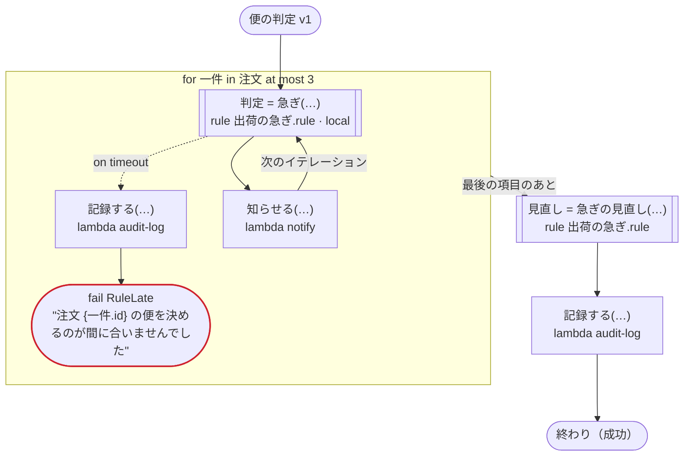

# 便の判定 v1

規則をローカルアクティビティで呼ぶ（Temporal）：注文ごとに規則で便を決めて知らせる。規則のタイムアウトを処理してタスクを呼ぶ呼び出しと、ふつうのアクティビティで呼ぶ規則も通る。ほかのプラットフォームでは、ふつうの規則の呼び出しと同じ

`tests/flows/local_rules.flow` を `dandori doc` で描いたものです。入力は `注文: list[注文]`, `まとめ: 注文` です。

## flow

四角はタスク、両脇に線のある四角は規則、斜めの四角は外から値が届くタスク（イベントやコールバックの応答）、六角形は `match`、角の丸い四角は待ち、ステップを囲む枠はループです。破線の矢印は、呼び出しがその場で処理するエラーです。

## 呼び出し

| 行 | 呼び出し | 呼ぶもの | リトライ | タイムアウト | 失敗したとき |
|---:|---|---|---|---|---|
| 32 | `判定 = 急ぎ(…)` | 規則 `出荷の急ぎ.rule`（Temporal ではローカルアクティビティ） | 2 回（1 秒後と 2 秒後、failure） | — | `timeout` → 33 行目 `failure` → ワークフローが失敗する |
| 34 | `記録する(…)` | `lambda audit-log`, `idempotent` | — | — | `timeout`, `failure` → ワークフローが失敗する |
| 36 | `知らせる(…)` | `lambda notify`, `idempotent` | — | — | `timeout`, `failure` → ワークフローが失敗する |
| 37 | `見直し = 急ぎの見直し(…)` | 規則 `出荷の急ぎ.rule` | 2 回（1 秒後と 2 秒後、failure） | — | `timeout`, `failure` → ワークフローが失敗する |
| 38 | `記録する(…)` | `lambda audit-log`, `idempotent` | — | — | `timeout`, `failure` → ワークフローが失敗する |

## 終わり方

ワークフローの終わり方のすべてです。

| 行 | 終わり方 |
|---:|---|
| 35 | `fail RuleLate` "注文 {一件.id} の便を決めるのが間に合いませんでした" |
| 38 | flow が最後まで走り、ワークフローは成功する |

## 規則

このワークフローが呼ぶ規則を、`rulec doc` が承認する人向けに描いたものです。

<code>急ぎ</code> · 出荷の急ぎ v1 · <code>../../examples/order/rules/出荷の急ぎ.rule</code>

<!-- rulec 0.22.0 が 出荷の急ぎ.rule (sha256:3f566b643eb8) から生成。これは読み取り専用の資料で、本物は .rule のほうです。編集しても戻せません（§1.6）。 -->
# 規則 出荷の急ぎ v1

注文を急ぎで出すかどうかと、使う便。会員はいつも急ぎ、それ以外は三万円以上なら急ぎ。書き下ろしの例

## 入力

| 名前 | 型 | 範囲 | 注記 |
|---|---|---|---|
| 会員 | bool |  |  |
| 金額 | money[円, incl_tax] | 0円 〜 100万円 |  |

## 出力

| 名前 | 型 | 丸め | 注記 |
|---|---|---|---|
| 急ぎ | bool |  |  |
| 便 | 便（2 値） |  |  |

## 型

列挙は**閉じた**有限集合です。値を足すと、それを見ていない表が完全性検査で割れます。

- **便**（2 値）— 通常便、翌日便

## 表 急ぎの判定（policy unique）

| 列 | 出どころ |
|---|---|
| 会員 | 入力 |
| 金額 | 入力 |
| → 急ぎ | この規則の出力 |
| → 便 | この規則の出力 |

| # | 会員 | 金額 | → 急ぎ（bool） | → 便（便） |
|---|---|---|---|---|
| 1 | true | - | true | 翌日便 |
| 2 | false | >=30000円 | true | 翌日便 |
| 3 | false | <30000円 | false | 通常便 |

**`rulec check` が確かめたこと**

- どの入力の組合せも、いずれかの行に当てはまります（E101 完全性）
- どの入力にも当てはまらない行はありません（E102）
- 二つ以上の行に同時に当てはまる入力はありません（E105 重なり）。行の並べ替えは意味を変えません

## 例（検証済み）

| 会員 | 金額 | → 急ぎ | 便 |
|---|---|---|---|
| true | 1000円 | true | 翌日便 |
| false | 5000円 | false | 通常便 |
| false | 30000円 | true | 翌日便 |

この 3 件は `rulec check` が参照評価器で実行し、すべて宣言どおりの値になりました（E107）。例は**実行される仕様**です。

<code>急ぎの見直し</code> · 出荷の急ぎ v1 · <code>../../examples/order/rules/出荷の急ぎ.rule</code>

<!-- rulec 0.22.0 が 出荷の急ぎ.rule (sha256:3f566b643eb8) から生成。これは読み取り専用の資料で、本物は .rule のほうです。編集しても戻せません（§1.6）。 -->
# 規則 出荷の急ぎ v1

注文を急ぎで出すかどうかと、使う便。会員はいつも急ぎ、それ以外は三万円以上なら急ぎ。書き下ろしの例

## 入力

| 名前 | 型 | 範囲 | 注記 |
|---|---|---|---|
| 会員 | bool |  |  |
| 金額 | money[円, incl_tax] | 0円 〜 100万円 |  |

## 出力

| 名前 | 型 | 丸め | 注記 |
|---|---|---|---|
| 急ぎ | bool |  |  |
| 便 | 便（2 値） |  |  |

## 型

列挙は**閉じた**有限集合です。値を足すと、それを見ていない表が完全性検査で割れます。

- **便**（2 値）— 通常便、翌日便

## 表 急ぎの判定（policy unique）

| 列 | 出どころ |
|---|---|
| 会員 | 入力 |
| 金額 | 入力 |
| → 急ぎ | この規則の出力 |
| → 便 | この規則の出力 |

| # | 会員 | 金額 | → 急ぎ（bool） | → 便（便） |
|---|---|---|---|---|
| 1 | true | - | true | 翌日便 |
| 2 | false | >=30000円 | true | 翌日便 |
| 3 | false | <30000円 | false | 通常便 |

**`rulec check` が確かめたこと**

- どの入力の組合せも、いずれかの行に当てはまります（E101 完全性）
- どの入力にも当てはまらない行はありません（E102）
- 二つ以上の行に同時に当てはまる入力はありません（E105 重なり）。行の並べ替えは意味を変えません

## 例（検証済み）

| 会員 | 金額 | → 急ぎ | 便 |
|---|---|---|---|
| true | 1000円 | true | 翌日便 |
| false | 5000円 | false | 通常便 |
| false | 30000円 | true | 翌日便 |

この 3 件は `rulec check` が参照評価器で実行し、すべて宣言どおりの値になりました（E107）。例は**実行される仕様**です。

