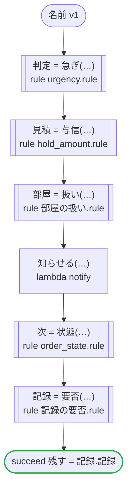
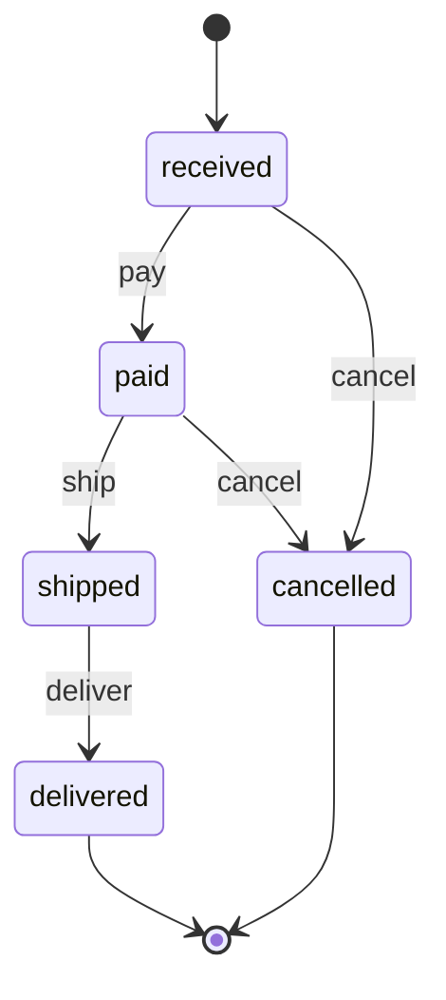

# 名前 v1

生成するコードの名前を試す：rulec が規則のために生成するコードの名前を、dandori がまわりに書くコードと一つのファイルに並べても、ぶつからないもの。単位の型が同じ規則が二つ（urgency と記録の要否が money[JPY, incl_tax] を受け取る）、同じ名前の列挙を受け取る規則が二つ（hold_amount と部屋の扱いが客室の列挙 Room を受け取る）、dandori の名前に近い別名の規則が二つ（rule と activities）。ステートマシンの規則 order_state も関数として呼び、返金の額で記録の要否を決める（列挙の値の集合を行に書く規則の TypeScript は、rulec の §15.171 から tsc --strict を通る）。どれも E006 にならず、どのプラットフォームでも動く

`tests/flows/names.flow`, drawn by `dandori doc`. Inputs: `注文: 注文`. Outputs: `残す: bool`.

## flow

A rectangle is a task, one with a line down each side a rule, a slanted one a task whose value comes from outside (an event, or the answer to a callback), a hexagon a `match`, a rounded box a wait, and a box around steps a loop. A dashed arrow is an error the call handles.

## Calls

| Line | Call | Calls | Retries | Timeout | When it fails |
|---:|---|---|---|---|---|
| 40 | `判定 = 急ぎ(…)` | rule `urgency.rule` | 2 times, after 1 second and 2 (failure) | — | `timeout`, `failure` → the workflow fails |
| 41 | `見積 = 与信(…)` | rule `hold_amount.rule` | 2 times, after 1 second and 2 (failure) | — | `timeout`, `failure` → the workflow fails |
| 42 | `部屋 = 扱い(…)` | rule `部屋の扱い.rule` | 2 times, after 1 second and 2 (failure) | — | `timeout`, `failure` → the workflow fails |
| 43 | `知らせる(…)` | `lambda notify`, `idempotent` | — | — | `timeout`, `failure` → the workflow fails |
| 44 | `次 = 状態(…)` | rule `order_state.rule` | 2 times, after 1 second and 2 (failure) | — | `timeout`, `failure` → the workflow fails |
| 45 | `記録 = 要否(…)` | rule `記録の要否.rule` | 2 times, after 1 second and 2 (failure) | — | `timeout`, `failure` → the workflow fails |

## Ends

Every way the workflow can end.

| Line | End |
|---:|---|
| 46 | `succeed 残す = 記録.記録` |

## Rules

The rules this workflow calls, as `rulec doc` renders them for whoever approves them.

<code>急ぎ</code> · urgency v1 · <code>../../examples/order/rules/urgency.rule</code>

<!-- Generated by rulec 0.23.0 from urgency.rule (sha256:5ff6efc93a9b). This is a read-only rendering; the source of truth is the .rule file. Edits cannot be carried back (§1.6). -->
# Rule urgency v1

Whether an order goes out in a hurry, and by which carrier: a member's always does, and anyone else's from 30,000 yen. Written for the example

## Inputs

| Name | Type | Range | Notes |
|---|---|---|---|
| member | bool |  |  |
| amount | money[JPY, incl_tax] | 0JPY 〜 100万JPY |  |

## Outputs

| Name | Type | Rounding | Notes |
|---|---|---|---|
| urgent | bool |  |  |
| carrier | carrier (2 values) |  |  |

## Types

An enum is a **closed** finite set. Add a value, and every table that does not look at it fails the completeness check.

- **carrier** (2 values) — standard, next_day

## Table decide (policy unique)

| Column | Source |
|---|---|
| member | Input |
| amount | Input |
| → urgent | Output of this rule |
| → carrier | Output of this rule |

| # | member | amount | → urgent (bool) | → carrier (carrier) |
|---|---|---|---|---|
| 1 | true | - | true | next_day |
| 2 | false | >=30000JPY | true | next_day |
| 3 | false | <30000JPY | false | standard |

**What `rulec check` verified**

- Every combination of inputs matches some row (E101 completeness)
- There is no row that can never match (E102 unreachable row)
- No input matches two or more rows at once (E105 overlap). Reordering the rows does not change the meaning

## Examples (verified)

| member | amount | → urgent | carrier |
|---|---|---|---|
| true | 1000JPY | true | next_day |
| false | 5000JPY | false | standard |
| false | 30000JPY | true | next_day |

`rulec check` ran these 3 examples through the reference evaluator, and every one produced the declared values (E107). The examples are an **executable specification**.

<code>与信</code> · hold_amount v1 · <code>../../examples/hotel/rules/hold_amount.rule</code>

<!-- Generated by rulec 0.23.0 from hold_amount.rule (sha256:0ce5f2bc9d81). This is a read-only rendering; the source of truth is the .rule file. Edits cannot be carried back (§1.6). -->
# Rule hold_amount v1

How much a booking holds on the card, and whether the front desk looks at it first: the nightly rate times the nights, and a stay of fifteen nights or more goes to the desk. Written for the example

## Inputs

| Name | Type | Range | Notes |
|---|---|---|---|
| room | room (3 values) |  |  |
| nights | number | 1 〜 30 |  |

## Outputs

| Name | Type | Rounding | Notes |
|---|---|---|---|
| amount | money[JPY, incl_tax] | down(1JPY) |  |
| handling | handling (2 values) |  |  |

## Types

An enum is a **closed** finite set. Add a value, and every table that does not look at it fails the completeness check.

- **room** (3 values) — standard, deluxe, suite
- **handling** (2 values) — auto, review

## Derived Values and Definitions

Intermediate values that can be placed in a table column. The expressions are as written in the source file, and the ranges are the declared ones.

| Name | Kind | Expression | Range | Notes |
|---|---|---|---|---|
| amount | Definition | `per_night * nights` |  |  |

## Table rate (policy unique)

| Column | Source |
|---|---|
| room | Input |
| → per_night | (this table only) |

| # | room | → per_night (money[JPY, incl_tax]) |
|---|---|---|
| 1 | standard | 12000JPY |
| 2 | deluxe | 18000JPY |
| 3 | suite | 40000JPY |

**What `rulec check` verified**

- Every combination of inputs matches some row (E101 completeness)
- There is no row that can never match (E102 unreachable row)
- No input matches two or more rows at once (E105 overlap). Reordering the rows does not change the meaning

## Table decide (policy unique)

| Column | Source |
|---|---|
| nights | Input |
| → handling | Output of this rule |

| # | nights | → handling (handling) |
|---|---|---|
| 1 | <=14 | auto |
| 2 | >=15 | review |

**What `rulec check` verified**

- Every combination of inputs matches some row (E101 completeness)
- There is no row that can never match (E102 unreachable row)
- No input matches two or more rows at once (E105 overlap). Reordering the rows does not change the meaning

## Examples (verified)

| room | nights | → amount | handling |
|---|---|---|---|
| standard | 2 | 24000JPY | auto |
| suite | 15 | 600000JPY | review |

`rulec check` ran these 2 examples through the reference evaluator, and every one produced the declared values (E107). The examples are an **executable specification**.

<code>扱い</code> · 部屋の扱い v1 · <code>rules/部屋の扱い.rule</code>

<!-- Generated by rulec 0.23.0 from 部屋の扱い.rule (sha256:416d7544b916). This is a read-only rendering; the source of truth is the .rule file. Edits cannot be carried back (§1.6). -->
# Rule 部屋の扱い v1

生成するコードの名前を試す規則（tests/flows/names.flow）。別名 rule は、dandori が規則のまわりに書く名前（rules、rule_<規則>）に近い。客室の列挙は、hold_amount.rule の列挙と、生成するコードで同じ名前（Room）になる。書き下ろしの例

## Inputs

| Name | Type | Range | Notes |
|---|---|---|---|
| 客室 | 客室 (3 values) |  |  |

## Outputs

| Name | Type | Rounding | Notes |
|---|---|---|---|
| 扱い | 扱い (2 values) |  |  |

## Types

An enum is a **closed** finite set. Add a value, and every table that does not look at it fails the completeness check.

- **客室** (3 values) — standard, deluxe, suite
- **扱い** (2 values) — 自動, 確認

## Table 客室ごとの扱い (policy unique)

| Column | Source |
|---|---|
| 客室 | Input |
| → 扱い | Output of this rule |

| # | 客室 | → 扱い (扱い) |
|---|---|---|
| 1 | standard | 自動 |
| 2 | deluxe | 自動 |
| 3 | suite | 確認 |

**What `rulec check` verified**

- Every combination of inputs matches some row (E101 completeness)
- There is no row that can never match (E102 unreachable row)
- No input matches two or more rows at once (E105 overlap). Reordering the rows does not change the meaning

## Examples (verified)

| 客室 | → 扱い |
|---|---|
| standard | 自動 |
| suite | 確認 |

`rulec check` ran these 2 examples through the reference evaluator, and every one produced the declared values (E107). The examples are an **executable specification**.

<code>要否</code> · 記録の要否 v1 · <code>rules/記録の要否.rule</code>

<!-- Generated by rulec 0.23.0 from 記録の要否.rule (sha256:a1abbceb3d77). This is a read-only rendering; the source of truth is the .rule file. Edits cannot be carried back (§1.6). -->
# Rule 記録の要否 v1

生成するコードの名前を試す規則（tests/flows/names.flow）。別名 activities は、dandori が書くモジュール（activities.ts、activities.py）と同じ名前だが、rulec の生成したコードは別のディレクトリ（rulec/）に置くのでぶつからない。返金の型は、urgency.rule の金額と、生成するコードで同じ型（JPYInclTax）になる。書き下ろしの例

## Inputs

| Name | Type | Range | Notes |
|---|---|---|---|
| 急ぎ | bool |  |  |
| 返金 | money[JPY, incl_tax] | 0JPY 〜 100万JPY |  |

## Outputs

| Name | Type | Rounding | Notes |
|---|---|---|---|
| 記録 | bool |  |  |

## Table 要否 (policy unique)

| Column | Source |
|---|---|
| 急ぎ | Input |
| 返金 | Input |
| → 記録 | Output of this rule |

| # | 急ぎ | 返金 | → 記録 (bool) |
|---|---|---|---|
| 1 | true | - | true |
| 2 | false | >=1JPY | true |
| 3 | false | 0JPY | false |

**What `rulec check` verified**

- Every combination of inputs matches some row (E101 completeness)
- There is no row that can never match (E102 unreachable row)
- No input matches two or more rows at once (E105 overlap). Reordering the rows does not change the meaning

## Examples (verified)

| 急ぎ | 返金 | → 記録 |
|---|---|---|
| true | 0JPY | true |
| false | 500JPY | true |
| false | 0JPY | false |

`rulec check` ran these 3 examples through the reference evaluator, and every one produced the declared values (E107). The examples are an **executable specification**.

<code>状態</code> · order_state v1 · <code>../../examples/order/rules/order_state.rule</code>

<!-- Generated by rulec 0.23.0 from order_state.rule (sha256:5b6ae1fbd5cf). This is a read-only rendering; the source of truth is the .rule file. Edits cannot be carried back (§1.6). -->
# Rule order_state v1

Where an online order goes on a payment, a shipment, a delivery or a request to cancel it, and how much is refunded. The caller keeps the state; the rule decides one event at a time. Written for the example

## Inputs

| Name | Type | Range | Notes |
|---|---|---|---|
| state | state (5 values) |  |  |
| event | event (4 values) |  |  |
| amount_paid | money[JPY, incl_tax] | 0JPY 〜 100万JPY |  |

## Outputs

| Name | Type | Rounding | Notes |
|---|---|---|---|
| next_state | state (5 values) |  |  |
| refund | money[JPY, incl_tax] | down(1JPY) |  |
| accepted | bool |  |  |

## Types

An enum is a **closed** finite set. Add a value, and every table that does not look at it fails the completeness check.

- **state** (5 values) — received, paid, shipped, delivered, cancelled
- **event** (4 values) — pay, ship, deliver, cancel

## Table step (policy unique)

| Column | Source |
|---|---|
| state | Input |
| event | Input |
| → next_state | Output of this rule |
| → refund | Output of this rule |
| → accepted | Output of this rule |

| # | state | event | → next_state (state) | → refund (money[JPY, incl_tax] / down(1JPY)) | → accepted (bool) | Notes |
|---|---|---|---|---|---|---|
| 1 | received | pay | paid | 0JPY | true |  |
| 2 | received | cancel | cancelled | 0JPY | true |  |
| 3 | received | ship, deliver | state | 0JPY | false |  |
| 4 | paid | ship | shipped | 0JPY | true |  |
| 5 | paid | cancel | cancelled | amount_paid | true |  |
| 6 | paid | pay, deliver | state | 0JPY | false |  |
| 7 | shipped | deliver | delivered | 0JPY | true |  |
| 8 | shipped | pay, ship, cancel | state | 0JPY | false | a cancel after the shipment goes through a return |
| 9 | delivered | - | state | 0JPY | false |  |
| 10 | cancelled | - | state | 0JPY | false | a payment that comes after a cancel does not bring the order back |

**What `rulec check` verified**

- Every combination of inputs matches some row (E101 completeness)
- There is no row that can never match (E102 unreachable row)
- No input matches two or more rows at once (E105 overlap). Reordering the rows does not change the meaning

## State machine: order

This rule is one step of a state machine. Every call is passed the state (input state) and answers the next one (output next_state). **The caller keeps the state; the generated code keeps nothing.** Where a case goes is decided by table step.

| Initial state | Final states |
|---|---|
| received | delivered, cancelled |

One case passes amount_paid with the same value from its first call to its last (`held`). The claims below are about the sequences of calls that keep it.

### Where each state goes

| State | Goes to (row of table step) |
|---|---|
| received | pay（row 1） → paid / cancel（row 2） → cancelled / ship, deliver（row 3） → stays |
| paid | ship（row 4） → shipped / cancel（row 5） → cancelled / pay, deliver（row 6） → stays |
| shipped | deliver（row 7） → delivered / pay, ship, cancel（row 8） → stays |
| delivered | any call（row 9） → stays |
| cancelled | any call（row 10） → stays |

### What `rulec check` proved about every sequence of calls

- From received a case can reach received, paid, shipped, delivered, cancelled. Every state is reached.
- No call moves a case out of the final states delivered, cancelled.
- Whatever state a case reaches, a way to a final state remains.
- `never shipped after cancelled`: no sequence of calls reaches shipped after cancelled.
- `once refund >0JPY`: refund is answered >0JPY at most once in a case.

### Scenarios (verified)

**delivered**

| # | state | event | amount_paid | → next_state | refund | accepted |
|---|---|---|---|---|---|---|
| 1 | received | pay | 3000JPY | paid | 0JPY | true |
| 2 | paid | ship | 3000JPY | shipped | 0JPY | true |
| 3 | shipped | deliver | 3000JPY | delivered | 0JPY | true |

**late_pay**

| # | state | event | amount_paid | → next_state | refund | accepted |
|---|---|---|---|---|---|---|
| 1 | received | pay | 3000JPY | paid | 0JPY | true |
| 2 | paid | cancel | 3000JPY | cancelled | 3000JPY | true |
| 3 | cancelled | pay | 3000JPY | cancelled | 0JPY | false |

The first call starts in received, and every later one in the state the call before it answered (the left column). `rulec check` ran them in order through the reference evaluator, and every one produced the declared values (E107).

## Examples (verified)

| state | event | amount_paid | → next_state | refund | accepted |
|---|---|---|---|---|---|
| received | cancel | 0JPY | cancelled | 0JPY | true |
| shipped | cancel | 3000JPY | shipped | 0JPY | false |

`rulec check` ran these 2 examples through the reference evaluator, and every one produced the declared values (E107). The examples are an **executable specification**.

