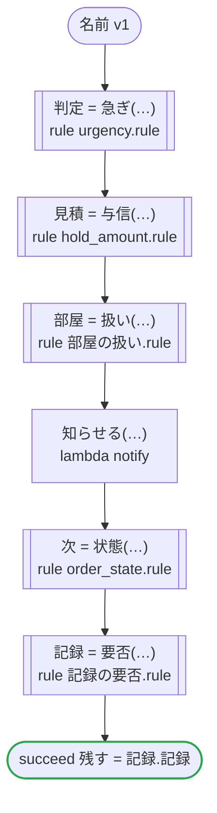
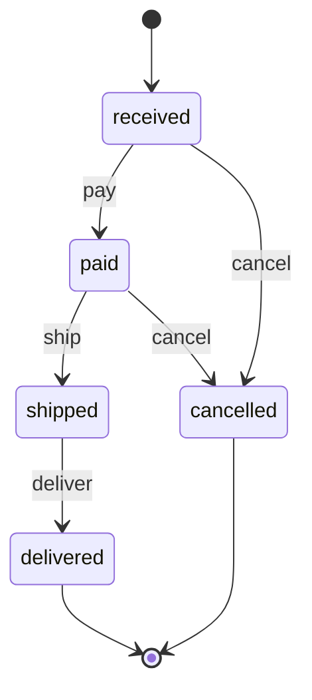

# 名前 v1

生成するコードの名前を試す：rulec が規則のために生成するコードの名前を、dandori がまわりに書くコードと一つのファイルに並べても、ぶつからないもの。単位の型が同じ規則が二つ（urgency と記録の要否が money[JPY, incl_tax] を受け取る）、同じ名前の列挙を受け取る規則が二つ（hold_amount と部屋の扱いが客室の列挙 Room を受け取る）、dandori の名前に近い別名の規則が二つ（rule と activities）。ステートマシンの規則 order_state も関数として呼び、返金の額で記録の要否を決める（列挙の値の集合を行に書く規則の TypeScript は、rulec の §15.171 から tsc --strict を通る）。どれも E006 にならず、どのプラットフォームでも動く

`tests/flows/names.flow` を `dandori doc` で描いたものです。入力は `注文: 注文`、出力は `残す: bool` です。

## flow

四角はタスク、両脇に線のある四角は規則、斜めの四角は外から値が届くタスク（イベントやコールバックの応答）、六角形は `match`、角の丸い四角は待ち、ステップを囲む枠はループです。破線の矢印は、呼び出しがその場で処理するエラーです。

## 呼び出し

| 行 | 呼び出し | 呼ぶもの | リトライ | タイムアウト | 失敗したとき |
|---:|---|---|---|---|---|
| 40 | `判定 = 急ぎ(…)` | 規則 `urgency.rule` | 1 秒後と 2 秒後の 2 回（failure） | — | `timeout`・`failure` → ワークフローが失敗する |
| 41 | `見積 = 与信(…)` | 規則 `hold_amount.rule` | 1 秒後と 2 秒後の 2 回（failure） | — | `timeout`・`failure` → ワークフローが失敗する |
| 42 | `部屋 = 扱い(…)` | 規則 `部屋の扱い.rule` | 1 秒後と 2 秒後の 2 回（failure） | — | `timeout`・`failure` → ワークフローが失敗する |
| 43 | `知らせる(…)` | `lambda notify`・`idempotent` | — | — | `timeout`・`failure` → ワークフローが失敗する |
| 44 | `次 = 状態(…)` | 規則 `order_state.rule` | 1 秒後と 2 秒後の 2 回（failure） | — | `timeout`・`failure` → ワークフローが失敗する |
| 45 | `記録 = 要否(…)` | 規則 `記録の要否.rule` | 1 秒後と 2 秒後の 2 回（failure） | — | `timeout`・`failure` → ワークフローが失敗する |

## 終わり方

ワークフローの終わり方のすべてです。

| 行 | 終わり方 |
|---:|---|
| 46 | `succeed 残す = 記録.記録` |

## 規則

このワークフローが呼ぶ規則です。`rulec doc` が描いた、人が読むページをそのまま載せています。

<code>急ぎ</code> · urgency v1 · <code>../../examples/order/rules/urgency.rule</code>

<!-- rulec 0.25.0 が urgency.rule (sha256:5ff6efc93a9b) から生成した資料です。読むためのもので、もとになるのは .rule のほうです。ここを編集しても .rule には戻せません。 -->
# 規則 urgency v1

Whether an order goes out in a hurry, and by which carrier: a member's always does, and anyone else's from 30,000 yen. Written for the example

## 入力

| 名前 | 型 | 範囲 | 注記 |
|---|---|---|---|
| member | bool |  |  |
| amount | money[JPY, incl_tax] | 0JPY 〜 100万JPY |  |

## 出力

| 名前 | 型 | 丸め | 注記 |
|---|---|---|---|
| urgent | bool |  |  |
| carrier | carrier（2 値） |  |  |

## 型

列挙は**閉じた**有限集合です。値を足すと、その値を扱っていない表は完全性の検査を通らなくなります。

- **carrier**（2 値）— standard、next_day

## 表 decide（policy unique）

| 列 | 出どころ |
|---|---|
| member | 入力 |
| amount | 入力 |
| → urgent | この規則の出力 |
| → carrier | この規則の出力 |

| # | member | amount | → urgent（bool） | → carrier（carrier） |
|---|---|---|---|---|
| 1 | true | - | true | next_day |
| 2 | false | >=30000JPY | true | next_day |
| 3 | false | <30000JPY | false | standard |

**`rulec check` が確かめたこと**

- どの入力の組合せも、いずれかの行に当てはまります（E101 完全性）
- どの入力にも当てはまらない行はありません（E102）
- 二つ以上の行に同時に当てはまる入力はありません（E105 重なり）。行の並べ替えは意味を変えません

## 例（検証済み）

| member | amount | → urgent | carrier |
|---|---|---|---|
| true | 1000JPY | true | next_day |
| false | 5000JPY | false | standard |
| false | 30000JPY | true | next_day |

この 3 件は `rulec check` が参照評価器で実行し、すべて宣言どおりの値になりました（E107）。例は**実行される仕様**です。

<code>与信</code> · hold_amount v1 · <code>../../examples/hotel/rules/hold_amount.rule</code>

<!-- rulec 0.25.0 が hold_amount.rule (sha256:0ce5f2bc9d81) から生成した資料です。読むためのもので、もとになるのは .rule のほうです。ここを編集しても .rule には戻せません。 -->
# 規則 hold_amount v1

How much a booking holds on the card, and whether the front desk looks at it first: the nightly rate times the nights, and a stay of fifteen nights or more goes to the desk. Written for the example

## 入力

| 名前 | 型 | 範囲 | 注記 |
|---|---|---|---|
| room | room（3 値） |  |  |
| nights | number | 1 〜 30 |  |

## 出力

| 名前 | 型 | 丸め | 注記 |
|---|---|---|---|
| amount | money[JPY, incl_tax] | down(1JPY) |  |
| handling | handling（2 値） |  |  |

## 型

列挙は**閉じた**有限集合です。値を足すと、その値を扱っていない表は完全性の検査を通らなくなります。

- **room**（3 値）— standard、deluxe、suite
- **handling**（2 値）— auto、review

## 導出と定義

表の列に置ける中間の値です。式はもとの規則のとおりで、範囲は宣言されたものです。

| 名前 | 種類 | 式 | 範囲 | 注記 |
|---|---|---|---|---|
| amount | 定義 | `per_night * nights` |  |  |

## 表 rate（policy unique）

| 列 | 出どころ |
|---|---|
| room | 入力 |
| → per_night | （この表の中だけ） |

| # | room | → per_night（money[JPY, incl_tax]） |
|---|---|---|
| 1 | standard | 12000JPY |
| 2 | deluxe | 18000JPY |
| 3 | suite | 40000JPY |

**`rulec check` が確かめたこと**

- どの入力の組合せも、いずれかの行に当てはまります（E101 完全性）
- どの入力にも当てはまらない行はありません（E102）
- 二つ以上の行に同時に当てはまる入力はありません（E105 重なり）。行の並べ替えは意味を変えません

## 表 decide（policy unique）

| 列 | 出どころ |
|---|---|
| nights | 入力 |
| → handling | この規則の出力 |

| # | nights | → handling（handling） |
|---|---|---|
| 1 | <=14 | auto |
| 2 | >=15 | review |

**`rulec check` が確かめたこと**

- どの入力の組合せも、いずれかの行に当てはまります（E101 完全性）
- どの入力にも当てはまらない行はありません（E102）
- 二つ以上の行に同時に当てはまる入力はありません（E105 重なり）。行の並べ替えは意味を変えません

## 例（検証済み）

| room | nights | → amount | handling |
|---|---|---|---|
| standard | 2 | 24000JPY | auto |
| suite | 15 | 600000JPY | review |

この 2 件は `rulec check` が参照評価器で実行し、すべて宣言どおりの値になりました（E107）。例は**実行される仕様**です。

<code>扱い</code> · 部屋の扱い v1 · <code>rules/部屋の扱い.rule</code>

<!-- rulec 0.25.0 が 部屋の扱い.rule (sha256:416d7544b916) から生成した資料です。読むためのもので、もとになるのは .rule のほうです。ここを編集しても .rule には戻せません。 -->
# 規則 部屋の扱い v1

生成するコードの名前を試す規則（tests/flows/names.flow）。別名 rule は、dandori が規則のまわりに書く名前（rules、rule_<規則>）に近い。客室の列挙は、hold_amount.rule の列挙と、生成するコードで同じ名前（Room）になる。書き下ろしの例

## 入力

| 名前 | 型 | 範囲 | 注記 |
|---|---|---|---|
| 客室 | 客室（3 値） |  |  |

## 出力

| 名前 | 型 | 丸め | 注記 |
|---|---|---|---|
| 扱い | 扱い（2 値） |  |  |

## 型

列挙は**閉じた**有限集合です。値を足すと、その値を扱っていない表は完全性の検査を通らなくなります。

- **客室**（3 値）— standard、deluxe、suite
- **扱い**（2 値）— 自動、確認

## 表 客室ごとの扱い（policy unique）

| 列 | 出どころ |
|---|---|
| 客室 | 入力 |
| → 扱い | この規則の出力 |

| # | 客室 | → 扱い（扱い） |
|---|---|---|
| 1 | standard | 自動 |
| 2 | deluxe | 自動 |
| 3 | suite | 確認 |

**`rulec check` が確かめたこと**

- どの入力の組合せも、いずれかの行に当てはまります（E101 完全性）
- どの入力にも当てはまらない行はありません（E102）
- 二つ以上の行に同時に当てはまる入力はありません（E105 重なり）。行の並べ替えは意味を変えません

## 例（検証済み）

| 客室 | → 扱い |
|---|---|
| standard | 自動 |
| suite | 確認 |

この 2 件は `rulec check` が参照評価器で実行し、すべて宣言どおりの値になりました（E107）。例は**実行される仕様**です。

<code>要否</code> · 記録の要否 v1 · <code>rules/記録の要否.rule</code>

<!-- rulec 0.25.0 が 記録の要否.rule (sha256:a1abbceb3d77) から生成した資料です。読むためのもので、もとになるのは .rule のほうです。ここを編集しても .rule には戻せません。 -->
# 規則 記録の要否 v1

生成するコードの名前を試す規則（tests/flows/names.flow）。別名 activities は、dandori が書くモジュール（activities.ts、activities.py）と同じ名前だが、rulec の生成したコードは別のディレクトリ（rulec/）に置くのでぶつからない。返金の型は、urgency.rule の金額と、生成するコードで同じ型（JPYInclTax）になる。書き下ろしの例

## 入力

| 名前 | 型 | 範囲 | 注記 |
|---|---|---|---|
| 急ぎ | bool |  |  |
| 返金 | money[JPY, incl_tax] | 0JPY 〜 100万JPY |  |

## 出力

| 名前 | 型 | 丸め | 注記 |
|---|---|---|---|
| 記録 | bool |  |  |

## 表 要否（policy unique）

| 列 | 出どころ |
|---|---|
| 急ぎ | 入力 |
| 返金 | 入力 |
| → 記録 | この規則の出力 |

| # | 急ぎ | 返金 | → 記録（bool） |
|---|---|---|---|
| 1 | true | - | true |
| 2 | false | >=1JPY | true |
| 3 | false | 0JPY | false |

**`rulec check` が確かめたこと**

- どの入力の組合せも、いずれかの行に当てはまります（E101 完全性）
- どの入力にも当てはまらない行はありません（E102）
- 二つ以上の行に同時に当てはまる入力はありません（E105 重なり）。行の並べ替えは意味を変えません

## 例（検証済み）

| 急ぎ | 返金 | → 記録 |
|---|---|---|
| true | 0JPY | true |
| false | 500JPY | true |
| false | 0JPY | false |

この 3 件は `rulec check` が参照評価器で実行し、すべて宣言どおりの値になりました（E107）。例は**実行される仕様**です。

<code>状態</code> · order_state v1 · <code>../../examples/order/rules/order_state.rule</code>

<!-- rulec 0.25.0 が order_state.rule (sha256:5b6ae1fbd5cf) から生成した資料です。読むためのもので、もとになるのは .rule のほうです。ここを編集しても .rule には戻せません。 -->
# 規則 order_state v1

Where an online order goes on a payment, a shipment, a delivery or a request to cancel it, and how much is refunded. The caller keeps the state; the rule decides one event at a time. Written for the example

## 入力

| 名前 | 型 | 範囲 | 注記 |
|---|---|---|---|
| state | state（5 値） |  |  |
| event | event（4 値） |  |  |
| amount_paid | money[JPY, incl_tax] | 0JPY 〜 100万JPY |  |

## 出力

| 名前 | 型 | 丸め | 注記 |
|---|---|---|---|
| next_state | state（5 値） |  |  |
| refund | money[JPY, incl_tax] | down(1JPY) |  |
| accepted | bool |  |  |

## 型

列挙は**閉じた**有限集合です。値を足すと、その値を扱っていない表は完全性の検査を通らなくなります。

- **state**（5 値）— received、paid、shipped、delivered、cancelled
- **event**（4 値）— pay、ship、deliver、cancel

## 表 step（policy unique）

| 列 | 出どころ |
|---|---|
| state | 入力 |
| event | 入力 |
| → next_state | この規則の出力 |
| → refund | この規則の出力 |
| → accepted | この規則の出力 |

| # | state | event | → next_state（state） | → refund（money[JPY, incl_tax] / down(1JPY)） | → accepted（bool） | 注記 |
|---|---|---|---|---|---|---|
| 1 | received | pay | paid | 0JPY | true |  |
| 2 | received | cancel | cancelled | 0JPY | true |  |
| 3 | received | ship, deliver | state | 0JPY | false |  |
| 4 | paid | ship | shipped | 0JPY | true |  |
| 5 | paid | cancel | cancelled | amount_paid | true |  |
| 6 | paid | pay, deliver | state | 0JPY | false |  |
| 7 | shipped | deliver | delivered | 0JPY | true |  |
| 8 | shipped | pay, ship, cancel | state | 0JPY | false | a cancel after the shipment goes through a return |
| 9 | delivered | - | state | 0JPY | false |  |
| 10 | cancelled | - | state | 0JPY | false | a payment that comes after a cancel does not bring the order back |

**`rulec check` が確かめたこと**

- どの入力の組合せも、いずれかの行に当てはまります（E101 完全性）
- どの入力にも当てはまらない行はありません（E102）
- 二つ以上の行に同時に当てはまる入力はありません（E105 重なり）。行の並べ替えは意味を変えません

## ステートマシン: order

この規則はステートマシンの一歩です。呼び出しのたびに状態（入力 state）を受け取り、次の状態（出力 next_state）を返します。**状態を覚えておくのは呼び出す側で、生成コードは何も覚えません。**行き先を決めるのは表 step です。

| 始まりの状態 | 終わりの状態 |
|---|---|
| received | delivered、cancelled |

一つの案件は、amount_paid を最初の呼び出しから最後の呼び出しまで同じ値で渡します（`held`）。下の主張は、それを変えない呼び出しの並びについてのものです。

### 状態ごとの行き先

| 状態 | 行き先（表 step の行） |
|---|---|
| received | pay（行1） → paid / cancel（行2） → cancelled / ship, deliver（行3） → 留まる |
| paid | ship（行4） → shipped / cancel（行5） → cancelled / pay, deliver（行6） → 留まる |
| shipped | deliver（行7） → delivered / pay, ship, cancel（行8） → 留まる |
| delivered | どの呼び出しでも（行9） → 留まる |
| cancelled | どの呼び出しでも（行10） → 留まる |

### `rulec check` が呼び出しの並び全体について確かめたこと

- received から着ける状態は received・paid・shipped・delivered・cancelled です。すべての状態に着けます。
- 終わりの状態 delivered・cancelled からは、ほかの状態へ移る呼び出しがありません。
- どの状態に着いても、終わりの状態へ行く手順が残っています。
- `never shipped after cancelled`: cancelled のあとに shipped に着く手順はありません。
- `once refund >0JPY`: refund が >0JPY になる呼び出しは、一件の案件で一回までです。

### 手順の例（検証済み）

**delivered**

| # | state | event | amount_paid | → next_state | refund | accepted |
|---|---|---|---|---|---|---|
| 1 | received | pay | 3000JPY | paid | 0JPY | true |
| 2 | paid | ship | 3000JPY | shipped | 0JPY | true |
| 3 | shipped | deliver | 3000JPY | delivered | 0JPY | true |

**late_pay**

| # | state | event | amount_paid | → next_state | refund | accepted |
|---|---|---|---|---|---|---|
| 1 | received | pay | 3000JPY | paid | 0JPY | true |
| 2 | paid | cancel | 3000JPY | cancelled | 3000JPY | true |
| 3 | cancelled | pay | 3000JPY | cancelled | 0JPY | false |

一行目は received から始まり、二行目からは一つ前の呼び出しが返した状態から始まります（左の列）。`rulec check` が参照評価器で順に実行し、すべて宣言どおりの値になりました（E107）。

## 例（検証済み）

| state | event | amount_paid | → next_state | refund | accepted |
|---|---|---|---|---|---|
| received | cancel | 0JPY | cancelled | 0JPY | true |
| shipped | cancel | 3000JPY | shipped | 0JPY | false |

この 2 件は `rulec check` が参照評価器で実行し、すべて宣言どおりの値になりました（E107）。例は**実行される仕様**です。

