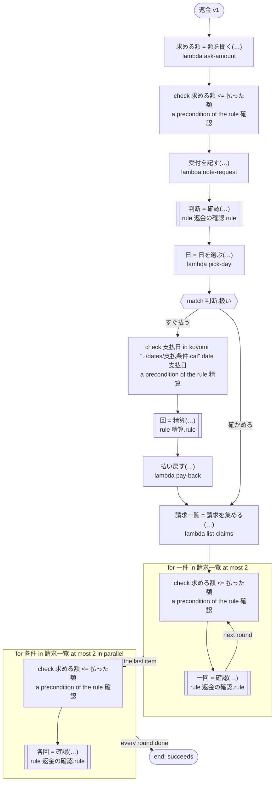

# 返金 v1

返金をすぐに払うか確かめに回し、支払日に精算する。規則の前提は、ここでは ritsu が決められない（求める額と日が、範囲の無いタスクの結果から来る）ので、ワークフローが値のできたところですぐに確かめる。答えたタスクの直後、規則を呼ぶ分岐の始め、イテレーションの始めで確かめる。どのプラットフォームでも動く

`tests/flows/preconditions.ja.flow`, drawn by `dandori doc`. Inputs: `注文: string`, `払った額: int`.

## flow



A rectangle is a task, one with a line down each side a rule, a slanted one a task whose value comes from outside (an event, or the answer to a callback), a hexagon a `match`, a rounded box a wait, and a box around steps a loop. A dashed arrow is an error the call handles.

## Calls

| Line | Call | Calls | Retries | Timeout | When it fails |
|---:|---|---|---|---|---|
| 39 | `求める額 = 額を聞く(…)` | `lambda ask-amount`, `idempotent` | — | — | `timeout`, `failure` → the workflow fails |
| 40 | `受付を記す(…)` | `lambda note-request`, `idempotent` | — | — | `timeout`, `failure` → the workflow fails |
| 41 | `判断 = 確認(…)` | rule `返金の確認.rule` | 2 times, after 1 second and 2 (failure) | — | `timeout`, `failure` → the workflow fails |
| 42 | `日 = 日を選ぶ(…)` | `lambda pick-day`, `idempotent` | — | — | `timeout`, `failure` → the workflow fails |
| 46 | `回 = 精算(…)` | rule `精算.rule` | 2 times, after 1 second and 2 (failure) | — | `timeout`, `failure` → the workflow fails |
| 47 | `払い戻す(…)` | `lambda pay-back`, `key` | — | — | `timeout`, `failure` → the workflow fails |
| 49 | `請求一覧 = 請求を集める(…)` | `lambda list-claims`, `idempotent` | — | — | `timeout`, `failure` → the workflow fails |
| 52 | `一回 = 確認(…)` | rule `返金の確認.rule` | 2 times, after 1 second and 2 (failure) | — | `timeout`, `failure` → the workflow fails |
| 54 | `各回 = 確認(…)` | rule `返金の確認.rule` | 2 times, after 1 second and 2 (failure) | — | `timeout`, `failure` → the round fails, and then the workflow |

## Ends

Every way the workflow can end.

| Line | End |
|---:|---|
| 54 | the flow runs to its end, and the workflow succeeds |

## Rules

The rules this workflow calls, as `rulec doc` renders them for whoever approves them.

<details>
<summary><code>確認</code> · 返金の確認 v1 · <code>rules/返金の確認.rule</code></summary>

<!-- Generated by rulec 0.23.0 from 返金の確認.rule (sha256:1fa3e261e2c7). This is a read-only rendering; the source of truth is the .rule file. Edits cannot be carried back (§1.6). -->
# Rule 返金の確認 v1

返金をすぐに払うか、確かめに回すか。返金は払った額を超えないことを、規則は前提にする。求める額が範囲の無いタスクの結果から来るところでは、dandori はこの前提を示せないので、ワークフローが走るときに確かめる（tests/flows/preconditions.ja.flow）

## Inputs

| Name | Type | Range | Notes |
|---|---|---|---|
| 払った額 | number | 0 to 10_000 |  |
| 求める額 | number | 0 to 10_000 |  |

## Outputs

| Name | Type | Rounding | Notes |
|---|---|---|---|
| 扱い | 扱い (2 values) |  |  |

## Types

An enum is a **closed** finite set. Add a value, and every table that does not look at it fails the completeness check.

- **扱い** (2 values) — すぐ払う, 確かめる

## Combinations that do not happen

Relations between inputs that the caller guarantees. **The checks believed them and demanded no row for the combinations they exclude**, and the generated code refuses such an input at the door.

- `求める額 <= 払った額`


## Table 選ぶ (policy unique)

| Column | Source |
|---|---|
| 求める額 | Input |
| → 扱い | Output of this rule |

| # | 求める額 | → 扱い (扱い) |
|---|---|---|
| 1 | <=100 | すぐ払う |
| 2 | >100 | 確かめる |

**What `rulec check` verified**

- Every combination of inputs matches some row (E101 completeness)
- There is no row that can never match (E102 unreachable row)
- No input matches two or more rows at once (E105 overlap). Reordering the rows does not change the meaning

## Examples (verified)

| 払った額 | 求める額 | → 扱い |
|---|---|---|
| 500 | 100 | すぐ払う |
| 500 | 300 | 確かめる |

`rulec check` ran these 2 examples through the reference evaluator, and every one produced the declared values (E107). The examples are an **executable specification**.

</details>

<details>
<summary><code>精算</code> · 精算 v1 · <code>rules/精算.rule</code></summary>

<!-- Generated by rulec 0.23.0 from 精算.rule (sha256:2707c4c4a6fe). This is a read-only rendering; the source of truth is the .rule file. Edits cannot be carried back (§1.6). -->
# Rule 精算 v1

支払日が入る精算の回。日は 支払条件.cal が払う日なので、表はその日だけを書き、あいだの日は書かない。dandori は日の範囲を運ばないので、渡す日はワークフローが走るときに確かめる（tests/flows/preconditions.ja.flow）

## Inputs

| Name | Type | Range | Notes |
|---|---|---|---|
| 支払日 | date | 2026-02-10 to 2027-01-10 | Only the days `koyomi "../dates/支払条件.cal" date 支払日` comes to (12 days: 2026-02-10, 2026-03-10, 2026-04-10, 2026-05-10, 2026-06-10, 2026-07-10, 2026-08-10, 2026-09-10, 2026-10-10, 2026-11-10, 2026-12-10, 2027-01-10). The tables are checked over these days; the generated code refuses any other day at its door |

## Outputs

| Name | Type | Rounding | Notes |
|---|---|---|---|
| 精算の回 | 回 (3 values) |  |  |

## Types

An enum is a **closed** finite set. Add a value, and every table that does not look at it fails the completeness check.

- **回** (3 values) — 前半, 後半, 年末

## Table 選ぶ (policy unique)

| Column | Source |
|---|---|
| 支払日 | Input |
| → 精算の回 | Output of this rule |

| # | 支払日 | → 精算の回 (回) |
|---|---|---|
| 1 | <=2026-06-30 | 前半 |
| 2 | >=2026-07-10 <=2026-12-10 | 後半 |
| 3 | >=2027-01-01 | 年末 |

**What `rulec check` verified**

- Every combination of inputs matches some row (E101 completeness)
- There is no row that can never match (E102 unreachable row)
- No input matches two or more rows at once (E105 overlap). Reordering the rows does not change the meaning

## Examples (verified)

| 支払日 | → 精算の回 |
|---|---|
| 2026-02-10 | 前半 |
| 2026-07-10 | 後半 |
| 2027-01-10 | 年末 |

`rulec check` ran these 3 examples through the reference evaluator, and every one produced the declared values (E107). The examples are an **executable specification**.

</details>

## What check says

What `dandori check` says of this workflow, each with the run that gets there.

```text
warning[W104]: tests/flows/preconditions.ja.flow:41:1: nothing says what range `求める額` is in (the answer of `額を聞く` has no range), and `求める額` of the rule `確認` takes `>=0 <=10000`
    41 |   let 判断 = 確認(払った額: 払った額, 求める額: 求める額)
warning[W104]: tests/flows/preconditions.ja.flow:52:1: nothing says what range `一件.求める額` is in (the field `求める額` of `請求` has no range), and `求める額` of the rule `確認` takes `>=0 <=10000`
    52 |     let 一回 = 確認(払った額: 払った額, 求める額: 一件.求める額)
warning[W104]: tests/flows/preconditions.ja.flow:54:1: nothing says what range `各件.求める額` is in (the field `求める額` of `請求` has no range), and `求める額` of the rule `確認` takes `>=0 <=10000`
    54 |     let 各回 = 確認(払った額: 払った額, 求める額: 各件.求める額)
```
