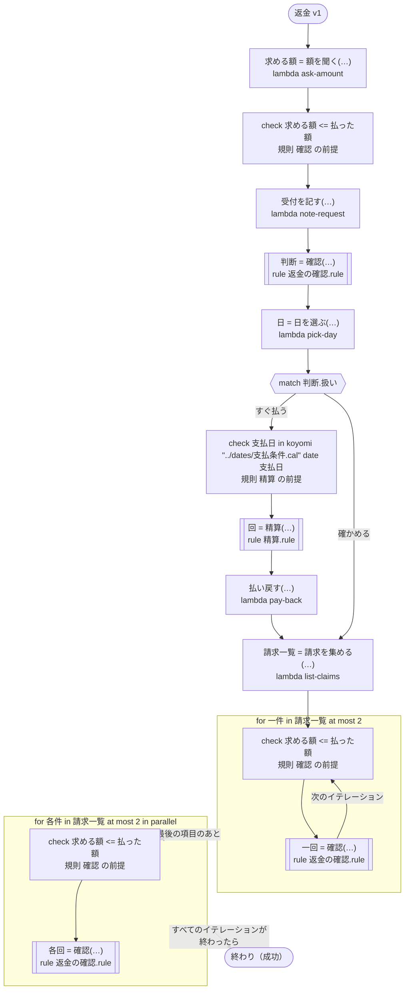

# 返金 v1

返金をすぐに払うか確かめに回し、支払日に精算する。規則の前提は、ここでは ritsu が決められない（求める額と日が、範囲の無いタスクの結果から来る）ので、ワークフローが値のできたところですぐに確かめる。答えたタスクの直後、規則を呼ぶ分岐の始め、イテレーションの始めで確かめる。どのプラットフォームでも動く

`tests/flows/preconditions.ja.flow` を `dandori doc` で描いたものです。入力は `注文: string`, `払った額: int` です。

## flow



四角はタスク、両脇に線のある四角は規則、斜めの四角は外から値が届くタスク（イベントやコールバックの応答）、六角形は `match`、角の丸い四角は待ち、ステップを囲む枠はループです。破線の矢印は、呼び出しがその場で処理するエラーです。

## 呼び出し

| 行 | 呼び出し | 呼ぶもの | リトライ | タイムアウト | 失敗したとき |
|---:|---|---|---|---|---|
| 39 | `求める額 = 額を聞く(…)` | `lambda ask-amount`, `idempotent` | — | — | `timeout`, `failure` → ワークフローが失敗する |
| 40 | `受付を記す(…)` | `lambda note-request`, `idempotent` | — | — | `timeout`, `failure` → ワークフローが失敗する |
| 41 | `判断 = 確認(…)` | 規則 `返金の確認.rule` | 2 回（1 秒後と 2 秒後、failure） | — | `timeout`, `failure` → ワークフローが失敗する |
| 42 | `日 = 日を選ぶ(…)` | `lambda pick-day`, `idempotent` | — | — | `timeout`, `failure` → ワークフローが失敗する |
| 46 | `回 = 精算(…)` | 規則 `精算.rule` | 2 回（1 秒後と 2 秒後、failure） | — | `timeout`, `failure` → ワークフローが失敗する |
| 47 | `払い戻す(…)` | `lambda pay-back`, `key` | — | — | `timeout`, `failure` → ワークフローが失敗する |
| 49 | `請求一覧 = 請求を集める(…)` | `lambda list-claims`, `idempotent` | — | — | `timeout`, `failure` → ワークフローが失敗する |
| 52 | `一回 = 確認(…)` | 規則 `返金の確認.rule` | 2 回（1 秒後と 2 秒後、failure） | — | `timeout`, `failure` → ワークフローが失敗する |
| 54 | `各回 = 確認(…)` | 規則 `返金の確認.rule` | 2 回（1 秒後と 2 秒後、failure） | — | `timeout`, `failure` → そのイテレーションが失敗し、ワークフローも失敗する |

## 終わり方

ワークフローの終わり方のすべてです。

| 行 | 終わり方 |
|---:|---|
| 54 | flow が最後まで走り、ワークフローは成功する |

## 規則

このワークフローが呼ぶ規則を、`rulec doc` が承認する人向けに描いたものです。

<details>
<summary><code>確認</code> · 返金の確認 v1 · <code>rules/返金の確認.rule</code></summary>

<!-- rulec 0.23.0 が 返金の確認.rule (sha256:1fa3e261e2c7) から生成。これは読み取り専用の資料で、本物は .rule のほうです。編集しても戻せません（§1.6）。 -->
# 規則 返金の確認 v1

返金をすぐに払うか、確かめに回すか。返金は払った額を超えないことを、規則は前提にする。求める額が範囲の無いタスクの結果から来るところでは、dandori はこの前提を示せないので、ワークフローが走るときに確かめる（tests/flows/preconditions.ja.flow）

## 入力

| 名前 | 型 | 範囲 | 注記 |
|---|---|---|---|
| 払った額 | number | 0 〜 1万 |  |
| 求める額 | number | 0 〜 1万 |  |

## 出力

| 名前 | 型 | 丸め | 注記 |
|---|---|---|---|
| 扱い | 扱い（2 値） |  |  |

## 型

列挙は**閉じた**有限集合です。値を足すと、それを見ていない表が完全性検査で割れます。

- **扱い**（2 値）— すぐ払う、確かめる

## 起きない組み合わせ

呼び出し側が保証する、入力どうしの関係です。**検査はこれを信じて、満たさない組み合わせには行を要求していません。** 生成コードは、満たさない入力を入口で断ります。

- `求める額 <= 払った額`


## 表 選ぶ（policy unique）

| 列 | 出どころ |
|---|---|
| 求める額 | 入力 |
| → 扱い | この規則の出力 |

| # | 求める額 | → 扱い（扱い） |
|---|---|---|
| 1 | <=100 | すぐ払う |
| 2 | >100 | 確かめる |

**`rulec check` が確かめたこと**

- どの入力の組合せも、いずれかの行に当てはまります（E101 完全性）
- どの入力にも当てはまらない行はありません（E102）
- 二つ以上の行に同時に当てはまる入力はありません（E105 重なり）。行の並べ替えは意味を変えません

## 例（検証済み）

| 払った額 | 求める額 | → 扱い |
|---|---|---|
| 500 | 100 | すぐ払う |
| 500 | 300 | 確かめる |

この 2 件は `rulec check` が参照評価器で実行し、すべて宣言どおりの値になりました（E107）。例は**実行される仕様**です。

</details>

<details>
<summary><code>精算</code> · 精算 v1 · <code>rules/精算.rule</code></summary>

<!-- rulec 0.23.0 が 精算.rule (sha256:2707c4c4a6fe) から生成。これは読み取り専用の資料で、本物は .rule のほうです。編集しても戻せません（§1.6）。 -->
# 規則 精算 v1

支払日が入る精算の回。日は 支払条件.cal が払う日なので、表はその日だけを書き、あいだの日は書かない。dandori は日の範囲を運ばないので、渡す日はワークフローが走るときに確かめる（tests/flows/preconditions.ja.flow）

## 入力

| 名前 | 型 | 範囲 | 注記 |
|---|---|---|---|
| 支払日 | date | 2026-02-10 〜 2027-01-10 | `koyomi "../dates/支払条件.cal" date 支払日` がとる日だけ（12 日: 2026-02-10, 2026-03-10, 2026-04-10, 2026-05-10, 2026-06-10, 2026-07-10, 2026-08-10, 2026-09-10, 2026-10-10, 2026-11-10, 2026-12-10, 2027-01-10）。表はこの日の上で確かめ、ほかの日は生成コードが入口で断ります |

## 出力

| 名前 | 型 | 丸め | 注記 |
|---|---|---|---|
| 精算の回 | 回（3 値） |  |  |

## 型

列挙は**閉じた**有限集合です。値を足すと、それを見ていない表が完全性検査で割れます。

- **回**（3 値）— 前半、後半、年末

## 表 選ぶ（policy unique）

| 列 | 出どころ |
|---|---|
| 支払日 | 入力 |
| → 精算の回 | この規則の出力 |

| # | 支払日 | → 精算の回（回） |
|---|---|---|
| 1 | <=2026-06-30 | 前半 |
| 2 | >=2026-07-10 <=2026-12-10 | 後半 |
| 3 | >=2027-01-01 | 年末 |

**`rulec check` が確かめたこと**

- どの入力の組合せも、いずれかの行に当てはまります（E101 完全性）
- どの入力にも当てはまらない行はありません（E102）
- 二つ以上の行に同時に当てはまる入力はありません（E105 重なり）。行の並べ替えは意味を変えません

## 例（検証済み）

| 支払日 | → 精算の回 |
|---|---|
| 2026-02-10 | 前半 |
| 2026-07-10 | 後半 |
| 2027-01-10 | 年末 |

この 3 件は `rulec check` が参照評価器で実行し、すべて宣言どおりの値になりました（E107）。例は**実行される仕様**です。

</details>

## 検査の結果

`dandori check` の結果です。それぞれにそうなる例が付いています。

```text
警告[W104]: tests/flows/preconditions.ja.flow:41:1: `求める額` の範囲が分かりません（`額を聞く` の結果に範囲がありません）。規則 `確認` の `求める額` が受け取るのは `>=0 <=10000` です
    41 |   let 判断 = 確認(払った額: 払った額, 求める額: 求める額)
警告[W104]: tests/flows/preconditions.ja.flow:52:1: `一件.求める額` の範囲が分かりません（`請求` のフィールド `求める額` に範囲がありません）。規則 `確認` の `求める額` が受け取るのは `>=0 <=10000` です
    52 |     let 一回 = 確認(払った額: 払った額, 求める額: 一件.求める額)
警告[W104]: tests/flows/preconditions.ja.flow:54:1: `各件.求める額` の範囲が分かりません（`請求` のフィールド `求める額` に範囲がありません）。規則 `確認` の `求める額` が受け取るのは `>=0 <=10000` です
    54 |     let 各回 = 確認(払った額: 払った額, 求める額: 各件.求める額)
```
