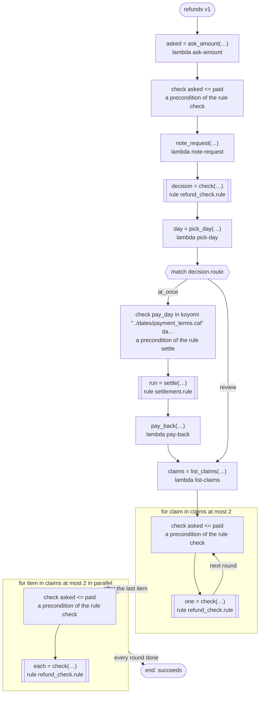

# refunds v1

Pays a refund back at once or sends it to review, and settles it on a payment day. ritsu cannot decide the rules' preconditions here (the amount asked and the day come from tasks with no range), so the workflow checks each as soon as its values are made: right after the task that answers them, at the start of the arm that calls the rule, at the start of each round. Runs on every platform

`tests/flows/preconditions.flow`, drawn by `dandori doc`. Inputs: `order: string`, `paid: int`.

## flow



A rectangle is a task, one with a line down each side a rule, a slanted one a task whose value comes from outside (an event, or the answer to a callback), a hexagon a `match`, a rounded box a wait, and a box around steps a loop. A dashed arrow is an error the call handles.

## Calls

| Line | Call | Calls | Retries | Timeout | When it fails |
|---:|---|---|---|---|---|
| 39 | `asked = ask_amount(…)` | `lambda ask-amount`, `idempotent` | — | — | `timeout`, `failure` → the workflow fails |
| 40 | `note_request(…)` | `lambda note-request`, `idempotent` | — | — | `timeout`, `failure` → the workflow fails |
| 41 | `decision = check(…)` | rule `refund_check.rule` | 2 times, after 1 second and 2 (failure) | — | `timeout`, `failure` → the workflow fails |
| 42 | `day = pick_day(…)` | `lambda pick-day`, `idempotent` | — | — | `timeout`, `failure` → the workflow fails |
| 46 | `run = settle(…)` | rule `settlement.rule` | 2 times, after 1 second and 2 (failure) | — | `timeout`, `failure` → the workflow fails |
| 47 | `pay_back(…)` | `lambda pay-back`, `key` | — | — | `timeout`, `failure` → the workflow fails |
| 49 | `claims = list_claims(…)` | `lambda list-claims`, `idempotent` | — | — | `timeout`, `failure` → the workflow fails |
| 52 | `one = check(…)` | rule `refund_check.rule` | 2 times, after 1 second and 2 (failure) | — | `timeout`, `failure` → the workflow fails |
| 54 | `each = check(…)` | rule `refund_check.rule` | 2 times, after 1 second and 2 (failure) | — | `timeout`, `failure` → the round fails, and then the workflow |

## Ends

Every way the workflow can end.

| Line | End |
|---:|---|
| 54 | the flow runs to its end, and the workflow succeeds |

## Rules

The rules this workflow calls, each as the page for people that `rulec doc` renders.

<details>
<summary><code>check</code> · refund_check v1 · <code>rules/refund_check.rule</code></summary>

<!-- Generated by rulec 0.25.0 from refund_check.rule (sha256:e7003e2fa202). This is a read-only rendering; the source of truth is the .rule file. Edits cannot be carried back. -->
# Rule refund_check v1

Whether a refund is paid back at once or reviewed. A refund never asks for more than was paid, which the rule takes for granted: a precondition dandori cannot show where the amount asked comes from a task with no range, so the workflow checks it when it runs (tests/flows/preconditions.flow)

## Inputs

| Name | Type | Range | Notes |
|---|---|---|---|
| paid | number | 0 to 10_000 |  |
| asked | number | 0 to 10_000 |  |

## Outputs

| Name | Type | Rounding | Notes |
|---|---|---|---|
| route | path (2 values) |  |  |

## Types

An enum is a **closed** finite set. Add a value, and every table that does not look at it fails the completeness check.

- **path** (2 values) — at_once, review

## Combinations that do not happen

Relations between inputs that the caller guarantees. **The checks believed them and demanded no row for the combinations they exclude**, and the generated code refuses such an input at the door.

- `asked <= paid`


## Table pick (policy unique)

| Column | Source |
|---|---|
| asked | Input |
| → route | Output of this rule |

| # | asked | → route (path) |
|---|---|---|
| 1 | <=100 | at_once |
| 2 | >100 | review |

**What `rulec check` verified**

- Every combination of inputs matches some row (E101 completeness)
- There is no row that can never match (E102 unreachable row)
- No input matches two or more rows at once (E105 overlap). Reordering the rows does not change the meaning

## Examples (verified)

| paid | asked | → route |
|---|---|---|
| 500 | 100 | at_once |
| 500 | 300 | review |

`rulec check` ran these 2 examples through the reference evaluator, and every one produced the declared values (E107). The examples are an **executable specification**.

</details>

<details>
<summary><code>settle</code> · settlement v1 · <code>rules/settlement.rule</code></summary>

<!-- Generated by rulec 0.25.0 from settlement.rule (sha256:524fd7442add). This is a read-only rendering; the source of truth is the .rule file. Edits cannot be carried back. -->
# Rule settlement v1

The settlement run a payment day falls in. The days are the ones payment_terms.cal pays on, so the table names those and nothing in between; dandori carries no range of days, so the workflow checks the day it gives when it runs (tests/flows/preconditions.flow)

## Inputs

| Name | Type | Range | Notes |
|---|---|---|---|
| pay_day | date | 2026-02-10 to 2027-01-10 | Only the days `koyomi "../dates/payment_terms.cal" date payment` comes to (12 days: 2026-02-10, 2026-03-10, 2026-04-10, 2026-05-10, 2026-06-10, 2026-07-10, 2026-08-10, 2026-09-10, 2026-10-10, 2026-11-10, 2026-12-10, 2027-01-10). The tables are checked over these days; the generated code refuses any other day at its door |

## Outputs

| Name | Type | Rounding | Notes |
|---|---|---|---|
| batch | run (3 values) |  |  |

## Types

An enum is a **closed** finite set. Add a value, and every table that does not look at it fails the completeness check.

- **run** (3 values) — first_half, second_half, year_end

## Table pick (policy unique)

| Column | Source |
|---|---|
| pay_day | Input |
| → batch | Output of this rule |

| # | pay_day | → batch (run) |
|---|---|---|
| 1 | <=2026-06-30 | first_half |
| 2 | >=2026-07-10 <=2026-12-10 | second_half |
| 3 | >=2027-01-01 | year_end |

**What `rulec check` verified**

- Every combination of inputs matches some row (E101 completeness)
- There is no row that can never match (E102 unreachable row)
- No input matches two or more rows at once (E105 overlap). Reordering the rows does not change the meaning

## Examples (verified)

| pay_day | → batch |
|---|---|
| 2026-02-10 | first_half |
| 2026-07-10 | second_half |
| 2027-01-10 | year_end |

`rulec check` ran these 3 examples through the reference evaluator, and every one produced the declared values (E107). The examples are an **executable specification**.

</details>

## What check says

What `dandori check` says of this workflow, each with the run that gets there.

```text
warning[W104]: tests/flows/preconditions.flow:41:1: nothing says what range `asked` is in (the answer of `ask_amount` has no range), and `asked` of the rule `check` takes `>=0 <=10000`
    41 |   let decision = check(paid: paid, asked: asked)
warning[W104]: tests/flows/preconditions.flow:52:1: nothing says what range `claim.asked` is in (the field `asked` of `Claim` has no range), and `asked` of the rule `check` takes `>=0 <=10000`
    52 |     let one = check(paid: paid, asked: claim.asked)
warning[W104]: tests/flows/preconditions.flow:54:1: nothing says what range `item.asked` is in (the field `asked` of `Claim` has no range), and `asked` of the rule `check` takes `>=0 <=10000`
    54 |     let each = check(paid: paid, asked: item.asked)
```
