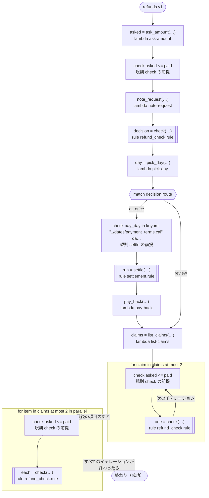

# refunds v1

Pays a refund back at once or sends it to review, and settles it on a payment day. ritsu cannot decide the rules' preconditions here (the amount asked and the day come from tasks with no range), so the workflow checks each as soon as its values are made: right after the task that answers them, at the start of the arm that calls the rule, at the start of each round. Runs on every platform

`tests/flows/preconditions.flow` を `dandori doc` で描いたものです。入力は `order: string`・`paid: int` です。

## flow



四角はタスク、両脇に線のある四角は規則、斜めの四角は外から値が届くタスク（イベントやコールバックの応答）、六角形は `match`、角の丸い四角は待ち、ステップを囲む枠はループです。破線の矢印は、呼び出しがその場で処理するエラーです。

## 呼び出し

| 行 | 呼び出し | 呼ぶもの | リトライ | タイムアウト | 失敗したとき |
|---:|---|---|---|---|---|
| 39 | `asked = ask_amount(…)` | `lambda ask-amount`・`idempotent` | — | — | `timeout`・`failure` → ワークフローが失敗する |
| 40 | `note_request(…)` | `lambda note-request`・`idempotent` | — | — | `timeout`・`failure` → ワークフローが失敗する |
| 41 | `decision = check(…)` | 規則 `refund_check.rule` | 1 秒後と 2 秒後の 2 回（failure） | — | `timeout`・`failure` → ワークフローが失敗する |
| 42 | `day = pick_day(…)` | `lambda pick-day`・`idempotent` | — | — | `timeout`・`failure` → ワークフローが失敗する |
| 46 | `run = settle(…)` | 規則 `settlement.rule` | 1 秒後と 2 秒後の 2 回（failure） | — | `timeout`・`failure` → ワークフローが失敗する |
| 47 | `pay_back(…)` | `lambda pay-back`・`key` | — | — | `timeout`・`failure` → ワークフローが失敗する |
| 49 | `claims = list_claims(…)` | `lambda list-claims`・`idempotent` | — | — | `timeout`・`failure` → ワークフローが失敗する |
| 52 | `one = check(…)` | 規則 `refund_check.rule` | 1 秒後と 2 秒後の 2 回（failure） | — | `timeout`・`failure` → ワークフローが失敗する |
| 54 | `each = check(…)` | 規則 `refund_check.rule` | 1 秒後と 2 秒後の 2 回（failure） | — | `timeout`・`failure` → そのイテレーションが失敗し、ワークフローも失敗する |

## 終わり方

ワークフローの終わり方のすべてです。

| 行 | 終わり方 |
|---:|---|
| 54 | flow が最後まで走り、ワークフローは成功する |

## 規則

このワークフローが呼ぶ規則を、`rulec doc` が承認する人向けに描いたものです。

<details>
<summary><code>check</code> · refund_check v1 · <code>rules/refund_check.rule</code></summary>

<!-- rulec 0.23.0 が refund_check.rule (sha256:e7003e2fa202) から生成。これは読み取り専用の資料で、本物は .rule のほうです。編集しても戻せません（§1.6）。 -->
# 規則 refund_check v1

Whether a refund is paid back at once or reviewed. A refund never asks for more than was paid, which the rule takes for granted: a precondition dandori cannot show where the amount asked comes from a task with no range, so the workflow checks it when it runs (tests/flows/preconditions.flow)

## 入力

| 名前 | 型 | 範囲 | 注記 |
|---|---|---|---|
| paid | number | 0 〜 1万 |  |
| asked | number | 0 〜 1万 |  |

## 出力

| 名前 | 型 | 丸め | 注記 |
|---|---|---|---|
| route | path（2 値） |  |  |

## 型

列挙は**閉じた**有限集合です。値を足すと、それを見ていない表が完全性検査で割れます。

- **path**（2 値）— at_once、review

## 起きない組み合わせ

呼び出し側が保証する、入力どうしの関係です。**検査はこれを信じて、満たさない組み合わせには行を要求していません。** 生成コードは、満たさない入力を入口で断ります。

- `asked <= paid`


## 表 pick（policy unique）

| 列 | 出どころ |
|---|---|
| asked | 入力 |
| → route | この規則の出力 |

| # | asked | → route（path） |
|---|---|---|
| 1 | <=100 | at_once |
| 2 | >100 | review |

**`rulec check` が確かめたこと**

- どの入力の組合せも、いずれかの行に当てはまります（E101 完全性）
- どの入力にも当てはまらない行はありません（E102）
- 二つ以上の行に同時に当てはまる入力はありません（E105 重なり）。行の並べ替えは意味を変えません

## 例（検証済み）

| paid | asked | → route |
|---|---|---|
| 500 | 100 | at_once |
| 500 | 300 | review |

この 2 件は `rulec check` が参照評価器で実行し、すべて宣言どおりの値になりました（E107）。例は**実行される仕様**です。

</details>

<details>
<summary><code>settle</code> · settlement v1 · <code>rules/settlement.rule</code></summary>

<!-- rulec 0.23.0 が settlement.rule (sha256:524fd7442add) から生成。これは読み取り専用の資料で、本物は .rule のほうです。編集しても戻せません（§1.6）。 -->
# 規則 settlement v1

The settlement run a payment day falls in. The days are the ones payment_terms.cal pays on, so the table names those and nothing in between; dandori carries no range of days, so the workflow checks the day it gives when it runs (tests/flows/preconditions.flow)

## 入力

| 名前 | 型 | 範囲 | 注記 |
|---|---|---|---|
| pay_day | date | 2026-02-10 〜 2027-01-10 | `koyomi "../dates/payment_terms.cal" date payment` がとる日だけ（12 日: 2026-02-10, 2026-03-10, 2026-04-10, 2026-05-10, 2026-06-10, 2026-07-10, 2026-08-10, 2026-09-10, 2026-10-10, 2026-11-10, 2026-12-10, 2027-01-10）。表はこの日の上で確かめ、ほかの日は生成コードが入口で断ります |

## 出力

| 名前 | 型 | 丸め | 注記 |
|---|---|---|---|
| batch | run（3 値） |  |  |

## 型

列挙は**閉じた**有限集合です。値を足すと、それを見ていない表が完全性検査で割れます。

- **run**（3 値）— first_half、second_half、year_end

## 表 pick（policy unique）

| 列 | 出どころ |
|---|---|
| pay_day | 入力 |
| → batch | この規則の出力 |

| # | pay_day | → batch（run） |
|---|---|---|
| 1 | <=2026-06-30 | first_half |
| 2 | >=2026-07-10 <=2026-12-10 | second_half |
| 3 | >=2027-01-01 | year_end |

**`rulec check` が確かめたこと**

- どの入力の組合せも、いずれかの行に当てはまります（E101 完全性）
- どの入力にも当てはまらない行はありません（E102）
- 二つ以上の行に同時に当てはまる入力はありません（E105 重なり）。行の並べ替えは意味を変えません

## 例（検証済み）

| pay_day | → batch |
|---|---|
| 2026-02-10 | first_half |
| 2026-07-10 | second_half |
| 2027-01-10 | year_end |

この 3 件は `rulec check` が参照評価器で実行し、すべて宣言どおりの値になりました（E107）。例は**実行される仕様**です。

</details>

## 検査の結果

`dandori check` の結果です。それぞれにそうなる例が付いています。

```text
警告[W104]: tests/flows/preconditions.flow:41:1: `asked` の範囲が分かりません（`ask_amount` の結果に範囲がありません）。規則 `check` の `asked` が受け取るのは `>=0 <=10000` です
    41 |   let decision = check(paid: paid, asked: asked)
警告[W104]: tests/flows/preconditions.flow:52:1: `claim.asked` の範囲が分かりません（`Claim` のフィールド `asked` に範囲がありません）。規則 `check` の `asked` が受け取るのは `>=0 <=10000` です
    52 |     let one = check(paid: paid, asked: claim.asked)
警告[W104]: tests/flows/preconditions.flow:54:1: `item.asked` の範囲が分かりません（`Claim` のフィールド `asked` に範囲がありません）。規則 `check` の `asked` が受け取るのは `>=0 <=10000` です
    54 |     let each = check(paid: paid, asked: item.asked)
```
