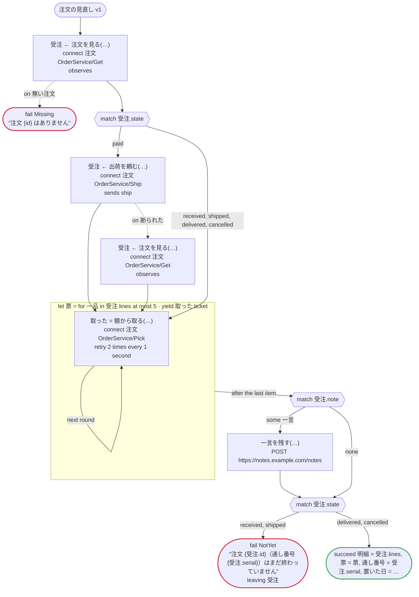
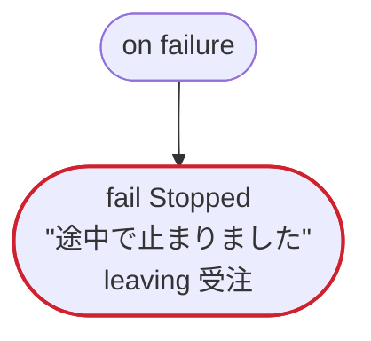
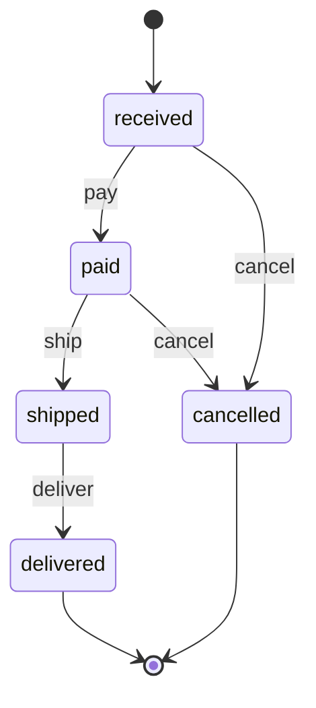

# 注文の見直し v1

注文の記述（.proto）から型を作る：メッセージと列挙をそのまま型に使い、案件の状態を .proto の列挙で運ぶ。範囲のある数、省かれたゼロ値、文字列で来る 64 ビットの整数、日時、`optional` の項目を通す。.proto の列挙の値は ASCII の識別子なので、ステートマシンには英語の規則 order_state を使う

`tests/flows/proto_types.flow`, drawn by `dandori doc`. Inputs: `id: string`. Outputs: `明細: list[注文.Line]`, `票: list[string]`, `通し番号: string`, `置いた日: timestamp?`.

## flow

A rectangle is a task, one with a line down each side a rule, a slanted one a task whose value comes from outside (an event, or the answer to a callback), a hexagon a `match`, a rounded box a wait, and a box around steps a loop. A dashed arrow is an error the call handles.

## on failure

Runs when a call fails and nothing at the call handles the error: from the calls on lines 51, 55, 56, 59 and 62. When it runs to its end, the workflow fails with that error.

## Calls

| Line | Call | Calls | Retries | Timeout | When it fails | Case after |
|---:|---|---|---|---|---|---|
| 51 | `受注 ← 注文を見る(…)` | `connect 注文 OrderService/Get`, `observes`, `idempotent` | — | — | `無い注文` → line 52 `timeout`, `failure` → `on failure` | `受注`: `received`, `paid`, `shipped`, `delivered`, `cancelled` |
| 55 | `受注 ← 出荷を頼む(…)` | `connect 注文 OrderService/Ship`, `sends ship`, `key` | — | — | `断られた` → line 56 `timeout`, `failure` → `on failure` | `受注`: `shipped` |
| 56 | `受注 ← 注文を見る(…)` | `connect 注文 OrderService/Get`, `observes`, `idempotent` | — | — | `無い注文`, `timeout`, `failure` → `on failure` | `受注`: `cancelled` |
| 59 | `取った = 棚から取る(…)` | `connect 注文 OrderService/Pick`, `key` | 2 times every 1 second (failure, timeout) | — | `timeout`, `failure` → `on failure` | — |
| 62 | `一言を残す(…)` | `POST https://notes.example.com/notes`, `idempotent` | — | — | `timeout`, `failure` → `on failure` | — |

## Ends

Every way the workflow can end, and what each case can be then, the events on the other side included.

| Line | End | `受注` |
|---:|---|---|
| 52 | `fail Missing` "注文 {id} はありません" | not started |
| 66 | `fail NotYet` "注文 {受注.id}（通し番号 {受注.serial}）はまだ終わっていません" `leaving 受注` | handed over as it is: `received`, `paid`, `shipped`, `delivered`, `cancelled` |
| 67 | `succeed 明細 = 受注.lines, 票 = 票, 通し番号 = 受注.serial, 置いた日 = 受注.placedAt` | `delivered`, `cancelled` |
| 70 | `fail Stopped` "途中で止まりました" `leaving 受注` | handed over as it is: not started, or `received`, `paid`, `shipped`, `delivered`, `cancelled` |

## Rules

The rules this workflow calls, as `rulec doc` renders them for whoever approves them.

<code>order_state</code> · order_state v1 · <code>../../examples/order/rules/order_state.rule</code>

<!-- Generated by rulec 0.22.0 from order_state.rule (sha256:5b6ae1fbd5cf). This is a read-only rendering; the source of truth is the .rule file. Edits cannot be carried back (§1.6). -->
# Rule order_state v1

Where an online order goes on a payment, a shipment, a delivery or a request to cancel it, and how much is refunded. The caller keeps the state; the rule decides one event at a time. Written for the example

## Inputs

| Name | Type | Range | Notes |
|---|---|---|---|
| state | state (5 values) |  |  |
| event | event (4 values) |  |  |
| amount_paid | money[JPY, incl_tax] | 0JPY 〜 100万JPY |  |

## Outputs

| Name | Type | Rounding | Notes |
|---|---|---|---|
| next_state | state (5 values) |  |  |
| refund | money[JPY, incl_tax] | down(1JPY) |  |
| accepted | bool |  |  |

## Types

An enum is a **closed** finite set. Add a value, and every table that does not look at it fails the completeness check.

- **state** (5 values) — received, paid, shipped, delivered, cancelled
- **event** (4 values) — pay, ship, deliver, cancel

## Table step (policy unique)

| Column | Source |
|---|---|
| state | Input |
| event | Input |
| → next_state | Output of this rule |
| → refund | Output of this rule |
| → accepted | Output of this rule |

| # | state | event | → next_state (state) | → refund (money[JPY, incl_tax] / down(1JPY)) | → accepted (bool) | Notes |
|---|---|---|---|---|---|---|
| 1 | received | pay | paid | 0JPY | true |  |
| 2 | received | cancel | cancelled | 0JPY | true |  |
| 3 | received | ship, deliver | state | 0JPY | false |  |
| 4 | paid | ship | shipped | 0JPY | true |  |
| 5 | paid | cancel | cancelled | amount_paid | true |  |
| 6 | paid | pay, deliver | state | 0JPY | false |  |
| 7 | shipped | deliver | delivered | 0JPY | true |  |
| 8 | shipped | pay, ship, cancel | state | 0JPY | false | a cancel after the shipment goes through a return |
| 9 | delivered | - | state | 0JPY | false |  |
| 10 | cancelled | - | state | 0JPY | false | a payment that comes after a cancel does not bring the order back |

**What `rulec check` verified**

- Every combination of inputs matches some row (E101 completeness)
- There is no row that can never match (E102 unreachable row)
- No input matches two or more rows at once (E105 overlap). Reordering the rows does not change the meaning

## State machine: order

This rule is one step of a state machine. Every call is passed the state (input state) and answers the next one (output next_state). **The caller keeps the state; the generated code keeps nothing.** Where a case goes is decided by table step.

| Initial state | Final states |
|---|---|
| received | delivered, cancelled |

One case passes amount_paid with the same value from its first call to its last (`held`). The claims below are about the sequences of calls that keep it.

### Where each state goes

| State | Goes to (row of table step) |
|---|---|
| received | pay（row 1） → paid / cancel（row 2） → cancelled / ship, deliver（row 3） → stays |
| paid | ship（row 4） → shipped / cancel（row 5） → cancelled / pay, deliver（row 6） → stays |
| shipped | deliver（row 7） → delivered / pay, ship, cancel（row 8） → stays |
| delivered | any call（row 9） → stays |
| cancelled | any call（row 10） → stays |

### What `rulec check` proved about every sequence of calls

- From received a case can reach received, paid, shipped, delivered, cancelled. Every state is reached.
- No call moves a case out of the final states delivered, cancelled.
- Whatever state a case reaches, a way to a final state remains.
- `never shipped after cancelled`: no sequence of calls reaches shipped after cancelled.
- `once refund >0JPY`: refund is answered >0JPY at most once in a case.

### Scenarios (verified)

**delivered**

| # | state | event | amount_paid | → next_state | refund | accepted |
|---|---|---|---|---|---|---|
| 1 | received | pay | 3000JPY | paid | 0JPY | true |
| 2 | paid | ship | 3000JPY | shipped | 0JPY | true |
| 3 | shipped | deliver | 3000JPY | delivered | 0JPY | true |

**late_pay**

| # | state | event | amount_paid | → next_state | refund | accepted |
|---|---|---|---|---|---|---|
| 1 | received | pay | 3000JPY | paid | 0JPY | true |
| 2 | paid | cancel | 3000JPY | cancelled | 3000JPY | true |
| 3 | cancelled | pay | 3000JPY | cancelled | 0JPY | false |

The first call starts in received, and every later one in the state the call before it answered (the left column). `rulec check` ran them in order through the reference evaluator, and every one produced the declared values (E107).

## Examples (verified)

| state | event | amount_paid | → next_state | refund | accepted |
|---|---|---|---|---|---|
| received | cancel | 0JPY | cancelled | 0JPY | true |
| shipped | cancel | 3000JPY | shipped | 0JPY | false |

`rulec check` ran these 2 examples through the reference evaluator, and every one produced the declared values (E107). The examples are an **executable specification**.

