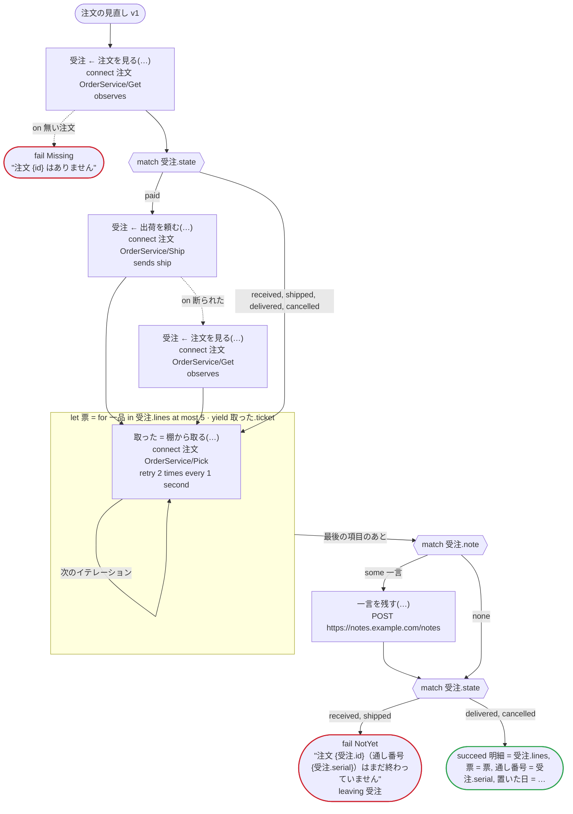
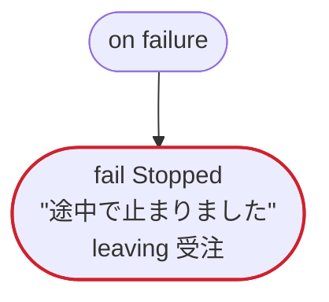
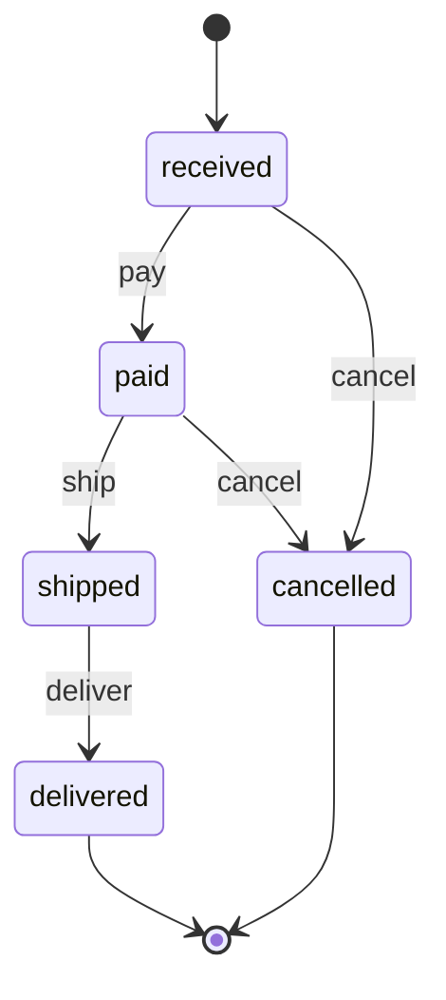

# 注文の見直し v1

注文の記述（.proto）から型を作る：メッセージと列挙をそのまま型に使い、案件の状態を .proto の列挙で運ぶ。範囲のある数、省かれたゼロ値、文字列で来る 64 ビットの整数、日時、`optional` の項目を通す。.proto の列挙の値は ASCII の識別子なので、ステートマシンには英語の規則 order_state を使う

`tests/flows/proto_types.flow` を `dandori doc` で描いたものです。入力は `id: string`、出力は `明細: list[注文.Line]`, `票: list[string]`, `通し番号: string`, `置いた日: timestamp?` です。

## flow

四角はタスク、両脇に線のある四角は規則、斜めの四角は外から値が届くタスク（イベントやコールバックの応答）、六角形は `match`、角の丸い四角は待ち、ステップを囲む枠はループです。破線の矢印は、呼び出しがその場で処理するエラーです。

## on failure

呼び出しが失敗し、そのエラーをその場で処理しないときに走ります（51・55・56・59・62 行目の呼び出しから）。最後まで走ると、ワークフローはそのエラーで失敗します。

## 呼び出し

| 行 | 呼び出し | 呼ぶもの | リトライ | タイムアウト | 失敗したとき | 呼び出しのあとの案件 |
|---:|---|---|---|---|---|---|
| 51 | `受注 ← 注文を見る(…)` | `connect 注文 OrderService/Get`, `observes`, `idempotent` | — | — | `無い注文` → 52 行目 `timeout`, `failure` → `on failure` | `受注`: `received`, `paid`, `shipped`, `delivered`, `cancelled` |
| 55 | `受注 ← 出荷を頼む(…)` | `connect 注文 OrderService/Ship`, `sends ship`, `key` | — | — | `断られた` → 56 行目 `timeout`, `failure` → `on failure` | `受注`: `shipped` |
| 56 | `受注 ← 注文を見る(…)` | `connect 注文 OrderService/Get`, `observes`, `idempotent` | — | — | `無い注文`, `timeout`, `failure` → `on failure` | `受注`: `cancelled` |
| 59 | `取った = 棚から取る(…)` | `connect 注文 OrderService/Pick`, `key` | 1 秒おきに 2 回（failure, timeout） | — | `timeout`, `failure` → `on failure` | — |
| 62 | `一言を残す(…)` | `POST https://notes.example.com/notes`, `idempotent` | — | — | `timeout`, `failure` → `on failure` | — |

## 終わり方

ワークフローの終わり方のすべてと、そのとき各案件がとりうる状態です。外部のサービスで起きるイベントも含めています。

| 行 | 終わり方 | `受注` |
|---:|---|---|
| 52 | `fail Missing` "注文 {id} はありません" | 始まっていない |
| 66 | `fail NotYet` "注文 {受注.id}（通し番号 {受注.serial}）はまだ終わっていません" `leaving 受注` | そのまま引き渡す: `received`, `paid`, `shipped`, `delivered`, `cancelled` |
| 67 | `succeed 明細 = 受注.lines, 票 = 票, 通し番号 = 受注.serial, 置いた日 = 受注.placedAt` | `delivered`, `cancelled` |
| 70 | `fail Stopped` "途中で止まりました" `leaving 受注` | そのまま引き渡す: 始まっていないか、`received`, `paid`, `shipped`, `delivered`, `cancelled` |

## 規則

このワークフローが呼ぶ規則を、`rulec doc` が承認する人向けに描いたものです。

<code>order_state</code> · order_state v1 · <code>../../examples/order/rules/order_state.rule</code>

<!-- rulec 0.22.0 が order_state.rule (sha256:5b6ae1fbd5cf) から生成。これは読み取り専用の資料で、本物は .rule のほうです。編集しても戻せません（§1.6）。 -->
# 規則 order_state v1

Where an online order goes on a payment, a shipment, a delivery or a request to cancel it, and how much is refunded. The caller keeps the state; the rule decides one event at a time. Written for the example

## 入力

| 名前 | 型 | 範囲 | 注記 |
|---|---|---|---|
| state | state（5 値） |  |  |
| event | event（4 値） |  |  |
| amount_paid | money[JPY, incl_tax] | 0JPY 〜 100万JPY |  |

## 出力

| 名前 | 型 | 丸め | 注記 |
|---|---|---|---|
| next_state | state（5 値） |  |  |
| refund | money[JPY, incl_tax] | down(1JPY) |  |
| accepted | bool |  |  |

## 型

列挙は**閉じた**有限集合です。値を足すと、それを見ていない表が完全性検査で割れます。

- **state**（5 値）— received、paid、shipped、delivered、cancelled
- **event**（4 値）— pay、ship、deliver、cancel

## 表 step（policy unique）

| 列 | 出どころ |
|---|---|
| state | 入力 |
| event | 入力 |
| → next_state | この規則の出力 |
| → refund | この規則の出力 |
| → accepted | この規則の出力 |

| # | state | event | → next_state（state） | → refund（money[JPY, incl_tax] / down(1JPY)） | → accepted（bool） | 注記 |
|---|---|---|---|---|---|---|
| 1 | received | pay | paid | 0JPY | true |  |
| 2 | received | cancel | cancelled | 0JPY | true |  |
| 3 | received | ship, deliver | state | 0JPY | false |  |
| 4 | paid | ship | shipped | 0JPY | true |  |
| 5 | paid | cancel | cancelled | amount_paid | true |  |
| 6 | paid | pay, deliver | state | 0JPY | false |  |
| 7 | shipped | deliver | delivered | 0JPY | true |  |
| 8 | shipped | pay, ship, cancel | state | 0JPY | false | a cancel after the shipment goes through a return |
| 9 | delivered | - | state | 0JPY | false |  |
| 10 | cancelled | - | state | 0JPY | false | a payment that comes after a cancel does not bring the order back |

**`rulec check` が確かめたこと**

- どの入力の組合せも、いずれかの行に当てはまります（E101 完全性）
- どの入力にも当てはまらない行はありません（E102）
- 二つ以上の行に同時に当てはまる入力はありません（E105 重なり）。行の並べ替えは意味を変えません

## ステートマシン: order

この規則はステートマシンの一歩です。呼び出しのたびに状態（入力 state）を受け取り、次の状態（出力 next_state）を返します。**状態を覚えておくのは呼び出す側で、生成コードは何も覚えません。**行き先を決めるのは表 step です。

| 始まりの状態 | 終わりの状態 |
|---|---|
| received | delivered、cancelled |

一つの案件は、amount_paid を最初の呼び出しから最後の呼び出しまで同じ値で渡します（`held`）。下の主張は、それを変えない呼び出しの並びについてのものです。

### 状態ごとの行き先

| 状態 | 行き先（表 step の行） |
|---|---|
| received | pay（行1） → paid / cancel（行2） → cancelled / ship, deliver（行3） → 留まる |
| paid | ship（行4） → shipped / cancel（行5） → cancelled / pay, deliver（行6） → 留まる |
| shipped | deliver（行7） → delivered / pay, ship, cancel（行8） → 留まる |
| delivered | どの呼び出しでも（行9） → 留まる |
| cancelled | どの呼び出しでも（行10） → 留まる |

### `rulec check` が呼び出しの並び全体について確かめたこと

- received から着ける状態は received・paid・shipped・delivered・cancelled です。すべての状態に着けます。
- 終わりの状態 delivered・cancelled からは、ほかの状態へ移る呼び出しがありません。
- どの状態に着いても、終わりの状態へ行く手順が残っています。
- `never shipped after cancelled`: cancelled のあとに shipped に着く手順はありません。
- `once refund >0JPY`: refund が >0JPY になる呼び出しは、一件の案件で一回までです。

### 手順の例（検証済み）

**delivered**

| # | state | event | amount_paid | → next_state | refund | accepted |
|---|---|---|---|---|---|---|
| 1 | received | pay | 3000JPY | paid | 0JPY | true |
| 2 | paid | ship | 3000JPY | shipped | 0JPY | true |
| 3 | shipped | deliver | 3000JPY | delivered | 0JPY | true |

**late_pay**

| # | state | event | amount_paid | → next_state | refund | accepted |
|---|---|---|---|---|---|---|
| 1 | received | pay | 3000JPY | paid | 0JPY | true |
| 2 | paid | cancel | 3000JPY | cancelled | 3000JPY | true |
| 3 | cancelled | pay | 3000JPY | cancelled | 0JPY | false |

一行目は received から始まり、二行目からは一つ前の呼び出しが返した状態から始まります（左の列）。`rulec check` が参照評価器で順に実行し、すべて宣言どおりの値になりました（E107）。

## 例（検証済み）

| state | event | amount_paid | → next_state | refund | accepted |
|---|---|---|---|---|---|
| received | cancel | 0JPY | cancelled | 0JPY | true |
| shipped | cancel | 3000JPY | shipped | 0JPY | false |

この 2 件は `rulec check` が参照評価器で実行し、すべて宣言どおりの値になりました（E107）。例は**実行される仕様**です。

