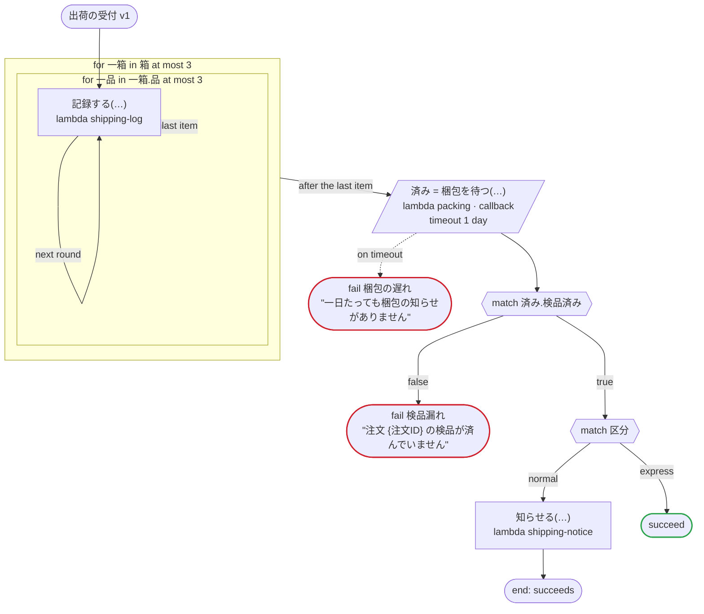

# 出荷の受付 v1

サービスを実装する（どのプラットフォームでも）：protos/shipping.proto のサービスの入口で、入力とコールバックの応答に、protobuf の JSON が省くゼロ値を埋めてから読む。箱のリストの中の品のリスト、中のメッセージ、ゼロ値が値でもある列挙を通る。値が設定されていない google.protobuf.Value は省かれるので、json の入力は無いことがあり、無ければ null として読む。出力は無く、実行は {} で終わる（protobuf の JSON を読む側は、null からメッセージを読まない）

`tests/flows/service.flow`, drawn by `dandori doc`. Inputs: `注文ID: string`, `箱: list[箱]`, `宛先: 宛先`, `区分: 受付.Kind`, `付帯: json`. It implements `shipping.v1.ShippingService` (`protos/shipping.proto`).

## flow

A rectangle is a task, one with a line down each side a rule, a slanted one a task whose value comes from outside (an event, or the answer to a callback), a hexagon a `match`, a rounded box a wait, and a box around steps a loop. A dashed arrow is an error the call handles.

## Service

What each method of the service does to a run.

| Method | What it does | Task |
|---|---|---|
| `Ship` | starts a run; it can fail with `梱包の遅れ`, `検品漏れ` | — |
| `AnswerPacking` | answers the callback | `梱包を待つ` |

## Calls

| Line | Call | Calls | Retries | Timeout | When it fails |
|---:|---|---|---|---|---|
| 48 | `記録する(…)` | `lambda shipping-log`, `idempotent` | — | — | `timeout`, `failure` → the workflow fails |
| 49 | `済み = 梱包を待つ(…)` | `lambda packing · callback` | — | 1 day | `timeout` → line 50 `failure` → the workflow fails |
| 55 | `知らせる(…)` | `lambda shipping-notice`, `idempotent` | — | — | `timeout`, `failure` → the workflow fails |

## Ends

Every way the workflow can end.

| Line | End |
|---:|---|
| 50 | `fail 梱包の遅れ` "一日たっても梱包の知らせがありません" |
| 53 | `fail 検品漏れ` "注文 {注文ID} の検品が済んでいません" |
| 56 | `succeed` |
| 56 | the flow runs to its end, and the workflow succeeds |

