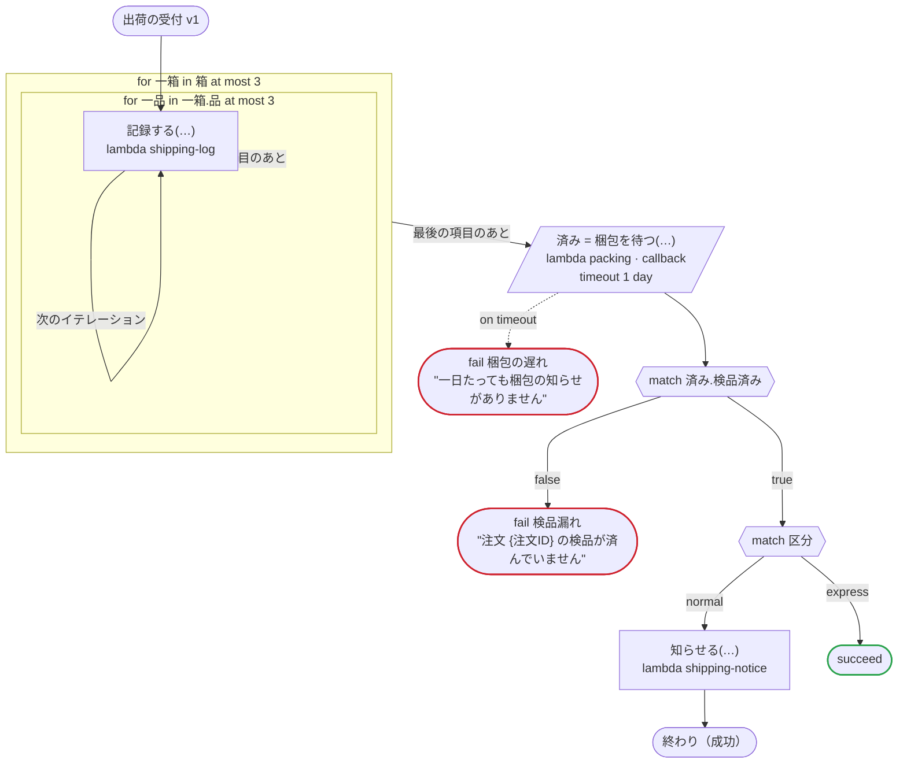

# 出荷の受付 v1

サービスを実装する（どのプラットフォームでも）：protos/shipping.proto のサービスの入口で、入力とコールバックの応答に、protobuf の JSON が省くゼロ値を埋めてから読む。箱のリストの中の品のリスト、中のメッセージ、ゼロ値が値でもある列挙を通る。値が設定されていない google.protobuf.Value は省かれるので、json の入力は無いことがあり、無ければ null として読む。出力は無く、実行は {} で終わる（protobuf の JSON を読む側は、null からメッセージを読まない）

`tests/flows/service.flow` を `dandori doc` で描いたものです。入力は `注文ID: string`, `箱: list[箱]`, `宛先: 宛先`, `区分: 受付.Kind`, `付帯: json` です。このワークフローは `shipping.v1.ShippingService`（`protos/shipping.proto`）を実装します。

## flow

四角はタスク、両脇に線のある四角は規則、斜めの四角は外から値が届くタスク（イベントやコールバックの応答）、六角形は `match`、角の丸い四角は待ち、ステップを囲む枠はループです。破線の矢印は、呼び出しがその場で処理するエラーです。

## サービス

サービスのメソッドと、それぞれが実行に対して何をするかです。

| メソッド | 何をするか | タスク |
|---|---|---|
| `Ship` | 実行を始めます。失敗の名前は `梱包の遅れ`・`検品漏れ` | — |
| `AnswerPacking` | コールバックに応答します | `梱包を待つ` |

## 呼び出し

| 行 | 呼び出し | 呼ぶもの | リトライ | タイムアウト | 失敗したとき |
|---:|---|---|---|---|---|
| 48 | `記録する(…)` | `lambda shipping-log`, `idempotent` | — | — | `timeout`, `failure` → ワークフローが失敗する |
| 49 | `済み = 梱包を待つ(…)` | `lambda packing · callback` | — | 1 日 | `timeout` → 50 行目 `failure` → ワークフローが失敗する |
| 55 | `知らせる(…)` | `lambda shipping-notice`, `idempotent` | — | — | `timeout`, `failure` → ワークフローが失敗する |

## 終わり方

ワークフローの終わり方のすべてです。

| 行 | 終わり方 |
|---:|---|
| 50 | `fail 梱包の遅れ` "一日たっても梱包の知らせがありません" |
| 53 | `fail 検品漏れ` "注文 {注文ID} の検品が済んでいません" |
| 56 | `succeed` |
| 56 | flow が最後まで走り、ワークフローは成功する |

