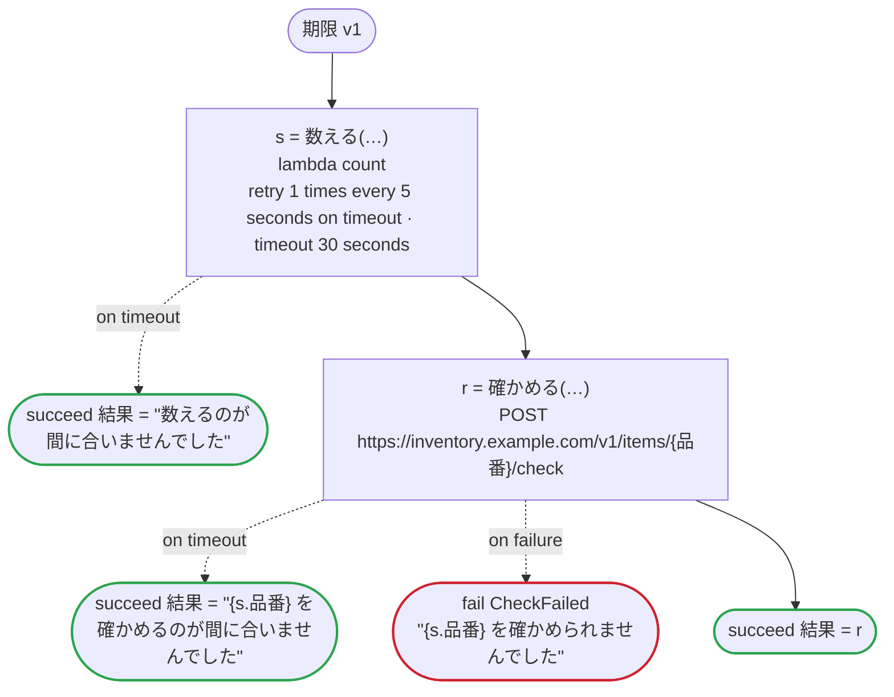

# 期限 v1

タスクの期限切れの端の振る舞い：期限切れを受ける呼び出し、期限切れだけをやり直す呼び出し、期限を書かないタスクの期限切れ。URL のパスに日本語の値も入る

`tests/flows/timeouts.flow`, drawn by `dandori doc`. Inputs: `sku: string`. Outputs: `結果: string`.

## flow

A rectangle is a task, one with a line down each side a rule, a slanted one a task whose value comes from outside (an event, or the answer to a callback), a hexagon a `match`, a rounded box a wait, and a box around steps a loop. A dashed arrow is an error the call handles.

## Calls

| Line | Call | Calls | Retries | Timeout | When it fails |
|---:|---|---|---|---|---|
| 29 | `s = 数える(…)` | `lambda count`, `idempotent` | 1 time every 5 seconds (timeout) | 30 seconds | `timeout` → line 30 `failure` → the workflow fails |
| 31 | `r = 確かめる(…)` | `POST https://inventory.example.com/v1/items/{品番}/check`, `idempotent` | — | — | `timeout` → line 32 `failure` → line 33 |

## Ends

Every way the workflow can end.

| Line | End |
|---:|---|
| 30 | `succeed 結果 = "数えるのが間に合いませんでした"` |
| 32 | `succeed 結果 = "{s.品番} を確かめるのが間に合いませんでした"` |
| 33 | `fail CheckFailed` "{s.品番} を確かめられませんでした" |
| 34 | `succeed 結果 = r` |

