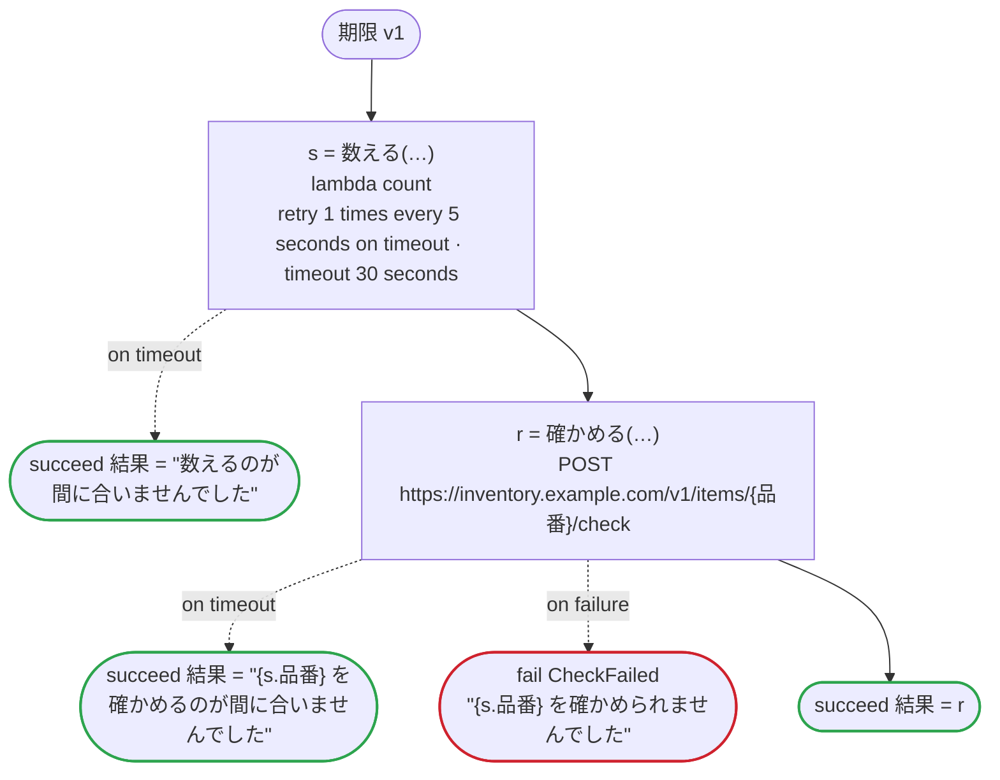

# 期限 v1

タスクのタイムアウトのエッジケース：タイムアウトを処理する呼び出し、タイムアウトだけをリトライする呼び出し、timeout を書かないタスクのタイムアウト。URL のパスに日本語の値も入る

`tests/flows/timeouts.flow` を `dandori doc` で描いたものです。入力は `sku: string`、出力は `結果: string` です。

## flow

四角はタスク、両脇に線のある四角は規則、斜めの四角は外から値が届くタスク（イベントやコールバックの応答）、六角形は `match`、角の丸い四角は待ち、ステップを囲む枠はループです。破線の矢印は、呼び出しがその場で処理するエラーです。

## 呼び出し

| 行 | 呼び出し | 呼ぶもの | リトライ | タイムアウト | 失敗したとき |
|---:|---|---|---|---|---|
| 29 | `s = 数える(…)` | `lambda count`, `idempotent` | 5 秒おきに 1 回（timeout） | 30 秒 | `timeout` → 30 行目 `failure` → ワークフローが失敗する |
| 31 | `r = 確かめる(…)` | `POST https://inventory.example.com/v1/items/{品番}/check`, `idempotent` | — | — | `timeout` → 32 行目 `failure` → 33 行目 |

## 終わり方

ワークフローの終わり方のすべてです。

| 行 | 終わり方 |
|---:|---|
| 30 | `succeed 結果 = "数えるのが間に合いませんでした"` |
| 32 | `succeed 結果 = "{s.品番} を確かめるのが間に合いませんでした"` |
| 33 | `fail CheckFailed` "{s.品番} を確かめられませんでした" |
| 34 | `succeed 結果 = r` |

