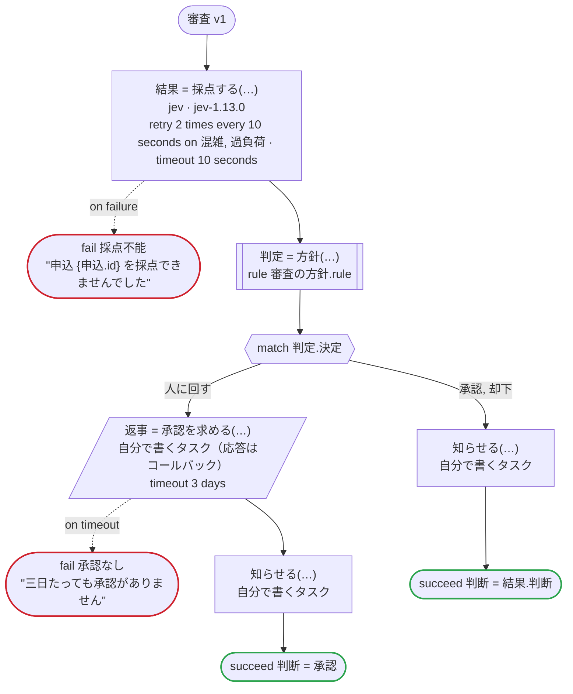

# ワークフローを図にする

`dandori doc` は、`.flow` をレビューする人のために図にします。図には流れの呼び出し・`match`・待ち・ループがすべて載り、その横に、検査が知っていて本文には書かれていないことが並びます。各呼び出しが何を呼び、どうリトライし、エラーがそれぞれどこへ行くか。呼び出しのあと各案件がどの状態になりうるか。ワークフローがどう終わりうるか、そのとき各案件がどの状態で残るか、です。

```text
dandori doc hotel.flow > hotel.md
dandori doc hotel.flow --format html > hotel.html
```

図はプラットフォームによって変わりません。ビルドが書いたものではなく、検査を通った `.flow` から描くので、何も走らせる前に手に入ります。Temporal にはワークフローのコードを図にする画面がありません。Step Functions や Argo Workflows が描くグラフには、結果を確かめるステートやループを回すステートなど、ビルドが足したものもすべて入ります。

## Markdown で、プルリクエストに

Markdown では、flow と `on failure`・`on cancel` を Mermaid のフローチャートで描きます。GitHub は、プルリクエストや issue や README の中でそのまま図にします。図の下には、すべての呼び出しの表と、すべての終わり方の表が付きます。Jev が申込を採点し、人の承認に回すかを規則が決める、審査の例の日本語版（[examples/review/temporal/review.ja.flow](https://github.com/i2y/dandori/blob/main/examples/review/temporal/review.ja.flow)）です。



四角はタスク、両脇に線のある四角は規則、斜めの四角は外から値が届くタスク（イベントやコールバックの応答）、六角形は `match`、角の丸い四角は待ち、ステップを囲む枠はループです。破線の矢印は、呼び出しがその場で処理するエラーです。呼び出しの二行目は呼び方で、三行目は、流れには書かれていない宣言の中身（案件に何をするか、リトライ、タイムアウト）です。

## 一枚のページで、実行を光らせる

`--format html` は、ほかに何も要らないページを一枚書きます。図は dandori が自分で描くので、ネットワークがなくても見られます。日本語で書いた例（Temporal 版）のページは、[ホテルの予約](doc/hotel.html)、[注文](doc/order.html)、[引当と発送](doc/fulfillment.html)、[問い合わせ](doc/inquiry.html)、[審査](doc/review.html) です。

- **ステップを選ぶ。** 右側に、そのステップの `.flow` の行、そこに来たとき各案件がとりうる状態、呼ぶもの、リトライとタイムアウト、エラーがそれぞれどこへ行くか、呼び出しのあとの案件、タスクや規則の宣言が出ます。
- **シナリオを選ぶ。** 左には `dandori scenarios` が作るシナリオが、終わり方ごとに並びます。すべての分岐、エラーを処理するすべての箇所、案件の状態の移り方のすべてを通るシナリオです。選ぶと、その実行が通るところが光り、ステップの横に通った回数が出て、右側に各呼び出しの結果が並びます。
- **両方を選ぶ。** ステップを選んでいると、そこを通るシナリオが目立ち、右側にその本数が出ます。

`!` の付いた呼び出しには、その場で処理しないエラーがあります。そのエラーは `on failure` へ行くか、ワークフローを失敗させます。実行でそうなると、印が光ります。選んだものはアドレスに残る（`hotel.html#run=40&node=s23`）ので、リンク一つで一本の実行を見せられます。

## 検査でエラーが見つかるワークフロー

名前と型が解決していれば、検査でエラーが見つかるワークフローも図にします。そのときの終了コードは 1 です。ページにはシナリオの代わりに診断が並び、選ぶと、そうなる例が図の上で光ります。E020 なら、案件を片付けないまま終わる実行が、図の上の一本の線になります。Markdown では、診断を `dandori check` の出力のまま最後に載せます。

## 何がどう描かれるか

| `.flow` | 図 |
|---|---|
| タスクの呼び出し | 四角。外から値が届くタスク（`event`、`callback`）は斜めの四角 |
| 規則の呼び出し | 両脇に線のある四角 |
| 呼び出しの下の `on <エラー> =>` | 呼び出しの横から、処理するステップへの破線の矢印 |
| `match` | 六角形と、分岐ごとの矢印。先へ進む最初の分岐が真下に来る |
| `wait`、`wait until` | 角の丸い四角 |
| `repeat`、`for` | 繰り返すステップを囲む枠。左に次のイテレーションへ戻る線、右に `break` で抜ける線。並列の `for` には戻る線がない |
| `succeed`、`fail` | 緑と赤の終わり。`fail … leaving` は、どの案件を引き渡すかを書く |
| `on failure`、`on cancel` | それぞれ別の図。始まりから、ワークフローの終わり方まで |
| `let x = <値>` | 四角 |
| `pass` | 何も描かず、矢印が先へ進む |
