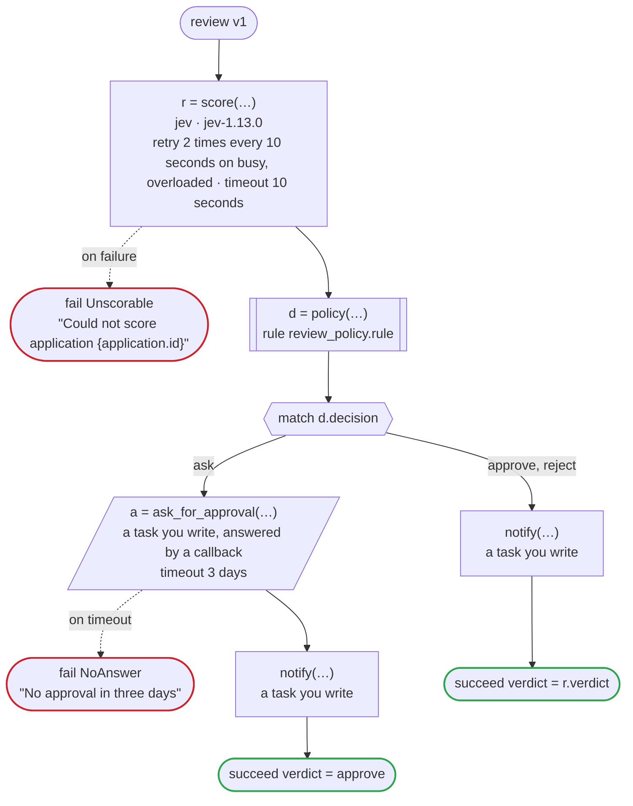

# Draw a workflow

`dandori doc` draws a `.flow` for the person who reviews it. The picture has every call, match,
wait and loop of the flow, and beside it is what the checker knows that the text does not show:
what each call calls, how it is retried and where each of its errors goes, what each case can be
after a call, and every way the workflow can end, with the state each case is left in.

```text
dandori doc hotel.flow > hotel.md
dandori doc hotel.flow --format html > hotel.html
```

The picture is the same whatever the platform: it is drawn from the checked `.flow`, not from what
a build writes, and it is there before anything runs. Temporal has no picture of a workflow's code,
and the graphs Step Functions and Argo Workflows draw show every state and template a build adds,
such as the check of each answer and the steps of each loop.

## As Markdown, for a pull request

The Markdown draws the flow, and `on failure` and `on cancel`, as Mermaid flowcharts, which GitHub
draws in a pull request, an issue or a README. Under them, a table lists every call and another
every way the workflow can end; for a workflow that implements a service, a table of the service's
methods comes first, with what each does to a run ([Implement a service](services.md)). The review example
([examples/review/temporal](https://github.com/i2y/dandori/blob/main/examples/review/temporal/review.flow)),
where Jev scores an application and a rule decides whether a person approves it:



A rectangle is a task, one with a line down each side a rule, a slanted one a task whose value comes
from outside (an event, or the answer to a callback), a hexagon a `match`, a rounded box a wait, and
a box around steps a loop. A dashed arrow is an error the call handles. The second line of a call
says how it is called, and the third what its declaration adds that the flow does not show: what it
does to a case, its retries, its timeout.

## As one page, with the runs lit up

`--format html` writes one page that needs nothing else: the picture is drawn by dandori itself, and
the page works without a network. The page of each example, as written for Temporal:
[hotel](doc/hotel.html), [order](doc/order.html), [fulfillment](doc/fulfillment.html),
[inquiry](doc/inquiry.html) and [review](doc/review.html).

- **Pick a step.** The pane on the right shows its lines of the `.flow`, what each case can be when
  a run gets there, what the call calls, its retries and timeout, where each of its errors goes,
  what the case can be after it, and the declaration of the task or the rule.
- **Pick a scenario.** On the left are the scenarios `dandori scenarios` writes, which together take
  every arm, every handler of an error and every way a case can move, grouped by how they end. The
  way a scenario's run goes lights up, with the number of times it passed a step beside the step,
  and the pane lists what each call answered.
- **Both.** With a step picked, the scenarios that pass it stand out, and the pane says how many of
  them do.

A call marked `!` has an error it does not handle, which goes on to `on failure`, or fails the
workflow; the mark lights up in a run where that happens. The address keeps what is picked
(`hotel.html#run=40&node=s23`), so a link can show one run.

## The rules it calls

A call of a rule is one box on the picture, and what the rule decides is in the rule. So `doc` shows
each rule the workflow uses as rulec draws it: what `rulec doc` renders for whoever approves the
rule, put in as it is, in the language of the page.

- **The Markdown** ends with a section of the rules, each folded in a `<details>` that a pull request
  opens.
- **The page** lists the rules on the left, and the pane of a step that calls a rule has a button.
  Either opens the page `rulec doc --format html` renders, over this one, and a case can be tried on
  it. A link opens it too (`hotel.html#rule=hold`), and Esc closes it.

What rulec renders names the version of rulec that rendered it.

## A workflow the checker finds errors in

`doc` draws a workflow whose check finds errors too, as long as its names and types resolve, and
exits with 1. The page lists the diagnostics instead of scenarios, and picking one lights up the run
that gets there: an E020 becomes the way on the picture that ends with the case unsettled. The
Markdown puts the diagnostics at its end, as `dandori check` prints them.

## Where each thing is drawn

| In the `.flow` | In the picture |
|---|---|
| a call of a task | a rectangle; a task whose value comes from outside (`event`, `callback`) is slanted |
| a call of a rule | a rectangle with a line down each side |
| `on <error> =>` under a call | a dashed arrow to the handler's steps, beside the call |
| `match` | a hexagon, with an arrow for each arm; the first arm that goes on stands under it |
| `wait`, `wait until` | a rounded box |
| `repeat`, `for` | a box around the steps it repeats: the way round is on its left, `break` leaves on its right, and a parallel `for` has no way round |
| `succeed`, `fail` | a green or a red end; `fail … leaving` says which case it hands over |
| `on failure`, `on cancel` | a picture of their own, from where they begin to how the workflow ends |
| `let x = <value>` | a rectangle |
| `pass` | nothing: the arrow goes on |
