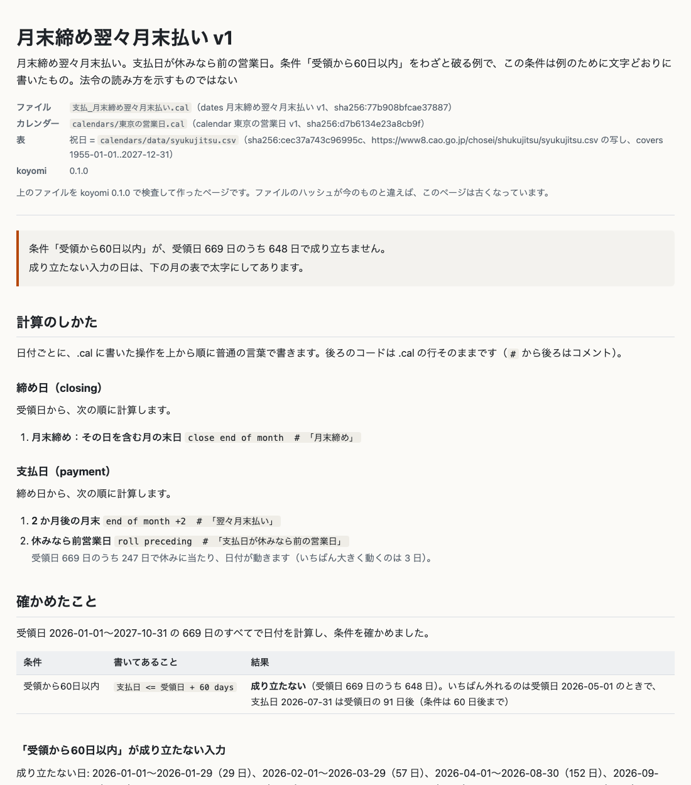
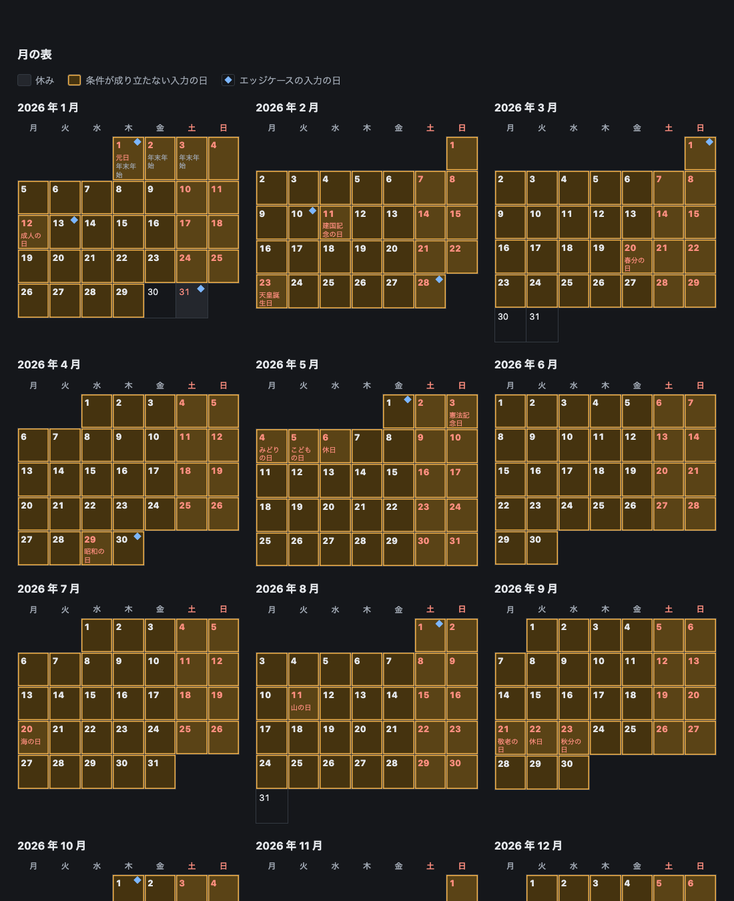

# koyomi

**期日を書く。全部の日で確かめる。コードにする。**

koyomi は、締め日や支払日、営業日、月の足し算を書くための小さな言語です。「20 日締め翌月 10 日払い。支払日が休みなら前の営業日」のような支払条件を、`.cal` のファイルに数行で書きます。どの日が休みかはカレンダーのファイルに書きます。祝日は、内閣府の祝日の CSV や GOV.UK の bank holidays のような公開されている表から読み、手元に保存したコピーを SHA-256 で固定します。

ファイルには、計算した日付が満たすべき条件も書きます。支払日は営業日である、受領から 60 日以内に払う、受領が遅くなっても支払日は早くならない、といった条件です。koyomi は、これを宣言した範囲のすべての日について確かめます。100 年分でも 3 万 7 千日に満たないので、一部の日を選んで試すのではなく、全部の日を計算できます。成り立たない日があれば全部挙げ、最初の日がどう計算されたかを一段ずつ見せます。

検査を通ったファイルだけを、TypeScript、Python、Go、Rust、SQL のコードにします。生成したコードを動かすのに、ほかのライブラリは要りません。言語の日付ライブラリも使いません。月の足し算の結果がライブラリによって違うからです。

```cal
dates 支払条件(payment_terms) v1
description "20 日締め翌月 10 日払い。支払日が休みなら前の営業日。条件「受領から60日以内」は、この例の条件として文字どおりに書いたもので、法令の読み方を示すものではない"
use calendar "calendars/東京の営業日.cal"

inputs
  受領日(received) : date  range >=2026-01-01 <=2027-11-20

date 締め日(closing) = 受領日
  close day 20          # 「20 日締め」

date 支払日(payment) = 締め日
  day 10 of month +1    # 「翌月 10 日払い」
  roll preceding        # 「支払日が休みなら前の営業日」
  at 09:00

claims
  営業日に払う       : 支払日 is open
  受領から60日以内   : 支払日 <= 受領日 + 60 days
  遅い受領は遅い支払 : 支払日 is monotonic

examples
| 受領日     | -> 締め日  | -> 支払日  |
| 2026-04-01 | 2026-04-20 | 2026-05-08 |
| 2026-12-21 | 2027-01-20 | 2027-02-10 |
```

```console
$ koyomi check examples/payment_20th_close_next_10th.ja.cal --lang ja
examples/payment_20th_close_next_10th.ja.cal: ok — 3 つの条件が、受領日 2026-01-01〜2027-11-20 の 689 日のすべてで成り立ちます。例 2 行も合っています
```

カレンダーの `東京の営業日.cal` は、土日と、内閣府の表にある国民の祝日と休日、12 月 29 日から 1 月 3 日までを休みにします。表には 2027 年の分までしか載っていないので、受領日の範囲は 2027-11-20 で終わります。翌日の 2027-11-21 に受領すると支払日は 2028 年 1 月 10 日になり、その日が休みかどうかはまだ分からないからです。範囲を広げると、検査は推測せずにそう言います（E203）。

一つの受領日でどう計算されるかは、`koyomi eval` で見られます。

```console
$ koyomi eval examples/payment_20th_close_next_10th.ja.cal 受領日=2026-04-01 --lang ja
受領日  2026-04-01（水）
締め日  2026-04-20（月）  20 日締め: 2026-03-21〜2026-04-20 の期間の締め日
支払日  2026-05-10（日）  翌月 10 日
        2026-05-08（金）  休みなら前営業日: 2026-05-10 は日曜、2026-05-09 は土曜で休み
        時刻 2026-05-08T09:00:00+09:00（UTC で 2026-05-08T00:00:00Z）

条件「営業日に払う」は成り立つ
条件「受領から60日以内」は成り立つ（支払日は受領日の 37 日後で、条件は 60 日後まで）
条件「遅い受領は遅い支払」は成り立つ（前の日 2026-03-31 なら支払日は 2026-05-08）
```

支払条件を「月末締め翌々月末払い」に変えると、「受領から60日以内」は範囲のほとんどの日で成り立たなくなります。

```console
$ koyomi check examples/eom_close_two_months_later.ja.cal --lang ja
エラー[E301]: examples/eom_close_two_months_later.ja.cal:16:3: 条件「受領から60日以内」が、受領日 669 日のうち 648 日で成り立ちません
    16 |   受領から60日以内 : 支払日 <= 受領日 + 60 days
  = 成り立たない日: 2026-01-01〜2026-01-29（29 日）、2026-02-01〜2026-03-29（57 日）、2026-04-01〜2026-08-30（152 日）、2026-09-01〜2026-10-28（58 日）、2026-11-01〜2026-11-29（29 日）、2026-12-01〜2026-12-27（27 日）、ほか 4 か所。全部は --format json で出ます
  = いちばん外れるのは受領日 2026-05-01 のときで、支払日 2026-07-31 は受領日の 91 日後
  そうなる例（最初の入力）:
      受領日  2026-01-01（木）
      締め日  2026-01-31（土）  月末締め
      支払日  2026-03-31（火）  2 か月後の月末
              2026-03-31（火）  休みなら前営業日: 営業日なので動かない
              支払日は受領日の 89 日後で、条件は 60 日後まで
```

例の条件「受領から60日以内」は、例のために文字どおりに書いたもので、何かの法令の読み方を示すものではありません。

検査を通ったファイルは、`koyomi gen` でコードになります。TypeScript では次のようになります（`--lang ja` を付けたので、コメントは日本語です）。

```ts
/**
 * 支払日（payment）を返す。
 * 受け取る範囲は受領日 2026-01-01〜2027-11-20 で、koyomi check はこの範囲のすべての入力を確かめた。範囲の外は KoyomiError（range）になる。
 */
export function payment(received: string): string {
  let day = _inputDate(received, "受領日", 20454, 21142); // range >=2026-01-01 <=2027-11-20
  day = _closeDay(day, 20, "none"); // close day 20  (締め日)
  day = _dayOfMonth(day, 10, 1, "none"); // day 10 of month +1
  day = _roll(day, "preceding"); // roll preceding
  return _formatDate(day);
}
```

`.cal` の一行が関数の一行になり、行末にもとの行が残ります。祝日の表はファイルに埋め込まれ、ファイルの頭には、もとにした `.cal`、カレンダー、表がハッシュつきで書かれます。

## なぜ期日のための言語を作るのか

支払期日の計算は、いまは人が手で書くコードの中にあり、フロントエンドとバックエンドで二度書かれることも珍しくありません。二度書けば、二つは少しずつずれていきます。

ずれやすいところの一つめは月の足し算です。2023-01-31 の 1 か月後は、Python の dateutil、Java、PostgreSQL、Temporal では 2023-02-28 ですが、Go と JavaScript の `Date` では 2023-03-03 になります。二つめは祝日です。祝日は法律で変わり、内閣府の表には毎年 2 月に翌年の分が載ります。三つめは、書く人と決める人が違うことです。コードを書くのは開発者で、支払条件を決めるのは経理や法務です。決める人が読むのは、ふつうはコードではなく契約書です。

koyomi は、[rulec](https://github.com/i2y/ritsu/tree/main/crates/rulec)（業務ルールのための小さな言語。条件を表に書き、抜けと重なりが無いことを証明する）と [dandori](https://github.com/i2y/ritsu/tree/main/crates/dandori)（rulec の規則を呼ぶワークフローの言語）の兄弟にあたります。rulec は日付を前後の比較にだけ使い、dandori は渡された時刻まで待つだけなので、期日の計算はどちらにも書けません。作り方は二つにそろえました。もとにした文書を固定し、コードにする前に検査し、人が読んで確かめられるページを出し、生成したコードをすべての入力で参照インタプリタと突き合わせます。

## 確かめること、確かめないこと

範囲のすべての入力で、ファイルのすべての日付を計算し、条件と例を確かめます。そのほかに、次の三つも検査で決まります。

- その月に無い日の扱いは、書かなければ通りません。1 月 31 日に 1 か月を足す、4 月の 31 日を指す、2 月に 30 日で締める、といった計算は、その月に無い日に当たることがあります。そのときどうするか（`else end_of_month` で月末に寄せる、`else start_of_next_month` で次の月の 1 日に送る、`else reject` でエラーにする）を書かなければ、検査は止まります（E201）。既定の扱いはありません。契約がどれを意味するかは、koyomi が決めることではないからです。`else reject` と書いた計算は、範囲の中で一度も無い日に当たらないことを検査が確かめます。
- カレンダーが知らない日は問えません。祝日の表が載せている範囲の外の日が休みかを問う計算は、検査でも生成したコードでも止まります。検査は、その日を問わずに済む範囲を示します（E203）。
- もとにした文書は固定します。祝日の表や、引いた法令の条文は、手元のコピーを SHA-256 で固定します。コピーが変われば、読み直して固定し直すまでエラーです。何が変わったか（増えた日、消えた日、名前の変わった日、条文の変わり方）は `koyomi source outdated` が言います。`koyomi check` は通信しません。

検査で言えないことは次の三つです。

- ファイルが、契約や約款や法令の言っていることと合っているか
- 祝日の表が現実と合っているか（言えるのは、コピーが配られたファイルそのものであることまで）
- 範囲の外の入力で、条件が成り立つか

生成したコードが参照インタプリタと同じ結果を返すことは、範囲のすべての入力で突き合わせるテストで確かめています。証明ではありません。

## 人が読むページ

`koyomi doc` は、支払条件やカレンダーを読んで、コードが実現すべきものを理解し、確かめる人（経理、法務、会社の休みを決める人、コードをレビューする開発者）のためのページを出します。プルリクエストにそのまま載せられる Markdown か、外のファイルを何も読まない一枚の HTML で、HTML には明るい配色と暗い配色があります。ページには次のものが載ります。

- 計算のしかた。操作を一つずつ普通の言葉で書き、隣に `.cal` の行を置きます。法令を引いた行には、コピーから引いた条文と、何年何月何日時点のどの版かを添えます。
- 条件ごとの結果と、余裕がいちばん少ない入力（成り立たなければ、いちばん外れる入力）。
- 無い日の扱いごとに、範囲の中で使われる数と、ほかの扱いに替えたら結果が変わる数。
- koyomi が範囲から選んだエッジケース。月末の日、休みの日とその前後、受領から支払までの日数がいちばん多い入力と少ない入力などです。
- 月ごとのカレンダー。祝日の名前を書き、条件が成り立たない入力の日とエッジケースの入力の日に印を付けます。





条件が成り立たないファイルにもページを出し、どこで成り立たないかを見せます。それ以外のエラーがあるファイルには、ページを出しません。

## インストール

koyomi は [ritsu](https://github.com/i2y/ritsu) の言語の一つで、ritsu のリポジトリから、最近の stable の Rust でビルドします。八つの言語を全部入れ、複数の言語のファイルがあるプロジェクトを `ritsu check` で確かめるなら、次のとおりです。

```console
$ cargo install --git https://github.com/i2y/ritsu --locked ritsu
```

これで `ritsu koyomi <コマンド>` が、下のコマンドのどれにもなります（`koyomi` という名前で `ritsu` を指すリンクでも同じです）。ほかの言語を読まない koyomi だけを入れるなら、次のとおりです。

```console
$ cargo install --git https://github.com/i2y/ritsu --locked koyomi
```

依存は serde_json だけです。`koyomi source fetch` と `koyomi source outdated` は `curl` を呼びます。

## コマンド

```console
$ koyomi check examples/                         # 下の .cal を全部。--format json、--budget <n>
$ koyomi eval examples/net30.cal invoice_date=2026-03-04   # 一つの入力の計算を一段ずつ
$ koyomi gen examples/net30.cal --out generated  # --target typescript|python|go|rust|sql、--check
$ koyomi vectors examples/net30.cal              # すべての入力の結果を JSON Lines で
$ koyomi doc examples/net30.cal --format html    # 人が読むページ
$ koyomi api examples/net30.cal                  # 生成したコードの呼び方を JSON で
$ koyomi source fetch|pin|outdated examples/calendars/england_and_wales.cal
$ koyomi explain E201 --lang ja                  # いつ出るか、どう直すか、最小の再現
```

`--lang ja` を付けると、診断、ページ、生成したコードのコメントとエラーのメッセージが日本語になります。exit code は、エラーが無ければ 0、あれば 1、引数の誤りなら 2 です。言語、コマンド、出力の形の全部は [docs/reference.md](docs/reference.md)（英語）に、診断の一覧は [docs/codes.ja.md](docs/codes.ja.md) に、生成したコードの形は [docs/generated-code.md](docs/generated-code.md)（英語）にあります。

## 例

日本の暦の例は、日本語の版 `<名前>.ja.cal` と、同じ条件を英語の名前で書いた英語の版 `<名前>.cal` が並んでいます。二つは同じ結果になります。日本語の版は日本語のカレンダー（`calendars/東京の営業日.cal`、`calendars/民法142条の休日.cal`）を、英語の版は同じカレンダーの英語の版（`calendars/tokyo_business_days.cal`、`calendars/civil_code_142_days.cal`）を読みます。

| 日本語の版 | 英語の版 | 書いてあること | `koyomi check` |
|---|---|---|---|
| [`payment_20th_close_next_10th.ja.cal`](examples/payment_20th_close_next_10th.ja.cal) | [`payment_20th_close_next_10th.cal`](examples/payment_20th_close_next_10th.cal) | 上の例 | 通る |
| [`eom_close_two_months_later.ja.cal`](examples/eom_close_two_months_later.ja.cal) | [`eom_close_two_months_later.cal`](examples/eom_close_two_months_later.cal) | 月末締め翌々月末払い | わざと通らないようにした例。648 日で「受領から60日以内」が成り立たない |
| [`closing_and_payment_days_as_inputs.ja.cal`](examples/closing_and_payment_days_as_inputs.ja.cal) | [`closing_and_payment_days_as_inputs.cal`](examples/closing_and_payment_days_as_inputs.cal) | 締め日、支払の月、支払の日を整数の入力で受け取る。871,596 通り | 通る |
| [`civil_code_period_end.ja.cal`](examples/civil_code_period_end.ja.cal) | [`civil_code_period_end.cal`](examples/civil_code_period_end.cal) | 民法 140〜143 条による期間の満了日。どの日付も e-Gov から取って保存した条文を引く | 通る |
| [`civil_code_two_readings.ja.cal`](examples/civil_code_two_readings.ja.cal) | [`civil_code_two_readings.cal`](examples/civil_code_two_readings.cal) | 142 条の二つの読み方と、143 条と「月数を足して月末に寄せる」書き方を、それぞれ並べる | わざと通らないようにした例。二つの読み方が分かれるのは 121 通り、もう一組は 39 通り |

England and Wales のカレンダー（GOV.UK の bank holidays を読む [`calendars/england_and_wales.cal`](examples/calendars/england_and_wales.cal)）で書いた英語の例もあります。英語の README はこちらを先に見せます。England and Wales には夏時間があって固定のオフセットを書けないので、この例は日付だけを出します。

| ファイル | 書いてあること | `koyomi check` |
|---|---|---|
| [`close_20th_pay_10th.cal`](examples/close_20th_pay_10th.cal) | 20 日締め翌月 10 日払い | 通る |
| [`close_eom_pay_two_months_on.cal`](examples/close_eom_pay_two_months_on.cal) | 月末締め翌々月末払い | わざと通らないようにした例。1,008 日で受領から 60 日以内という条件が成り立たない |
| [`net30.cal`](examples/net30.cal) | Net 30。請求日の 30 日後で、休みなら翌営業日 | 通る |
| [`close_and_pay_on_given_days.cal`](examples/close_and_pay_on_given_days.cal) | 締め日、支払の月、支払の日を整数の入力で受け取る。872,960 通り | 通る |
| [`period_of_months.cal`](examples/period_of_months.cal) | 月で数える期間の満了日。初日を数えず、応当する日の前日に満了し、休みに当たれば翌日に動かす | 通る |
| [`period_of_months_two_readings.cal`](examples/period_of_months_two_readings.cal) | 休みに当たった満了日を動かす先の二つの読み方（翌日と翌営業日）と、「応当する日の前日」と「月数を足して月末に寄せる」書き方を、それぞれ並べる | わざと通らないようにした例。二つの読み方が分かれるのは 709 通り、もう一組は 39 通り |

内閣府の祝日の表、GOV.UK の bank holidays、民法の条文のコピーは、配られたものをそのまま置いています（[THIRD_PARTY_NOTICES.md](THIRD_PARTY_NOTICES.md)）。

期間の例は、決まりや条文を文字どおりに書いて、読み方が分かれる日を見せるためのものです。読み方を一つに決めるものではありません。わざと通らないようにした例が六つあるので、`koyomi check examples/` は 1 で終わります。

## どう確かめているか

`.cal` の意味を決めるのは参照インタプリタで、`check`、`eval`、`vectors`、`doc` はどれもそれを通して計算します。テストは、検査を通る例と、すべての操作を 1900〜2100 年に使う十四のファイル（英語の七つと、同じものを日本語で書いた七つ）を、五つの出力先それぞれで生成し、出力先の言語のツールで確かめてから、`koyomi vectors` のすべての行をランナーに流して一行ずつ比べます。範囲のすべての入力と、範囲のすぐ外の入力で、行を間引いていません。macOS（Apple シリコン）で `cargo test -- --nocapture` を一度走らせた結果（テスト 156 件、77 秒）は次のとおりです。時間は、五つの出力先を同時に走らせたときのものです。

| 出力先 | ツール | 比べた行 | 時間 |
|---|---|---|---|
| TypeScript | Node v23.11.0、tsc 7.0.2 | 11,554,942 | 13.7 秒 |
| Python | Python 3.14.6、mypy 2.4.0 | 11,554,942 | 28.8 秒 |
| Go | go 1.25.5 | 11,554,942 | 14.5 秒 |
| Rust | rustc 1.94.1 | 11,554,942 | 14.9 秒 |
| SQL | PostgreSQL 18.0 | 11,554,942 | 46.9 秒 |

ツールが無ければ、そのテストは `SKIP:` の行を出して通ります。ツールの場所は `KOYOMI_TSC`、`KOYOMI_MYPY`、`KOYOMI_PG_BIN`、`KOYOMI_PG_SOCKET_DIR`、`KOYOMI_CHROME` で渡せます（tsc と mypy は `tools/` に入れます。入れ方は `tools/package.json` と `tools/requirements.txt` にあります）。例ごとの診断、ページ、api は golden のファイルと比べ、このページと docs とスキルに載せたコード、診断、出力は、ツールが実際に出すものと同じかをテストで確かめています。

## AI エージェント向けのスキル

[skills/koyomi](../../skills/koyomi) は、koyomi を使うための [Agent Skill](https://agentskills.io) です。最初の下書きから生成したコードまでの進め方、言語の要点、人に聞くべきこと、診断ごとの直し方が入っています。`~/.claude/skills/` か、プロジェクトの `.claude/skills/` にコピーして使います。詳しくは [skills/README.md](skills/README.md) にあります。

## 次に読むもの

| | |
|---|---|
| [DESIGN.md](DESIGN.md) | 決めたことと、その理由、捨てた案 |
| [docs/codes.ja.md](docs/codes.ja.md) | 診断の一覧（`koyomi explain --all --lang ja` の出力） |
| [docs/reference.md](docs/reference.md) | 言語、コマンド、出力の形（英語） |
| [docs/generated-code.md](docs/generated-code.md) | 出力先ごとの生成したコードと呼び方（英語） |
| [README.md](README.md) | このページの英語版 |

## ライセンス

[Apache License, Version 2.0](LICENSE-APACHE) と [MIT License](LICENSE-MIT) のどちらかを選んで使えます。`examples/` に置いた内閣府の祝日の表、GOV.UK の bank holidays、民法の条文のコピーと、WHATWG の索引から作った変換表 `src/sjis_table.rs` は、それぞれの条件に従います（[THIRD_PARTY_NOTICES.md](THIRD_PARTY_NOTICES.md)）。
