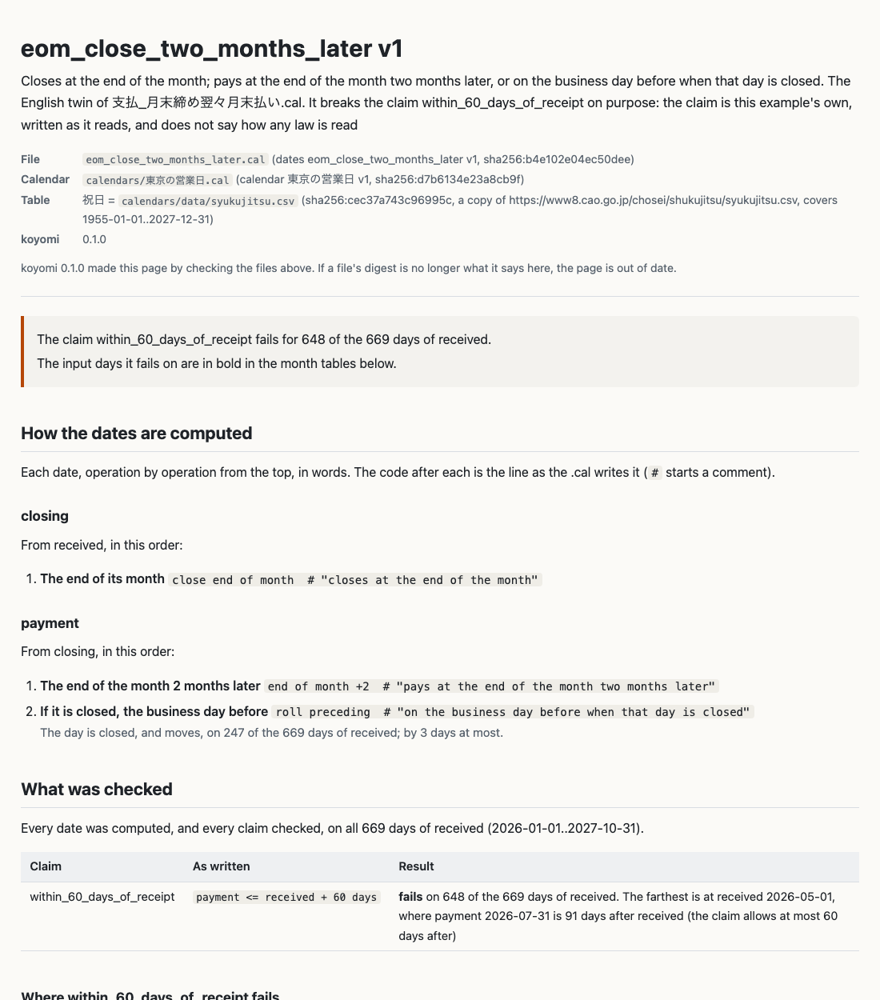
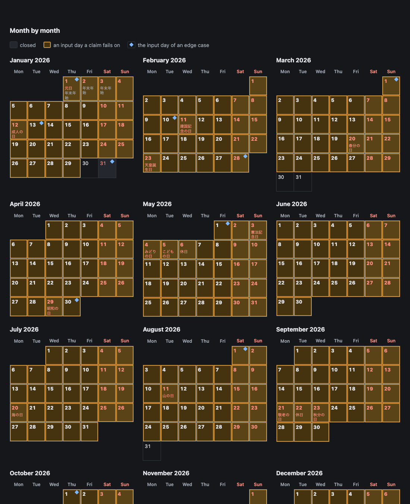

# koyomi

**Write due dates. Check every day. Compile them.**

koyomi is a little language for the dates of business: closing days, payment days, business
days and month arithmetic. "Closes on the 20th, pays on the 10th of the next month, or on the
business day before when that is a holiday" is a few lines of a `.cal` file, with a calendar
whose holidays come from a published table, pinned by its digest.

What a file claims (the payment falls on a business day, no more than 60 days after receipt,
never earlier for a later receipt) is checked on every day of the range it declares. Nothing is
sampled: a century is fewer than 37,000 days, so koyomi computes them all, and lists every day a
claim fails on, with the first one computed step by step. Only a file that passes compiles, into
TypeScript, Python, Go, Rust and SQL, with no runtime, no dependency, and no date library of the
target language, since that is where implementations disagree.

```cal
dates payment_20th_close_next_10th v1
description "Closes on the 20th; pays on the 10th of the next month, or on the business day before when that day is closed. The English twin of 支払_20日締め翌月10日払い.cal. The claim within_60_days_of_receipt is this example's own, written as it reads; it does not say how any law is read"
use calendar "calendars/東京の営業日.cal"

inputs
  received : date  range >=2026-01-01 <=2027-11-20

date closing = received
  close day 20          # "closes on the 20th"

date payment = closing
  day 10 of month +1    # "pays on the 10th of the next month"
  roll preceding        # "on the business day before when that day is closed"
  at 09:00

claims
  paid_on_a_business_day      : payment is open
  within_60_days_of_receipt   : payment <= received + 60 days
  later_receipt_later_payment : payment is monotonic

examples
| received   | -> closing | -> payment |
| 2026-04-01 | 2026-04-20 | 2026-05-08 |
| 2026-12-21 | 2027-01-20 | 2027-02-10 |
```

```console
$ koyomi check examples/payment_20th_close_next_10th.cal
examples/payment_20th_close_next_10th.cal: ok — 3 claims hold on all 689 days of received (2026-01-01..2027-11-20); 2 examples match
```

The calendar, `東京の営業日.cal`, closes Saturdays, Sundays, the Japanese national holidays from
the Cabinet Office's table, and 29 December to 3 January. Its table runs to the end of 2027, so
the range ends on 2027-11-20: one day later, the payment would fall in January 2028, and whether
2028-01-10 is a holiday is not known yet. The check says so, rather than guessing.

Change the terms to closing at the end of the month and paying at the end of the month after next,
and the claim of 60 days breaks on most days of the range:

```console
$ koyomi check examples/eom_close_two_months_later.cal
error[E301]: examples/eom_close_two_months_later.cal:16:3: The claim within_60_days_of_receipt fails for 648 of the 669 days of received
    16 |   within_60_days_of_receipt : payment <= received + 60 days
  = It fails on 2026-01-01..2026-01-29 (29 days), 2026-02-01..2026-03-29 (57 days), 2026-04-01..2026-08-30 (152 days), 2026-09-01..2026-10-28 (58 days), 2026-11-01..2026-11-29 (29 days), 2026-12-01..2026-12-27 (27 days), and 4 more runs; --format json lists them all
  = The farthest is received 2026-05-01, where payment 2026-07-31 is 91 days after received
  the first input it fails on:
      received  2026-01-01 Thu
      closing   2026-01-31 Sat  close end of month
      payment   2026-03-31 Tue  end of month +2
                2026-03-31 Tue  roll preceding: a business day, stays
                payment is 89 days after received, and the claim allows at most 60 days after
```

The claims of these examples are their own, written as they read; none of them says how a law is
to be read.

Once a file passes, `koyomi gen` writes it out, here in TypeScript:

```ts
/**
 * Gives payment.
 * It takes received 2026-01-01..2027-11-20, the range koyomi check checked every input of; outside it, the error is a KoyomiError of kind range.
 */
export function payment(received: string): string {
  let day = _inputDate(received, "received", 20454, 21142); // range >=2026-01-01 <=2027-11-20
  day = _closeDay(day, 20, "none"); // close day 20  (closing)
  day = _dayOfMonth(day, 10, 1, "none"); // day 10 of month +1
  day = _roll(day, "preceding"); // roll preceding
  return _formatDate(day);
}
```

Each line of the `.cal` becomes a line of the function, with the line it came from beside it.
The table of holidays is written into the file, and its head names the `.cal`, the calendar and
the table it was made from, by their digests.

## Why a language for dates

Payment terms are computed today in code people write by hand, often twice, in the front end
and in the back end. The two drift. Month arithmetic is the first place: the one-month-after of
2023-01-31 is 2023-02-28 in Python's dateutil, Java, PostgreSQL and Temporal, and 2023-03-03 in Go
and in JavaScript's `Date`. Holidays change by law, and the official table grows a year every
February. And the person who writes the code is not the person who decides the terms, who reads the
contract rather than the code.

koyomi takes what its siblings [rulec](https://github.com/i2y/rulec) (business rules, as tables
it proves complete) and [dandori](https://github.com/i2y/dandori) (typed workflows that call
them) leave outside on purpose: rulec keeps dates ordered and nothing more, and dandori waits
until a time it is given. The way of working is theirs: pin the documents a file is written
against, check it before anything is generated, give the person who approves it a page they can
read, and hold the generated code to a reference interpreter on every input.

## What it checks, and what it does not

For every input of the declared range, every date of the file is computed, and every claim and
every example is held to it. Three more things are settled too:

- **A day a month does not have needs an answer.** Adding a month to 31 January, the 31st of
  April, closing on the 30th in February: the operation says what then (`else end_of_month`,
  `else start_of_next_month`, or `else reject`, which the check holds to never happening), or
  the check stops (E201). There is no default; which one a contract means is not koyomi's to
  decide.
- **A calendar knows a span of days, and no more.** A computation that asks whether a day past
  the table is a holiday stops, in the check (E203, with the range that would avoid it) and in
  the generated code (an error of kind `data`).
- **The documents are pinned.** A table of holidays and the articles of a law cited are copies
  pinned by their SHA-256; a copy that changed is an error until it is read and pinned again
  (`koyomi source outdated` says what changed: the days added, removed, renamed, or the article's
  text). `koyomi check` never reads the network.

What the check does not show: that the file says what the contract, the terms or the law say;
that the table matches the world (only that the copy is the file the source served); and
anything outside the range. That the generated code gives what the reference interpreter gives
is a test over every input of the range, not a proof.

## The page for whoever approves it

`koyomi doc` writes the page for the people who decide the terms: accounting, legal, whoever
keeps the company calendar. It is Markdown, which a pull request shows as it is, or one HTML file
that loads nothing from anywhere, in a light and a dark palette. Every operation is said in words,
next to its line of the `.cal`; the article a line cites is quoted from its copy, with the date
and the revision it is from; every claim's result is there, with the input it has the least room
on; for each `else`, how often it is used, and how many inputs the other two ways would change;
the edge cases koyomi picked (month ends, closed days and the days around them, the longest and
the shortest); and the months as tables, with the holidays by name and the input days a claim
fails on marked.





A file whose claims fail still gets its page, which shows where they fail; a file with any other
error gets none.

## Install

```console
$ git clone https://github.com/i2y/koyomi
$ cd koyomi
$ cargo install --path .
```

koyomi builds with a recent stable Rust, and its one dependency is serde_json. `koyomi source
fetch` and `koyomi source outdated` call `curl`.

## Commands

```console
$ koyomi check examples/                         # every .cal under it; --format json, --budget <n>
$ koyomi eval examples/net30.cal invoice_date=2026-03-04   # one input, step by step
$ koyomi gen examples/net30.cal --out generated  # --target typescript|python|go|rust|sql, --check
$ koyomi vectors examples/net30.cal              # the result for every input, as JSON Lines
$ koyomi doc examples/net30.cal --format html    # the page for whoever approves it
$ koyomi api examples/net30.cal                  # how to call the generated code, as JSON
$ koyomi source fetch|pin|outdated examples/calendars/england_and_wales.cal
$ koyomi explain E201                            # when it appears, how to fix it, a repro
```

`--lang ja` gives the messages, the page and the comments of the generated code in Japanese. The
exit code is 0 with no error, 1 with one, and 2 for bad arguments. The whole language, the
commands and the formats are in [docs/reference.md](docs/reference.md), every diagnostic in
[docs/codes.md](docs/codes.md), and the generated code in
[docs/generated-code.md](docs/generated-code.md).

## Examples

| File | What it writes | `koyomi check` |
|---|---|---|
| [`payment_20th_close_next_10th.cal`](examples/payment_20th_close_next_10th.cal) | the file above | passes |
| [`eom_close_two_months_later.cal`](examples/eom_close_two_months_later.cal) | closing at the end of the month, paying at the end of the month after next | fails on purpose: 648 days break the claim of 60 days |
| [`net30.cal`](examples/net30.cal) | Net 30 in England and Wales, on GOV.UK's bank holidays | passes |
| [`支払_20日締め翌月10日払い.cal`](examples/支払_20日締め翌月10日払い.cal) | the first example, with Japanese names | passes |
| [`支払_月末締め翌々月末払い.cal`](examples/支払_月末締め翌々月末払い.cal) | the second, with Japanese names | fails on purpose |
| [`締め日と支払日を受け取る.cal`](examples/締め日と支払日を受け取る.cal) | the closing day, and the month and the day of payment, as integer inputs: 871,596 combinations | passes |
| [`民法の期間.cal`](examples/民法の期間.cal) | the end of a period under Articles 140 to 143 of Japan's Civil Code, each written as it reads and cited from e-Gov | passes |
| [`民法の期間_読み方の比較.cal`](examples/民法の期間_読み方の比較.cal) | two readings of Article 142 side by side, and Article 143 against adding months and rounding down | fails on purpose: the readings part on 121 inputs, the other pair on 39 |

The calendars are in [`examples/calendars/`](examples/calendars): the Tokyo business days, the
days Article 142 of the Civil Code names, and England and Wales. The copies of the Cabinet
Office's table, of GOV.UK's bank holidays and of the articles of the Civil Code are kept as they
were served ([THIRD_PARTY_NOTICES.md](THIRD_PARTY_NOTICES.md)). The Civil Code examples write the
articles as they read, to show where readings part; they do not decide how the articles are to be
read. `koyomi check examples/` exits 1, because three of the files fail on purpose.

## How it is checked

The reference interpreter defines what a `.cal` means; `check`, `eval`, `vectors` and `doc` all
compute through it. The tests generate every example that passes, and seven files that use every
operation over 1900–2100, for each of the five targets, look at the code with the target's own
tools, and run every line of `koyomi vectors` through it: every input of every range, and the
inputs just outside, none skipped. On one run of `cargo test -- --nocapture` on macOS on Apple
silicon (99 tests, 40 seconds):

| Target | Tools | Lines compared | Time |
|---|---|---|---|
| TypeScript | Node v23.11.0, tsc 7.0.2 | 5,341,318 | 6.6 s |
| Python | Python 3.14.6, mypy 2.4.0 | 5,341,318 | 16.3 s |
| Go | go 1.25.5 | 5,341,318 | 7.3 s |
| Rust | rustc 1.94.1 | 5,341,318 | 7.7 s |
| SQL | PostgreSQL 18.0 | 5,341,318 | 26.3 s |

A tool that is missing prints `SKIP:` and its test passes; `KOYOMI_TSC`, `KOYOMI_MYPY`,
`KOYOMI_PG_BIN`, `KOYOMI_PG_SOCKET_DIR` and `KOYOMI_CHROME` say where the tools are (tsc and mypy
install into `tools/`, as `tools/package.json` and `tools/requirements.txt` say). The diagnostics,
the pages and the API of every example are golden files, and the code, the diagnostics and the
outputs on this page, the reference and the skill are held to what the tool prints.

## For AI agents

[skills/koyomi](skills/koyomi) is an [Agent Skill](https://agentskills.io) for using koyomi: the
loop from a first draft to generated code, the language on one page, what to ask a person, and
the fix for each diagnostic. Copy it into `~/.claude/skills/`, or into a project's
`.claude/skills/`; [skills/README.md](skills/README.md) says more.

## Read next

| | |
|---|---|
| [docs/reference.md](docs/reference.md) | the language, the commands and the formats |
| [docs/codes.md](docs/codes.md), [docs/codes.ja.md](docs/codes.ja.md) | every diagnostic, as `koyomi explain --all` prints it |
| [docs/generated-code.md](docs/generated-code.md) | what each target writes, and how to call it |
| [README.ja.md](README.ja.md) | this page, in Japanese |
| [DESIGN.md](DESIGN.md) | every decision and what was set aside with it (Japanese) |

## License

Licensed under either of [Apache License, Version 2.0](LICENSE-APACHE) or
[MIT license](LICENSE-MIT), at your option. The copies of the Cabinet Office's table of holidays,
of GOV.UK's bank holidays and of the Civil Code under `examples/`, and the table `src/sjis_table.rs`
made from the WHATWG's index, keep their own terms ([THIRD_PARTY_NOTICES.md](THIRD_PARTY_NOTICES.md)).
