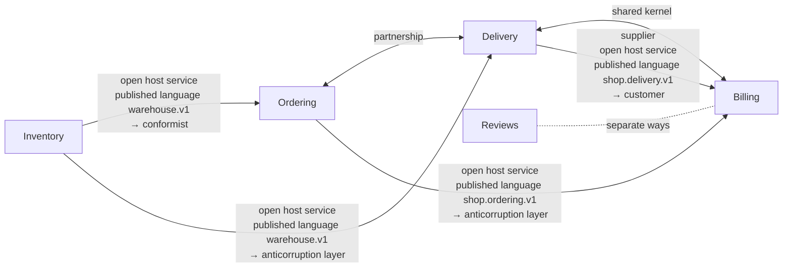

# Context map: Shop (shop) v1

A small online shop that takes orders, holds stock, delivers and bills

Written from `shop.ctx`. `sakai check` says: 5 contexts, 7 relationships; 79 artifacts, each in one context; 9 crossings checked (proto 1, rulec 2, koyomi 1, dandori 5).

An arrow goes from the upstream to the downstream, with the upstream's roles, the published language the relationship goes through, and the downstream's role. A line with two heads is a shared kernel or a partnership; a dotted line is separate ways.

## Contexts

| Context | Alias | Owner | Artifacts | Description |
|---|---|---|---|---|
| [Ordering](#ordering-ordering) | `ordering` | Ordering team | 17 | Takes orders, holds stock for them, hands them to delivery, and sees them through to arrival |
| [Inventory](#inventory-inventory) | `inventory` | Warehouse team | 17 | Keeps the counts on the warehouse shelves, holds stock for each line of an order, and answers how packing is going |
| [Delivery](#delivery-delivery) | `delivery` | Delivery team | 19 | Decides the day to ship, chooses how to carry, and arranges delivery of the parcel |
| [Billing](#billing-billing) | `billing` | Accounting team | 21 | Decides whether to bill an order, works out the fee and the shipping charge, and sets the day payment is due |
| [Reviews](#reviews-reviews) | `reviews` | Ordering team | 5 | Collects what buyers think and shows it. It has nothing to do with billing |

## Ordering (ordering)

Takes orders, holds stock for them, hands them to delivery, and sees them through to arrival

- Owner: Ordering team
- Written in: `contexts/ordering.ctx`

### Artifacts

| Tool | File | What it holds |
|---|---|---|
| `dandori` | `ordering/fulfillment.flow` | implements `FulfillmentService`; child flows `delivery/arrange_delivery.flow` |
| `proto` | `proto/shop/ordering/v1/fulfillment.proto` | messages `FulfillRequest`, `FulfillmentOrder`, `Line`, `Gift`, `FulfillResponse`, `AnswerPackingRequest`, `AnswerPackingResponse`; services `FulfillmentService` |
| `proto` | `proto/shop/ordering/v1/order.proto` | messages `Order`, `GetOrderRequest`, `GetOrderResponse`; enums `OrderStatus`; services `OrderService` |
| `file` | 14 files (code) |  |

### Published language

- `shop.ordering.v1`: written in `proto/shop/ordering/v1/order.proto`, `proto/shop/ordering/v1/fulfillment.proto`; open host service `OrderService` (`GetOrder`); open host service `FulfillmentService` (`Fulfill`, `AnswerPacking`), implemented by `ordering/fulfillment.flow`; generated code in `py/shop/ordering/v1`, `ts/shop/ordering/v1`, `java/src/main/java/shop/ordering/v1`, `go/shop/ordering/v1`

### Glossary

| Term | Definition | Means | Crosses into |
|---|---|---|---|
| `order` | A purchase the customer has confirmed. It does not disappear when it is cancelled | `proto "proto/shop/ordering/v1/order.proto" message Order` | — |
| `cancel` | Cancelling an order before it ships, at the customer's request | `proto "proto/shop/ordering/v1/order.proto" enum OrderStatus value ORDER_STATUS_CANCELLED` | [Billing](#billing-billing) (as `cancelled_in_ordering`) |

### Relationships

- Upstream [Inventory](#inventory-inventory): open host service, published language `warehouse.v1` → conformist. References that cross: `proto/shop/ordering/v1/fulfillment.proto:16` (proto import) → `proto "proto/warehouse/v1/stock.proto"`; `ordering/fulfillment.flow:9` (use proto) → `proto "proto/warehouse/v1/stock.proto"`; `ordering/fulfillment.flow:47` (connect) → `proto "proto/warehouse/v1/stock.proto" service StockService method Reserve`; `ordering/fulfillment.flow:53` (connect) → `proto "proto/warehouse/v1/stock.proto" service StockService method Release`
- Partnership with [Delivery](#delivery-delivery). References that cross: `ordering/fulfillment.flow:6` (use rule … connect) → `rulec "delivery/rules/urgency.rule"`; `ordering/fulfillment.flow:59` (flow) → `dandori "delivery/arrange_delivery.flow"`
- Downstream [Billing](#billing-billing): open host service, published language `shop.ordering.v1` → anticorruption layer. References that cross: `billing/rules/billing_need.rule:4` (import proto) → `proto "proto/shop/ordering/v1/order.proto" enum OrderStatus`

## Inventory (inventory)

Keeps the counts on the warehouse shelves, holds stock for each line of an order, and answers how packing is going

- Owner: Warehouse team
- Also called: stock control
- Written in: `contexts/inventory.ctx`

### Artifacts

| Tool | File | What it holds |
|---|---|---|
| `chobo` | `inventory/inventory.book` | accounts `stock`, `suppliers`, `customers`; transfers `receive`, `reserve`, `take_back` |
| `proto` | `proto/warehouse/v1/stock.proto` | messages `ReserveRequest`, `ReserveResponse`, `ReleaseRequest`, `ReleaseResponse`, `GetPackingRequest`, `GetPackingResponse`; enums `Stock`, `PackingStatus`; services `StockService`, `PackingService` |
| `file` | 15 files (code) |  |

### Published language

- `warehouse.v1`: written in `proto/warehouse/v1/stock.proto`; open host service `StockService` (`Reserve`, `Release`); open host service `PackingService` (`GetPacking`); generated code in `py/warehouse/v1`, `ts/warehouse/v1`, `java/src/main/java/warehouse/v1`, `go/warehouse/v1`

### Glossary

| Term | Definition | Means | Crosses into |
|---|---|---|---|
| `reservation` | Holding shelf stock for one line of an order until it ships or is cancelled | `proto "proto/warehouse/v1/stock.proto" message ReserveResponse` | [Ordering](#ordering-ordering) |
| `out_of_stock` | The count asked for is not on the shelf | `proto "proto/warehouse/v1/stock.proto" enum Stock value STOCK_SHORT` | [Ordering](#ordering-ordering) |
| `packing_status` | Whether the goods of an order are in the box. A shortage can turn up part-way through packing | `proto "proto/warehouse/v1/stock.proto" enum PackingStatus` | [Ordering](#ordering-ordering) |

### Relationships

- Downstream [Ordering](#ordering-ordering): open host service, published language `warehouse.v1` → conformist. References that cross: `proto/shop/ordering/v1/fulfillment.proto:16` (proto import) → `proto "proto/warehouse/v1/stock.proto"`; `ordering/fulfillment.flow:9` (use proto) → `proto "proto/warehouse/v1/stock.proto"`; `ordering/fulfillment.flow:47` (connect) → `proto "proto/warehouse/v1/stock.proto" service StockService method Reserve`; `ordering/fulfillment.flow:53` (connect) → `proto "proto/warehouse/v1/stock.proto" service StockService method Release`
- Downstream [Delivery](#delivery-delivery): open host service, published language `warehouse.v1` → anticorruption layer

## Delivery (delivery)

Decides the day to ship, chooses how to carry, and arranges delivery of the parcel

- Owner: Delivery team
- Written in: `contexts/delivery.ctx`

### Artifacts

| Tool | File | What it holds |
|---|---|---|
| `dandori` | `delivery/arrange_delivery.flow` |  |
| `rulec` | `delivery/rules/urgency.rule` | inputs `member`, `amount`; outputs `urgent`, `carrier` |
| `koyomi` | `delivery/ship_date.cal` | dates `ship`; calendar `tokyo_business_days`, its data 1955-01-01..2027-12-31 |
| `proto` | `proto/shop/delivery/v1/shipment.proto` | messages `CreateShipmentRequest`, `Destination`, `Parcel`, `CreateShipmentResponse`; enums `Handling`; services `DeliveryService` |
| `file` | 15 files (code) |  |

### Published language

- `shop.delivery.v1`: written in `proto/shop/delivery/v1/shipment.proto`; open host service `DeliveryService` (`CreateShipment`); generated code in `py/shop/delivery/v1`, `ts/shop/delivery/v1`, `java/src/main/java/shop/delivery/v1`, `go/shop/delivery/v1`
- `rulec.urgency.v1`: written in `delivery/rules/urgency.rule`; open host service `UrgencyService`

### Glossary

| Term | Definition | Means | Crosses into |
|---|---|---|---|
| `shipment` | Handing a parcel over from the warehouse to a carrier | `proto "proto/shop/delivery/v1/shipment.proto" message CreateShipmentRequest` | [Billing](#billing-billing) |
| `fragile` | A parcel that nothing is put on top of while it travels | `proto "proto/shop/delivery/v1/shipment.proto" enum Handling value HANDLING_FRAGILE` | [Billing](#billing-billing) |
| `urgent` | Whether to carry by the next-day service | `rulec "delivery/rules/urgency.rule" output urgent` | [Ordering](#ordering-ordering) |

### Relationships

- Partnership with [Ordering](#ordering-ordering). References that cross: `ordering/fulfillment.flow:6` (use rule … connect) → `rulec "delivery/rules/urgency.rule"`; `ordering/fulfillment.flow:59` (flow) → `dandori "delivery/arrange_delivery.flow"`
- Upstream [Inventory](#inventory-inventory): open host service, published language `warehouse.v1` → anticorruption layer
- Shared kernel with [Billing](#billing-billing): `koyomi "calendars/tokyo_business_days.cal"`, `dir "py/calendars"`, `dir "ts/calendars"`, `dir "java/src/main/java/calendars"`, `dir "go/calendars"`. References that cross: `delivery/ship_date.cal:3` (use calendar) → `koyomi "calendars/tokyo_business_days.cal"`
- Downstream [Billing](#billing-billing): supplier, open host service, published language `shop.delivery.v1` → customer. References that cross: `billing/rules/shipment_fee.rule:7` (shape) → `proto "proto/shop/delivery/v1/shipment.proto" message CreateShipmentRequest`

## Billing (billing)

Decides whether to bill an order, works out the fee and the shipping charge, and sets the day payment is due

- Owner: Accounting team
- Written in: `contexts/billing.ctx`

### Artifacts

| Tool | File | What it holds |
|---|---|---|
| `koyomi` | `billing/payment_terms.cal` | dates `closing`, `payment`; calendar `tokyo_business_days`, its data 1955-01-01..2027-12-31 |
| `rulec` | `billing/rules/billing_need.rule` | inputs `status`; outputs `handling` |
| `rulec` | `billing/rules/payment_fee.rule` | inputs `amount`, `rate`, `small`; outputs `fee` |
| `rulec` | `billing/rules/shipment_fee.rule` | inputs `destination`, `fragile`, `parcels`, `declared`, `window`; outputs `fee` |
| `koyomi` | `calendars/tokyo_business_days.cal` | calendar `tokyo_business_days`, its data 1955-01-01..2027-12-31 |
| `file` | 16 files (code) |  |

### Published language

- `rulec.payment_fee.v1`: written in `billing/rules/payment_fee.rule`; open host service `PaymentFeeService`

### Glossary

| Term | Definition | Means | Crosses into |
|---|---|---|---|
| `fee` | The amount for each payment, worked out from the rate in the contract | `rulec "billing/rules/payment_fee.rule" output fee` | — |
| `cancel` | Voiding an invoice after it was confirmed, and refunding it | — | — |

### Relationships

- Shared kernel with [Delivery](#delivery-delivery): `koyomi "calendars/tokyo_business_days.cal"`, `dir "py/calendars"`, `dir "ts/calendars"`, `dir "java/src/main/java/calendars"`, `dir "go/calendars"`. References that cross: `delivery/ship_date.cal:3` (use calendar) → `koyomi "calendars/tokyo_business_days.cal"`
- Upstream [Ordering](#ordering-ordering): open host service, published language `shop.ordering.v1` → anticorruption layer. References that cross: `billing/rules/billing_need.rule:4` (import proto) → `proto "proto/shop/ordering/v1/order.proto" enum OrderStatus`
- Upstream [Delivery](#delivery-delivery): supplier, open host service, published language `shop.delivery.v1` → customer. References that cross: `billing/rules/shipment_fee.rule:7` (shape) → `proto "proto/shop/delivery/v1/shipment.proto" message CreateShipmentRequest`
- Separate ways from [Reviews](#reviews-reviews) (no reference crosses, as checked)

## Reviews (reviews)

Collects what buyers think and shows it. It has nothing to do with billing

- Owner: Ordering team
- Written in: `contexts/reviews.ctx`

### Artifacts

| Tool | File | What it holds |
|---|---|---|
| `file` | 5 files (code) |  |

### Relationships

- Separate ways from [Billing](#billing-billing) (no reference crosses, as checked)

## Glossary index

| Term | Context | Definition | Across a boundary |
|---|---|---|---|
| `cancel` | [Ordering](#ordering-ordering) | Cancelling an order before it ships, at the customer's request | [Billing](#billing-billing) (as `cancelled_in_ordering`); a term of the same name is in [Billing](#billing-billing) |
| `cancel` | [Billing](#billing-billing) | Voiding an invoice after it was confirmed, and refunding it | a term of the same name is in [Ordering](#ordering-ordering) |
| `fee` | [Billing](#billing-billing) | The amount for each payment, worked out from the rate in the contract | — |
| `fragile` | [Delivery](#delivery-delivery) | A parcel that nothing is put on top of while it travels | [Billing](#billing-billing) |
| `order` | [Ordering](#ordering-ordering) | A purchase the customer has confirmed. It does not disappear when it is cancelled | — |
| `out_of_stock` | [Inventory](#inventory-inventory) | The count asked for is not on the shelf | [Ordering](#ordering-ordering) |
| `packing_status` | [Inventory](#inventory-inventory) | Whether the goods of an order are in the box. A shortage can turn up part-way through packing | [Ordering](#ordering-ordering) |
| `reservation` | [Inventory](#inventory-inventory) | Holding shelf stock for one line of an order until it ships or is cancelled | [Ordering](#ordering-ordering) |
| `shipment` | [Delivery](#delivery-delivery) | Handing a parcel over from the warehouse to a carrier | [Billing](#billing-billing) |
| `urgent` | [Delivery](#delivery-delivery) | Whether to carry by the next-day service | [Ordering](#ordering-ordering) |

## Mappings

### Delivery ← Inventory: PackingStatus

Maps `proto "proto/warehouse/v1/stock.proto" enum PackingStatus` to `shipping_decision`. The layer is `dir "py/delivery/acl/inventory"`, `dir "ts/delivery/acl/inventory"`, `dir "java/src/main/java/delivery/acl/inventory"`, `dir "go/delivery/acl/inventory"`. The mapping is written in `contexts/delivery.ctx`. Its target is only a name, so the downstream values are not checked.

| Upstream value | Downstream value |
|---|---|
| `PACKING_STATUS_WAITING` | `wait` |
| `PACKING_STATUS_PACKED` | `ship` |
| `PACKING_STATUS_SHORT` | refused: A box with an item missing is not shipped. It goes back to ordering |

### Billing ← Ordering: OrderStatus

Maps `proto "proto/shop/ordering/v1/order.proto" enum OrderStatus` to `rulec "billing/rules/billing_need.rule" enum order_status`. The layer is `rulec "billing/rules/billing_need.rule"`, `dir "py/billing/acl/ordering"`, `dir "ts/billing/acl/ordering"`, `dir "java/src/main/java/billing/acl/ordering"`, `dir "go/billing/acl/ordering"`. The mapping is read from the rule's `import proto` by rulec (rulec checks the rule's tables).

| Upstream value | Downstream value |
|---|---|
| `ORDER_STATUS_RECEIVED` | `received` |
| `ORDER_STATUS_PAID` | `paid` |
| `ORDER_STATUS_SHIPPED` | `shipped` |
| `ORDER_STATUS_CANCELLED` | `cancelled_in_ordering` |

## What is not checked

- Whether the code of an anticorruption layer maps as the mapping says. sakai checks that the mapping covers the upstream's enum and that what it maps to is in the downstream's enum (where a rule is the target, rulec checks the rule's tables).
- Calls seen only at run time: HTTP to a URL held in a string, message queues, a shared database, reflection and dynamic imports.
- Whether the code where generated code is kept was really generated from the published language.
- What a term's definition says.
- The imports of the code: the settings `sakai build` writes have import-linter, dependency-cruiser, ArchUnit and go-arch-lint check them in CI.

Written by sakai 0.23.0 from `shop.ctx`.
