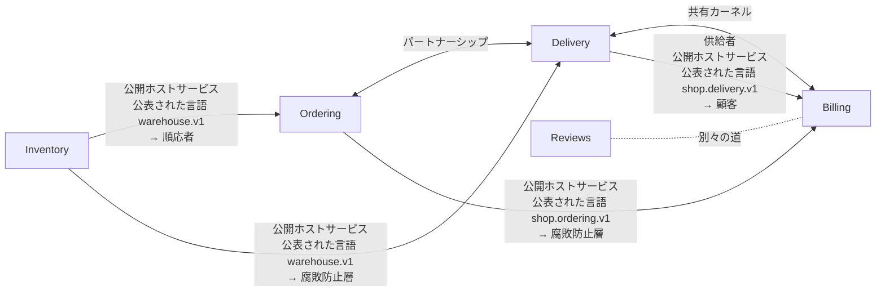

# コンテキストマップ：Shop（shop）v1

A small online shop that takes orders, holds stock, delivers and bills

`shop.ctx` から書いた。`sakai check` の結果：コンテキスト 5、関係 7。成果物 79 件は、どれも一つのコンテキストに属する。境界を越える参照 9 件を確かめた（proto 1、rulec 2、koyomi 1、dandori 5）。

矢印は上流から下流へ向かい、上流の役割と、通る公表された言語と、下流の役割を書く。両向きの線は共有カーネルかパートナーシップ、点線は別々の道。

## コンテキスト

| コンテキスト | 別名 | 持ち主 | 成果物 | 説明 |
|---|---|---|---|---|
| [Ordering](#orderingordering) | `ordering` | Ordering team | 17 | Takes orders, holds stock for them, hands them to delivery, and sees them through to arrival |
| [Inventory](#inventoryinventory) | `inventory` | Warehouse team | 17 | Keeps the counts on the warehouse shelves, holds stock for each line of an order, and answers how packing is going |
| [Delivery](#deliverydelivery) | `delivery` | Delivery team | 19 | Decides the day to ship, chooses how to carry, and arranges delivery of the parcel |
| [Billing](#billingbilling) | `billing` | Accounting team | 21 | Decides whether to bill an order, works out the fee and the shipping charge, and sets the day payment is due |
| [Reviews](#reviewsreviews) | `reviews` | Ordering team | 5 | Collects what buyers think and shows it. It has nothing to do with billing |

## Ordering（ordering）

Takes orders, holds stock for them, hands them to delivery, and sees them through to arrival

- 持ち主：Ordering team
- 書いたファイル：`contexts/ordering.ctx`

### 成果物

| ツール | ファイル | 持っているもの |
|---|---|---|
| `dandori` | `ordering/fulfillment.flow` | 実装するサービス `FulfillmentService`／子のフロー `delivery/arrange_delivery.flow` |
| `proto` | `proto/shop/ordering/v1/fulfillment.proto` | メッセージ `FulfillRequest`、`FulfillmentOrder`、`Line`、`Gift`、`FulfillResponse`、`AnswerPackingRequest`、`AnswerPackingResponse`／サービス `FulfillmentService` |
| `proto` | `proto/shop/ordering/v1/order.proto` | メッセージ `Order`、`GetOrderRequest`、`GetOrderResponse`／列挙 `OrderStatus`／サービス `OrderService` |
| `file` | 14 個のファイル（コード） |  |

### 公表された言語

- `shop.ordering.v1`：書いたもの `proto/shop/ordering/v1/order.proto`、`proto/shop/ordering/v1/fulfillment.proto`。公開ホストサービス `OrderService`（`GetOrder`）。公開ホストサービス `FulfillmentService`（`Fulfill`、`AnswerPacking`）。`ordering/fulfillment.flow` が実装する。生成したコード `py/shop/ordering/v1`、`ts/shop/ordering/v1`、`java/src/main/java/shop/ordering/v1`、`go/shop/ordering/v1`

### 用語集

| 語 | 定義 | 指すもの | 越えていく先 |
|---|---|---|---|
| `order` | A purchase the customer has confirmed. It does not disappear when it is cancelled | `proto "proto/shop/ordering/v1/order.proto" message Order` | — |
| `cancel` | Cancelling an order before it ships, at the customer's request | `proto "proto/shop/ordering/v1/order.proto" enum OrderStatus value ORDER_STATUS_CANCELLED` | [Billing](#billingbilling)（`cancelled_in_ordering` として） |

### 関係

- 上流 [Inventory](#inventoryinventory)：公開ホストサービス・公表された言語 `warehouse.v1` → 順応者。越える参照：`proto/shop/ordering/v1/fulfillment.proto:16` (proto import) → `proto "proto/warehouse/v1/stock.proto"`; `ordering/fulfillment.flow:9` (use proto) → `proto "proto/warehouse/v1/stock.proto"`; `ordering/fulfillment.flow:47` (connect) → `proto "proto/warehouse/v1/stock.proto" service StockService method Reserve`; `ordering/fulfillment.flow:53` (connect) → `proto "proto/warehouse/v1/stock.proto" service StockService method Release`
- [Delivery](#deliverydelivery) とパートナーシップ。越える参照：`ordering/fulfillment.flow:6` (use rule … connect) → `rulec "delivery/rules/urgency.rule"`; `ordering/fulfillment.flow:59` (flow) → `dandori "delivery/arrange_delivery.flow"`
- 下流 [Billing](#billingbilling)：公開ホストサービス・公表された言語 `shop.ordering.v1` → 腐敗防止層。越える参照：`billing/rules/billing_need.rule:4` (import proto) → `proto "proto/shop/ordering/v1/order.proto" enum OrderStatus`

## Inventory（inventory）

Keeps the counts on the warehouse shelves, holds stock for each line of an order, and answers how packing is going

- 持ち主：Warehouse team
- ほかの呼び名：stock control
- 書いたファイル：`contexts/inventory.ctx`

### 成果物

| ツール | ファイル | 持っているもの |
|---|---|---|
| `chobo` | `inventory/inventory.book` | 勘定 `stock`、`suppliers`、`customers`／振替 `receive`、`reserve`、`take_back` |
| `proto` | `proto/warehouse/v1/stock.proto` | メッセージ `ReserveRequest`、`ReserveResponse`、`ReleaseRequest`、`ReleaseResponse`、`GetPackingRequest`、`GetPackingResponse`／列挙 `Stock`、`PackingStatus`／サービス `StockService`、`PackingService` |
| `file` | 15 個のファイル（コード） |  |

### 公表された言語

- `warehouse.v1`：書いたもの `proto/warehouse/v1/stock.proto`。公開ホストサービス `StockService`（`Reserve`、`Release`）。公開ホストサービス `PackingService`（`GetPacking`）。生成したコード `py/warehouse/v1`、`ts/warehouse/v1`、`java/src/main/java/warehouse/v1`、`go/warehouse/v1`

### 用語集

| 語 | 定義 | 指すもの | 越えていく先 |
|---|---|---|---|
| `reservation` | Holding shelf stock for one line of an order until it ships or is cancelled | `proto "proto/warehouse/v1/stock.proto" message ReserveResponse` | [Ordering](#orderingordering) |
| `out_of_stock` | The count asked for is not on the shelf | `proto "proto/warehouse/v1/stock.proto" enum Stock value STOCK_SHORT` | [Ordering](#orderingordering) |
| `packing_status` | Whether the goods of an order are in the box. A shortage can turn up part-way through packing | `proto "proto/warehouse/v1/stock.proto" enum PackingStatus` | [Ordering](#orderingordering) |

### 関係

- 下流 [Ordering](#orderingordering)：公開ホストサービス・公表された言語 `warehouse.v1` → 順応者。越える参照：`proto/shop/ordering/v1/fulfillment.proto:16` (proto import) → `proto "proto/warehouse/v1/stock.proto"`; `ordering/fulfillment.flow:9` (use proto) → `proto "proto/warehouse/v1/stock.proto"`; `ordering/fulfillment.flow:47` (connect) → `proto "proto/warehouse/v1/stock.proto" service StockService method Reserve`; `ordering/fulfillment.flow:53` (connect) → `proto "proto/warehouse/v1/stock.proto" service StockService method Release`
- 下流 [Delivery](#deliverydelivery)：公開ホストサービス・公表された言語 `warehouse.v1` → 腐敗防止層

## Delivery（delivery）

Decides the day to ship, chooses how to carry, and arranges delivery of the parcel

- 持ち主：Delivery team
- 書いたファイル：`contexts/delivery.ctx`

### 成果物

| ツール | ファイル | 持っているもの |
|---|---|---|
| `dandori` | `delivery/arrange_delivery.flow` |  |
| `rulec` | `delivery/rules/urgency.rule` | 入力 `member`、`amount`／出力 `urgent`、`carrier` |
| `koyomi` | `delivery/ship_date.cal` | 日付 `ship`／カレンダー `tokyo_business_days` のデータ 1955-01-01..2027-12-31 |
| `proto` | `proto/shop/delivery/v1/shipment.proto` | メッセージ `CreateShipmentRequest`、`Destination`、`Parcel`、`CreateShipmentResponse`／列挙 `Handling`／サービス `DeliveryService` |
| `file` | 15 個のファイル（コード） |  |

### 公表された言語

- `shop.delivery.v1`：書いたもの `proto/shop/delivery/v1/shipment.proto`。公開ホストサービス `DeliveryService`（`CreateShipment`）。生成したコード `py/shop/delivery/v1`、`ts/shop/delivery/v1`、`java/src/main/java/shop/delivery/v1`、`go/shop/delivery/v1`
- `rulec.urgency.v1`：書いたもの `delivery/rules/urgency.rule`。公開ホストサービス `UrgencyService`

### 用語集

| 語 | 定義 | 指すもの | 越えていく先 |
|---|---|---|---|
| `shipment` | Handing a parcel over from the warehouse to a carrier | `proto "proto/shop/delivery/v1/shipment.proto" message CreateShipmentRequest` | [Billing](#billingbilling) |
| `fragile` | A parcel that nothing is put on top of while it travels | `proto "proto/shop/delivery/v1/shipment.proto" enum Handling value HANDLING_FRAGILE` | [Billing](#billingbilling) |
| `urgent` | Whether to carry by the next-day service | `rulec "delivery/rules/urgency.rule" output urgent` | [Ordering](#orderingordering) |

### 関係

- [Ordering](#orderingordering) とパートナーシップ。越える参照：`ordering/fulfillment.flow:6` (use rule … connect) → `rulec "delivery/rules/urgency.rule"`; `ordering/fulfillment.flow:59` (flow) → `dandori "delivery/arrange_delivery.flow"`
- 上流 [Inventory](#inventoryinventory)：公開ホストサービス・公表された言語 `warehouse.v1` → 腐敗防止層
- [Billing](#billingbilling) と共有カーネル：`koyomi "calendars/tokyo_business_days.cal"`、`dir "py/calendars"`、`dir "ts/calendars"`、`dir "java/src/main/java/calendars"`、`dir "go/calendars"`。越える参照：`delivery/ship_date.cal:3` (use calendar) → `koyomi "calendars/tokyo_business_days.cal"`
- 下流 [Billing](#billingbilling)：供給者・公開ホストサービス・公表された言語 `shop.delivery.v1` → 顧客。越える参照：`billing/rules/shipment_fee.rule:7` (shape) → `proto "proto/shop/delivery/v1/shipment.proto" message CreateShipmentRequest`

## Billing（billing）

Decides whether to bill an order, works out the fee and the shipping charge, and sets the day payment is due

- 持ち主：Accounting team
- 書いたファイル：`contexts/billing.ctx`

### 成果物

| ツール | ファイル | 持っているもの |
|---|---|---|
| `koyomi` | `billing/payment_terms.cal` | 日付 `closing`、`payment`／カレンダー `tokyo_business_days` のデータ 1955-01-01..2027-12-31 |
| `rulec` | `billing/rules/billing_need.rule` | 入力 `status`／出力 `handling` |
| `rulec` | `billing/rules/payment_fee.rule` | 入力 `amount`、`rate`、`small`／出力 `fee` |
| `rulec` | `billing/rules/shipment_fee.rule` | 入力 `destination`、`fragile`、`parcels`、`declared`、`window`／出力 `fee` |
| `koyomi` | `calendars/tokyo_business_days.cal` | カレンダー `tokyo_business_days` のデータ 1955-01-01..2027-12-31 |
| `file` | 16 個のファイル（コード） |  |

### 公表された言語

- `rulec.payment_fee.v1`：書いたもの `billing/rules/payment_fee.rule`。公開ホストサービス `PaymentFeeService`

### 用語集

| 語 | 定義 | 指すもの | 越えていく先 |
|---|---|---|---|
| `fee` | The amount for each payment, worked out from the rate in the contract | `rulec "billing/rules/payment_fee.rule" output fee` | — |
| `cancel` | Voiding an invoice after it was confirmed, and refunding it | — | — |

### 関係

- [Delivery](#deliverydelivery) と共有カーネル：`koyomi "calendars/tokyo_business_days.cal"`、`dir "py/calendars"`、`dir "ts/calendars"`、`dir "java/src/main/java/calendars"`、`dir "go/calendars"`。越える参照：`delivery/ship_date.cal:3` (use calendar) → `koyomi "calendars/tokyo_business_days.cal"`
- 上流 [Ordering](#orderingordering)：公開ホストサービス・公表された言語 `shop.ordering.v1` → 腐敗防止層。越える参照：`billing/rules/billing_need.rule:4` (import proto) → `proto "proto/shop/ordering/v1/order.proto" enum OrderStatus`
- 上流 [Delivery](#deliverydelivery)：供給者・公開ホストサービス・公表された言語 `shop.delivery.v1` → 顧客。越える参照：`billing/rules/shipment_fee.rule:7` (shape) → `proto "proto/shop/delivery/v1/shipment.proto" message CreateShipmentRequest`
- [Reviews](#reviewsreviews) と別々の道（越える参照が無いことを確かめた）

## Reviews（reviews）

Collects what buyers think and shows it. It has nothing to do with billing

- 持ち主：Ordering team
- 書いたファイル：`contexts/reviews.ctx`

### 成果物

| ツール | ファイル | 持っているもの |
|---|---|---|
| `file` | 5 個のファイル（コード） |  |

### 関係

- [Billing](#billingbilling) と別々の道（越える参照が無いことを確かめた）

## 用語集の索引

| 語 | コンテキスト | 定義 | 境界を越えるとき |
|---|---|---|---|
| `cancel` | [Ordering](#orderingordering) | Cancelling an order before it ships, at the customer's request | [Billing](#billingbilling)（`cancelled_in_ordering` として）。同じ名前の語が [Billing](#billingbilling) にもある |
| `cancel` | [Billing](#billingbilling) | Voiding an invoice after it was confirmed, and refunding it | 同じ名前の語が [Ordering](#orderingordering) にもある |
| `fee` | [Billing](#billingbilling) | The amount for each payment, worked out from the rate in the contract | — |
| `fragile` | [Delivery](#deliverydelivery) | A parcel that nothing is put on top of while it travels | [Billing](#billingbilling) |
| `order` | [Ordering](#orderingordering) | A purchase the customer has confirmed. It does not disappear when it is cancelled | — |
| `out_of_stock` | [Inventory](#inventoryinventory) | The count asked for is not on the shelf | [Ordering](#orderingordering) |
| `packing_status` | [Inventory](#inventoryinventory) | Whether the goods of an order are in the box. A shortage can turn up part-way through packing | [Ordering](#orderingordering) |
| `reservation` | [Inventory](#inventoryinventory) | Holding shelf stock for one line of an order until it ships or is cancelled | [Ordering](#orderingordering) |
| `shipment` | [Delivery](#deliverydelivery) | Handing a parcel over from the warehouse to a carrier | [Billing](#billingbilling) |
| `urgent` | [Delivery](#deliverydelivery) | Whether to carry by the next-day service | [Ordering](#orderingordering) |

## 対応

### Delivery ← Inventory：PackingStatus

`proto "proto/warehouse/v1/stock.proto" enum PackingStatus` を `shipping_decision` に読み替える。 層は `dir "py/delivery/acl/inventory"`、`dir "ts/delivery/acl/inventory"`、`dir "java/src/main/java/delivery/acl/inventory"`、`dir "go/delivery/acl/inventory"`。 対応は `contexts/delivery.ctx` に書いたもの。対応の先は名前だけなので、下流の値は確かめていない。

| 上流の値 | 下流の値 |
|---|---|
| `PACKING_STATUS_WAITING` | `wait` |
| `PACKING_STATUS_PACKED` | `ship` |
| `PACKING_STATUS_SHORT` | 拒否：A box with an item missing is not shipped. It goes back to ordering |

### Billing ← Ordering：OrderStatus

`proto "proto/shop/ordering/v1/order.proto" enum OrderStatus` を `rulec "billing/rules/billing_need.rule" enum order_status` に読み替える。 層は `rulec "billing/rules/billing_need.rule"`、`dir "py/billing/acl/ordering"`、`dir "ts/billing/acl/ordering"`、`dir "java/src/main/java/billing/acl/ordering"`、`dir "go/billing/acl/ordering"`。 対応は、規則の `import proto` から rulec が読んだもの（規則の表は rulec が確かめる）。

| 上流の値 | 下流の値 |
|---|---|
| `ORDER_STATUS_RECEIVED` | `received` |
| `ORDER_STATUS_PAID` | `paid` |
| `ORDER_STATUS_SHIPPED` | `shipped` |
| `ORDER_STATUS_CANCELLED` | `cancelled_in_ordering` |

## 確かめていないこと

- 腐敗防止層のコードが、書いた対応のとおりに読み替えているか。sakai が確かめるのは、対応が上流の列挙を網羅していることと、対応の先が下流の列挙にあることまで（規則が先のときは、規則の表を rulec が確かめる）。
- 契約に書いていない呼び出し：OpenAPI の文書の無い HTTP（URL を文字列で持つもの）、AsyncAPI の文書の無いメッセージのキュー、データベースの共有、リフレクションと動的な import。OpenAPI と AsyncAPI の文書に書いた HTTP の操作とチャネルは、ほかの成果物と同じく確かめる。
- コードが、OpenAPI と AsyncAPI の文書のとおりに HTTP を呼び、チャネルに送り、チャネルから受けているか。sakai が確かめるのは、文書どうしと、文書と地図が合っていることまで。
- 生成したコードの置き場所のコードが、本当にその公表された言語から生成したものか。
- 語の定義の文の中身。
- コードの import。これは sakai build が書く設定で、import-linter、dependency-cruiser、ArchUnit、go-arch-lint が CI で確かめる。

sakai 0.26.0 が `shop.ctx` から書いた。
