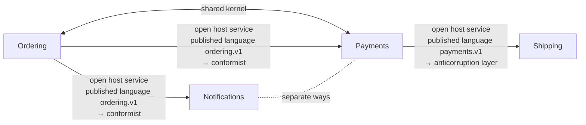

# Context map: Webshop (webshop) v1

Four services of a small shop that talk over HTTP and events, each with its contract

Written from `webshop.ctx`. `sakai check` says: 4 contexts, 5 relationships; 9 artifacts, each in one context; 7 crossings checked (openapi 1, asyncapi 5, dandori 1).

An arrow goes from the upstream to the downstream, with the upstream's roles, the published language the relationship goes through, and the downstream's role. A line with two heads is a shared kernel or a partnership; a dotted line is separate ways.

## Contexts

| Context | Alias | Owner | Artifacts | Description |
|---|---|---|---|---|
| [Ordering](#ordering-ordering) | `ordering` | Ordering team | 3 | Takes the customer's orders, and tells the other services when an order is placed or cancelled |
| [Payments](#payments-payments) | `payments` | Payments team | 2 | Charges the customer's card for a placed order, and tells how the charge went |
| [Shipping](#shipping-shipping) | `shipping` | Shipping team | 2 | Ships an order once its charge has gone through |
| [Notifications](#notifications-notifications) | `notifications` | Customer care team | 2 | Tells the customer by mail what happened to an order |

## Ordering (ordering)

Takes the customer's orders, and tells the other services when an order is placed or cancelled

- Owner: Ordering team
- Written in: `contexts/ordering.ctx`

### Artifacts

| Tool | File | What it holds |
|---|---|---|
| `openapi` | `common/money.yaml` | a part of a document: `Money` |
| `openapi` | `ordering/api/ordering.json` | OpenAPI 3.1.0 "Ordering API", version 1.0.0; operations `createOrder` (POST /orders), `getOrder` (GET /orders/{id}); schemas `NewOrder`, `Line`, `Order`; enums `OrderStatus` |
| `asyncapi` | `ordering/events/ordering.yaml` | AsyncAPI 3.0.0 "Ordering events", version 1.0.0; channels `orderPlaced` (`shop.ordering.order.placed`), `orderCancelled` (`shop.ordering.order.cancelled`); sends and receives `sendOrderPlaced` (send `orderPlaced`), `sendOrderCancelled` (send `orderCancelled`) |

### Published language

- `ordering.v1`: written in OpenAPI `ordering/api/ordering.json`, AsyncAPI `ordering/events/ordering.yaml`; open host service `createOrder` (the HTTP operation POST /orders); open host service `getOrder` (the HTTP operation GET /orders/{id}); open host service `orderPlaced` (the channel shop.ordering.order.placed); open host service `orderCancelled` (the channel shop.ordering.order.cancelled)

### Glossary

| Term | Definition | Means | Crosses into |
|---|---|---|---|
| `order` | A customer's confirmed request to buy. A cancelled order stays | `ordering/api/ordering.json#/components/schemas/Order` | [Notifications](#notifications-notifications), [Payments](#payments-payments) |
| `order_placed` | The event that an order has been placed | `ordering/events/ordering.yaml#/channels/orderPlaced` | [Notifications](#notifications-notifications), [Payments](#payments-payments) |

### Relationships

- Shared kernel with [Payments](#payments-payments): `dir "common"`. References that cross: `payments/api/payments.yaml:50` ($ref) → `common/money.yaml#/Money`
- Downstream [Payments](#payments-payments): open host service, published language `ordering.v1` → conformist. References that cross: `payments/events/payments.yaml:8` (receive) → `ordering/events/ordering.yaml#/channels/orderPlaced`
- Downstream [Notifications](#notifications-notifications): open host service, published language `ordering.v1` → conformist. References that cross: `notifications/events/notifications.yaml:8` (receive) → `ordering/events/ordering.yaml#/channels/orderPlaced`; `notifications/events/notifications.yaml:10` (receive) → `ordering/events/ordering.yaml#/channels/orderCancelled`; `notifications/notify.flow:4` (use openapi) → `file "ordering/api/ordering.json"`

## Payments (payments)

Charges the customer's card for a placed order, and tells how the charge went

- Owner: Payments team
- Written in: `contexts/payments.ctx`

### Artifacts

| Tool | File | What it holds |
|---|---|---|
| `openapi` | `payments/api/payments.yaml` | OpenAPI 3.2.0 "Payments API", version 1.0.0; operations `createCharge` (POST /charges), `getCharge` (GET /charges/{id}); schemas `NewCharge`, `Charge`; enums `ChargeStatus` |
| `asyncapi` | `payments/events/payments.yaml` | AsyncAPI 3.1.0 "Payments events", version 1.0.0; channels `orderPlaced` (from `ordering/events/ordering.yaml`), `paymentSucceeded` (`shop.payments.payment.succeeded`), `paymentFailed` (`shop.payments.payment.failed`); sends and receives `receiveOrderPlaced` (receive `orderPlaced`), `sendPaymentSucceeded` (send `paymentSucceeded`), `sendPaymentFailed` (send `paymentFailed`) |

### Published language

- `payments.v1`: written in OpenAPI `payments/api/payments.yaml`, AsyncAPI `payments/events/payments.yaml`; open host service `createCharge` (the HTTP operation POST /charges); open host service `getCharge` (the HTTP operation GET /charges/{id}); open host service `paymentSucceeded` (the channel shop.payments.payment.succeeded); open host service `paymentFailed` (the channel shop.payments.payment.failed)

### Glossary

| Term | Definition | Means | Crosses into |
|---|---|---|---|
| `charge` | Taking the money for one order from the customer's card | `payments/api/payments.yaml#/components/schemas/Charge` | [Shipping](#shipping-shipping) |
| `charge_status` | Where a charge is: waiting for the card's answer, taken, refused, or given back | `payments/api/payments.yaml#/components/schemas/ChargeStatus` | [Shipping](#shipping-shipping) |

### Relationships

- Shared kernel with [Ordering](#ordering-ordering): `dir "common"`. References that cross: `payments/api/payments.yaml:50` ($ref) → `common/money.yaml#/Money`
- Upstream [Ordering](#ordering-ordering): open host service, published language `ordering.v1` → conformist. References that cross: `payments/events/payments.yaml:8` (receive) → `ordering/events/ordering.yaml#/channels/orderPlaced`
- Downstream [Shipping](#shipping-shipping): open host service, published language `payments.v1` → anticorruption layer. References that cross: `shipping/acl/payments.yaml:9` (receive) → `payments/events/payments.yaml#/channels/paymentSucceeded`; `shipping/acl/payments.yaml:11` (receive) → `payments/events/payments.yaml#/channels/paymentFailed`
- Separate ways from [Notifications](#notifications-notifications) (no reference crosses, as checked)

## Shipping (shipping)

Ships an order once its charge has gone through

- Owner: Shipping team
- Written in: `contexts/shipping.ctx`

### Artifacts

| Tool | File | What it holds |
|---|---|---|
| `asyncapi` | `shipping/acl/payments.yaml` | AsyncAPI 3.0.0 "Shipping, from Payments", version 1.0.0; channels `paymentSucceeded` (from `payments/events/payments.yaml`), `paymentFailed` (from `payments/events/payments.yaml`); sends and receives `receivePaymentSucceeded` (receive `paymentSucceeded`), `receivePaymentFailed` (receive `paymentFailed`) |
| `openapi` | `shipping/api/shipping.yaml` | OpenAPI 3.0.3 "Shipping API", version 1.0.0; operations `getShipment` (GET /shipments/{orderId}); schemas `Shipment`; enums `ShipmentGate` |

### Published language

- `shipping.v1`: written in OpenAPI `shipping/api/shipping.yaml`; open host service `getShipment` (the HTTP operation GET /shipments/{orderId})

### Glossary

| Term | Definition | Means | Crosses into |
|---|---|---|---|
| `shipment_gate` | Whether an order may leave the warehouse | `shipping/api/shipping.yaml#/components/schemas/ShipmentGate` | — |

### Relationships

- Upstream [Payments](#payments-payments): open host service, published language `payments.v1` → anticorruption layer. References that cross: `shipping/acl/payments.yaml:9` (receive) → `payments/events/payments.yaml#/channels/paymentSucceeded`; `shipping/acl/payments.yaml:11` (receive) → `payments/events/payments.yaml#/channels/paymentFailed`

## Notifications (notifications)

Tells the customer by mail what happened to an order

- Owner: Customer care team
- Written in: `contexts/notifications.ctx`

### Artifacts

| Tool | File | What it holds |
|---|---|---|
| `dandori` | `notifications/notify.flow` |  |
| `asyncapi` | `notifications/events/notifications.yaml` | AsyncAPI 3.0.0 "Notifications, from Ordering", version 1.0.0; channels `orderPlaced` (from `ordering/events/ordering.yaml`), `orderCancelled` (from `ordering/events/ordering.yaml`); sends and receives `receiveOrderPlaced` (receive `orderPlaced`), `receiveOrderCancelled` (receive `orderCancelled`) |

### Glossary

| Term | Definition | Means | Crosses into |
|---|---|---|---|
| `order` |  | — | — |

### Relationships

- Upstream [Ordering](#ordering-ordering): open host service, published language `ordering.v1` → conformist. References that cross: `notifications/events/notifications.yaml:8` (receive) → `ordering/events/ordering.yaml#/channels/orderPlaced`; `notifications/events/notifications.yaml:10` (receive) → `ordering/events/ordering.yaml#/channels/orderCancelled`; `notifications/notify.flow:4` (use openapi) → `file "ordering/api/ordering.json"`
- Separate ways from [Payments](#payments-payments) (no reference crosses, as checked)

## Glossary index

| Term | Context | Definition | Across a boundary |
|---|---|---|---|
| `charge` | [Payments](#payments-payments) | Taking the money for one order from the customer's card | [Shipping](#shipping-shipping) |
| `charge_status` | [Payments](#payments-payments) | Where a charge is: waiting for the card's answer, taken, refused, or given back | [Shipping](#shipping-shipping) |
| `order` | [Ordering](#ordering-ordering) | A customer's confirmed request to buy. A cancelled order stays | [Notifications](#notifications-notifications), [Payments](#payments-payments); a term of the same name is in [Notifications](#notifications-notifications) |
| `order` | [Notifications](#notifications-notifications) |  | a term of the same name is in [Ordering](#ordering-ordering) |
| `order_placed` | [Ordering](#ordering-ordering) | The event that an order has been placed | [Notifications](#notifications-notifications), [Payments](#payments-payments) |
| `shipment_gate` | [Shipping](#shipping-shipping) | Whether an order may leave the warehouse | — |

## Mappings

### Shipping ← Payments: ChargeStatus

Maps `payments/api/payments.yaml#/components/schemas/ChargeStatus` to `shipping/api/shipping.yaml#/components/schemas/ShipmentGate`. The layer is `dir "shipping/acl"`. The mapping is written in `contexts/shipping.ctx`; the downstream values are checked to be in the target enum.

| Upstream value | Downstream value |
|---|---|
| `pending` | `hold` |
| `succeeded` | `release` |
| `failed` | refused: An order whose charge failed is not shipped |
| `refunded` | refused: A refunded order is not shipped |

## What is not checked

- Whether the code of an anticorruption layer maps as the mapping says. sakai checks that the mapping covers the upstream's enum and that what it maps to is in the downstream's enum (where a rule is the target, rulec checks the rule's tables).
- Calls no contract writes: HTTP to a URL held in a string with no OpenAPI document, a message queue with no AsyncAPI document, a shared database, reflection and dynamic imports. The HTTP operations and the channels written in OpenAPI and AsyncAPI documents are checked like any other artifact.
- Whether the code calls HTTP, and sends to and receives from the channels, as the OpenAPI and AsyncAPI documents say: sakai checks the documents against each other and against the map.
- Whether the code where generated code is kept was really generated from the published language.
- What a term's definition says.
- The imports of the code: the settings `sakai build` writes have import-linter, dependency-cruiser, ArchUnit and go-arch-lint check them in CI.

Written by sakai 0.23.0 from `webshop.ctx`.
