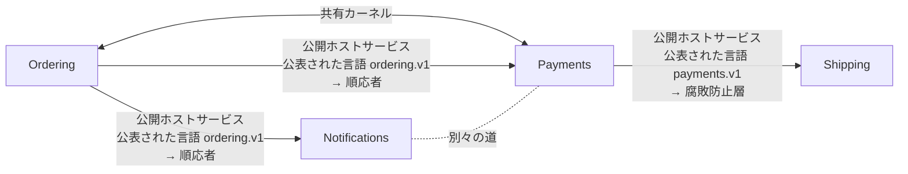

# コンテキストマップ：Webshop（webshop）v1

Four services of a small shop that talk over HTTP and events, each with its contract

`webshop.ctx` から書いた。`sakai check` の結果：コンテキスト 4、関係 5。成果物 9 件は、どれも一つのコンテキストに属する。境界を越える参照 7 件を確かめた（openapi 1、asyncapi 5、dandori 1）。

矢印は上流から下流へ向かい、上流の役割と、通る公表された言語と、下流の役割を書く。両向きの線は共有カーネルかパートナーシップ、点線は別々の道。

## コンテキスト

| コンテキスト | 別名 | 持ち主 | 成果物 | 説明 |
|---|---|---|---|---|
| [Ordering](#orderingordering) | `ordering` | Ordering team | 3 | Takes the customer's orders, and tells the other services when an order is placed or cancelled |
| [Payments](#paymentspayments) | `payments` | Payments team | 2 | Charges the customer's card for a placed order, and tells how the charge went |
| [Shipping](#shippingshipping) | `shipping` | Shipping team | 2 | Ships an order once its charge has gone through |
| [Notifications](#notificationsnotifications) | `notifications` | Customer care team | 2 | Tells the customer by mail what happened to an order |

## Ordering（ordering）

Takes the customer's orders, and tells the other services when an order is placed or cancelled

- 持ち主：Ordering team
- 書いたファイル：`contexts/ordering.ctx`

### 成果物

| ツール | ファイル | 持っているもの |
|---|---|---|
| `openapi` | `common/money.yaml` | 文書の一部 `Money` |
| `openapi` | `ordering/api/ordering.json` | OpenAPI 3.1.0「Ordering API」、バージョン 1.0.0／操作 `createOrder`（POST /orders）、`getOrder`（GET /orders/{id}）／スキーマ `NewOrder`、`Line`、`Order`／列挙 `OrderStatus` |
| `asyncapi` | `ordering/events/ordering.yaml` | AsyncAPI 3.0.0「Ordering events」、バージョン 1.0.0／チャネル `orderPlaced`（`shop.ordering.order.placed`）、`orderCancelled`（`shop.ordering.order.cancelled`）／送受信 `sendOrderPlaced`（send `orderPlaced`）、`sendOrderCancelled`（send `orderCancelled`） |

### 公表された言語

- `ordering.v1`：書いたもの OpenAPI `ordering/api/ordering.json`、AsyncAPI `ordering/events/ordering.yaml`。公開ホストサービス `createOrder`（HTTP の操作 POST /orders）。公開ホストサービス `getOrder`（HTTP の操作 GET /orders/{id}）。公開ホストサービス `orderPlaced`（チャネル shop.ordering.order.placed）。公開ホストサービス `orderCancelled`（チャネル shop.ordering.order.cancelled）

### 用語集

| 語 | 定義 | 指すもの | 越えていく先 |
|---|---|---|---|
| `order` | A customer's confirmed request to buy. A cancelled order stays | `ordering/api/ordering.json#/components/schemas/Order` | [Notifications](#notificationsnotifications)、[Payments](#paymentspayments) |
| `order_placed` | The event that an order has been placed | `ordering/events/ordering.yaml#/channels/orderPlaced` | [Notifications](#notificationsnotifications)、[Payments](#paymentspayments) |

### 関係

- [Payments](#paymentspayments) と共有カーネル：`dir "common"`。越える参照：`payments/api/payments.yaml:50` ($ref) → `common/money.yaml#/Money`
- 下流 [Payments](#paymentspayments)：公開ホストサービス・公表された言語 `ordering.v1` → 順応者。越える参照：`payments/events/payments.yaml:8` (receive) → `ordering/events/ordering.yaml#/channels/orderPlaced`
- 下流 [Notifications](#notificationsnotifications)：公開ホストサービス・公表された言語 `ordering.v1` → 順応者。越える参照：`notifications/events/notifications.yaml:8` (receive) → `ordering/events/ordering.yaml#/channels/orderPlaced`; `notifications/events/notifications.yaml:10` (receive) → `ordering/events/ordering.yaml#/channels/orderCancelled`; `notifications/notify.flow:4` (use openapi) → `file "ordering/api/ordering.json"`

## Payments（payments）

Charges the customer's card for a placed order, and tells how the charge went

- 持ち主：Payments team
- 書いたファイル：`contexts/payments.ctx`

### 成果物

| ツール | ファイル | 持っているもの |
|---|---|---|
| `openapi` | `payments/api/payments.yaml` | OpenAPI 3.2.0「Payments API」、バージョン 1.0.0／操作 `createCharge`（POST /charges）、`getCharge`（GET /charges/{id}）／スキーマ `NewCharge`、`Charge`／列挙 `ChargeStatus` |
| `asyncapi` | `payments/events/payments.yaml` | AsyncAPI 3.1.0「Payments events」、バージョン 1.0.0／チャネル `orderPlaced`（`ordering/events/ordering.yaml` のもの）、`paymentSucceeded`（`shop.payments.payment.succeeded`）、`paymentFailed`（`shop.payments.payment.failed`）／送受信 `receiveOrderPlaced`（receive `orderPlaced`）、`sendPaymentSucceeded`（send `paymentSucceeded`）、`sendPaymentFailed`（send `paymentFailed`） |

### 公表された言語

- `payments.v1`：書いたもの OpenAPI `payments/api/payments.yaml`、AsyncAPI `payments/events/payments.yaml`。公開ホストサービス `createCharge`（HTTP の操作 POST /charges）。公開ホストサービス `getCharge`（HTTP の操作 GET /charges/{id}）。公開ホストサービス `paymentSucceeded`（チャネル shop.payments.payment.succeeded）。公開ホストサービス `paymentFailed`（チャネル shop.payments.payment.failed）

### 用語集

| 語 | 定義 | 指すもの | 越えていく先 |
|---|---|---|---|
| `charge` | Taking the money for one order from the customer's card | `payments/api/payments.yaml#/components/schemas/Charge` | [Shipping](#shippingshipping) |
| `charge_status` | Where a charge is: waiting for the card's answer, taken, refused, or given back | `payments/api/payments.yaml#/components/schemas/ChargeStatus` | [Shipping](#shippingshipping) |

### 関係

- [Ordering](#orderingordering) と共有カーネル：`dir "common"`。越える参照：`payments/api/payments.yaml:50` ($ref) → `common/money.yaml#/Money`
- 上流 [Ordering](#orderingordering)：公開ホストサービス・公表された言語 `ordering.v1` → 順応者。越える参照：`payments/events/payments.yaml:8` (receive) → `ordering/events/ordering.yaml#/channels/orderPlaced`
- 下流 [Shipping](#shippingshipping)：公開ホストサービス・公表された言語 `payments.v1` → 腐敗防止層。越える参照：`shipping/acl/payments.yaml:9` (receive) → `payments/events/payments.yaml#/channels/paymentSucceeded`; `shipping/acl/payments.yaml:11` (receive) → `payments/events/payments.yaml#/channels/paymentFailed`
- [Notifications](#notificationsnotifications) と別々の道（越える参照が無いことを確かめた）

## Shipping（shipping）

Ships an order once its charge has gone through

- 持ち主：Shipping team
- 書いたファイル：`contexts/shipping.ctx`

### 成果物

| ツール | ファイル | 持っているもの |
|---|---|---|
| `asyncapi` | `shipping/acl/payments.yaml` | AsyncAPI 3.0.0「Shipping, from Payments」、バージョン 1.0.0／チャネル `paymentSucceeded`（`payments/events/payments.yaml` のもの）、`paymentFailed`（`payments/events/payments.yaml` のもの）／送受信 `receivePaymentSucceeded`（receive `paymentSucceeded`）、`receivePaymentFailed`（receive `paymentFailed`） |
| `openapi` | `shipping/api/shipping.yaml` | OpenAPI 3.0.3「Shipping API」、バージョン 1.0.0／操作 `getShipment`（GET /shipments/{orderId}）／スキーマ `Shipment`／列挙 `ShipmentGate` |

### 公表された言語

- `shipping.v1`：書いたもの OpenAPI `shipping/api/shipping.yaml`。公開ホストサービス `getShipment`（HTTP の操作 GET /shipments/{orderId}）

### 用語集

| 語 | 定義 | 指すもの | 越えていく先 |
|---|---|---|---|
| `shipment_gate` | Whether an order may leave the warehouse | `shipping/api/shipping.yaml#/components/schemas/ShipmentGate` | — |

### 関係

- 上流 [Payments](#paymentspayments)：公開ホストサービス・公表された言語 `payments.v1` → 腐敗防止層。越える参照：`shipping/acl/payments.yaml:9` (receive) → `payments/events/payments.yaml#/channels/paymentSucceeded`; `shipping/acl/payments.yaml:11` (receive) → `payments/events/payments.yaml#/channels/paymentFailed`

## Notifications（notifications）

Tells the customer by mail what happened to an order

- 持ち主：Customer care team
- 書いたファイル：`contexts/notifications.ctx`

### 成果物

| ツール | ファイル | 持っているもの |
|---|---|---|
| `dandori` | `notifications/notify.flow` |  |
| `asyncapi` | `notifications/events/notifications.yaml` | AsyncAPI 3.0.0「Notifications, from Ordering」、バージョン 1.0.0／チャネル `orderPlaced`（`ordering/events/ordering.yaml` のもの）、`orderCancelled`（`ordering/events/ordering.yaml` のもの）／送受信 `receiveOrderPlaced`（receive `orderPlaced`）、`receiveOrderCancelled`（receive `orderCancelled`） |

### 用語集

| 語 | 定義 | 指すもの | 越えていく先 |
|---|---|---|---|
| `order` |  | — | — |

### 関係

- 上流 [Ordering](#orderingordering)：公開ホストサービス・公表された言語 `ordering.v1` → 順応者。越える参照：`notifications/events/notifications.yaml:8` (receive) → `ordering/events/ordering.yaml#/channels/orderPlaced`; `notifications/events/notifications.yaml:10` (receive) → `ordering/events/ordering.yaml#/channels/orderCancelled`; `notifications/notify.flow:4` (use openapi) → `file "ordering/api/ordering.json"`
- [Payments](#paymentspayments) と別々の道（越える参照が無いことを確かめた）

## 用語集の索引

| 語 | コンテキスト | 定義 | 境界を越えるとき |
|---|---|---|---|
| `charge` | [Payments](#paymentspayments) | Taking the money for one order from the customer's card | [Shipping](#shippingshipping) |
| `charge_status` | [Payments](#paymentspayments) | Where a charge is: waiting for the card's answer, taken, refused, or given back | [Shipping](#shippingshipping) |
| `order` | [Ordering](#orderingordering) | A customer's confirmed request to buy. A cancelled order stays | [Notifications](#notificationsnotifications)、[Payments](#paymentspayments)。同じ名前の語が [Notifications](#notificationsnotifications) にもある |
| `order` | [Notifications](#notificationsnotifications) |  | 同じ名前の語が [Ordering](#orderingordering) にもある |
| `order_placed` | [Ordering](#orderingordering) | The event that an order has been placed | [Notifications](#notificationsnotifications)、[Payments](#paymentspayments) |
| `shipment_gate` | [Shipping](#shippingshipping) | Whether an order may leave the warehouse | — |

## 対応

### Shipping ← Payments：ChargeStatus

`payments/api/payments.yaml#/components/schemas/ChargeStatus` を `shipping/api/shipping.yaml#/components/schemas/ShipmentGate` に読み替える。 層は `dir "shipping/acl"`。 対応は `contexts/shipping.ctx` に書いたもの。下流の値は、対応の先の列挙にあることを確かめた。

| 上流の値 | 下流の値 |
|---|---|
| `pending` | `hold` |
| `succeeded` | `release` |
| `failed` | 拒否：An order whose charge failed is not shipped |
| `refunded` | 拒否：A refunded order is not shipped |

## 確かめていないこと

- 腐敗防止層のコードが、書いた対応のとおりに読み替えているか。sakai が確かめるのは、対応が上流の列挙を網羅していることと、対応の先が下流の列挙にあることまで（規則が先のときは、規則の表を rulec が確かめる）。
- 契約に書いていない呼び出し：OpenAPI の文書の無い HTTP（URL を文字列で持つもの）、AsyncAPI の文書の無いメッセージのキュー、データベースの共有、リフレクションと動的な import。OpenAPI と AsyncAPI の文書に書いた HTTP の操作とチャネルは、ほかの成果物と同じく確かめる。
- コードが、OpenAPI と AsyncAPI の文書のとおりに HTTP を呼び、チャネルに送り、チャネルから受けているか。sakai が確かめるのは、文書どうしと、文書と地図が合っていることまで。
- 生成したコードの置き場所のコードが、本当にその公表された言語から生成したものか。
- 語の定義の文の中身。
- コードの import。これは sakai build が書く設定で、import-linter、dependency-cruiser、ArchUnit、go-arch-lint が CI で確かめる。

sakai 0.23.0 が `webshop.ctx` から書いた。
