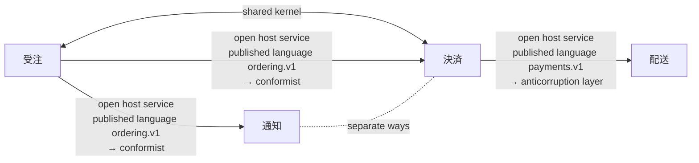

# Context map: ネットショップ (webshop) v1

HTTP とイベントでやりとりする、小さな店の四つのサービス。どれも契約の文書を持つ

Written from `ネットショップ.ctx`. `sakai check` says: 4 contexts, 5 relationships; 9 artifacts, each in one context; 7 crossings checked (openapi 1, asyncapi 5, dandori 1).

An arrow goes from the upstream to the downstream, with the upstream's roles, the published language the relationship goes through, and the downstream's role. A line with two heads is a shared kernel or a partnership; a dotted line is separate ways.

## Contexts

| Context | Alias | Owner | Artifacts | Description |
|---|---|---|---|---|
| [受注](#受注-ordering) | `ordering` | 受注チーム | 3 | 客の注文を受け、注文が入ったことと取り消されたことを、ほかのサービスに知らせる |
| [決済](#決済-payments) | `payments` | 決済チーム | 2 | 入った注文の代金を客のカードに課金し、課金がどうなったかを知らせる |
| [配送](#配送-shipping) | `shipping` | 配送チーム | 2 | 課金が済んだ注文を出荷する |
| [通知](#通知-notifications) | `notifications` | 顧客対応チーム | 2 | 注文がどうなったかを、客にメールで知らせる |

## 受注 (ordering)

客の注文を受け、注文が入ったことと取り消されたことを、ほかのサービスに知らせる

- Owner: 受注チーム
- Written in: `contexts/受注.ctx`

### Artifacts

| Tool | File | What it holds |
|---|---|---|
| `openapi` | `common/money.yaml` | a part of a document: `Money` |
| `openapi` | `ordering/api/ordering.json` | OpenAPI 3.1.0 "受注の API", version 1.0.0; operations `createOrder` (POST /orders), `getOrder` (GET /orders/{id}); schemas `NewOrder`, `Line`, `Order`; enums `OrderStatus` |
| `asyncapi` | `ordering/events/ordering.yaml` | AsyncAPI 3.0.0 "受注のイベント", version 1.0.0; channels `orderPlaced` (`shop.ordering.order.placed`), `orderCancelled` (`shop.ordering.order.cancelled`); sends and receives `sendOrderPlaced` (send `orderPlaced`), `sendOrderCancelled` (send `orderCancelled`) |

### Published language

- `ordering.v1`: written in OpenAPI `ordering/api/ordering.json`, AsyncAPI `ordering/events/ordering.yaml`; open host service `createOrder` (the HTTP operation POST /orders); open host service `getOrder` (the HTTP operation GET /orders/{id}); open host service `orderPlaced` (the channel shop.ordering.order.placed); open host service `orderCancelled` (the channel shop.ordering.order.cancelled)

### Glossary

| Term | Definition | Means | Crosses into |
|---|---|---|---|
| `注文` | 客が確定させた購入の申し込み。取り消されても消えない | `openapi "ordering/api/ordering.json" schema Order` | [通知](#通知-notifications), [決済](#決済-payments) |
| `注文の受付` | 注文が入ったという知らせ | `asyncapi "ordering/events/ordering.yaml" channel orderPlaced` | [通知](#通知-notifications), [決済](#決済-payments) |

### Relationships

- Shared kernel with [決済](#決済-payments): `dir "common"`. References that cross: `payments/api/payments.yaml:50` ($ref) → `openapi "common/money.yaml" pointer /Money`
- Downstream [決済](#決済-payments): open host service, published language `ordering.v1` → conformist. References that cross: `payments/events/payments.yaml:8` (receive) → `asyncapi "ordering/events/ordering.yaml" channel orderPlaced`
- Downstream [通知](#通知-notifications): open host service, published language `ordering.v1` → conformist. References that cross: `notifications/events/notifications.yaml:8` (receive) → `asyncapi "ordering/events/ordering.yaml" channel orderPlaced`; `notifications/events/notifications.yaml:10` (receive) → `asyncapi "ordering/events/ordering.yaml" channel orderCancelled`; `notifications/notify.flow:4` (use openapi) → `openapi "ordering/api/ordering.json"`

## 決済 (payments)

入った注文の代金を客のカードに課金し、課金がどうなったかを知らせる

- Owner: 決済チーム
- Written in: `contexts/決済.ctx`

### Artifacts

| Tool | File | What it holds |
|---|---|---|
| `openapi` | `payments/api/payments.yaml` | OpenAPI 3.2.0 "決済の API", version 1.0.0; operations `createCharge` (POST /charges), `getCharge` (GET /charges/{id}); schemas `NewCharge`, `Charge`; enums `ChargeStatus` |
| `asyncapi` | `payments/events/payments.yaml` | AsyncAPI 3.1.0 "決済のイベント", version 1.0.0; channels `orderPlaced` (from `ordering/events/ordering.yaml`), `paymentSucceeded` (`shop.payments.payment.succeeded`), `paymentFailed` (`shop.payments.payment.failed`); sends and receives `receiveOrderPlaced` (receive `orderPlaced`), `sendPaymentSucceeded` (send `paymentSucceeded`), `sendPaymentFailed` (send `paymentFailed`) |

### Published language

- `payments.v1`: written in OpenAPI `payments/api/payments.yaml`, AsyncAPI `payments/events/payments.yaml`; open host service `createCharge` (the HTTP operation POST /charges); open host service `getCharge` (the HTTP operation GET /charges/{id}); open host service `paymentSucceeded` (the channel shop.payments.payment.succeeded); open host service `paymentFailed` (the channel shop.payments.payment.failed)

### Glossary

| Term | Definition | Means | Crosses into |
|---|---|---|---|
| `課金` | 注文一つ分の代金を、客のカードから受け取ること | `openapi "payments/api/payments.yaml" schema Charge` | [配送](#配送-shipping) |
| `課金の状態` | 課金がどこまで進んだか。カードの返事待ち、受け取った、通らなかった、返した | `openapi "payments/api/payments.yaml" schema ChargeStatus` | [配送](#配送-shipping) |

### Relationships

- Shared kernel with [受注](#受注-ordering): `dir "common"`. References that cross: `payments/api/payments.yaml:50` ($ref) → `openapi "common/money.yaml" pointer /Money`
- Upstream [受注](#受注-ordering): open host service, published language `ordering.v1` → conformist. References that cross: `payments/events/payments.yaml:8` (receive) → `asyncapi "ordering/events/ordering.yaml" channel orderPlaced`
- Downstream [配送](#配送-shipping): open host service, published language `payments.v1` → anticorruption layer. References that cross: `shipping/acl/payments.yaml:9` (receive) → `asyncapi "payments/events/payments.yaml" channel paymentSucceeded`; `shipping/acl/payments.yaml:11` (receive) → `asyncapi "payments/events/payments.yaml" channel paymentFailed`
- Separate ways from [通知](#通知-notifications) (no reference crosses, as checked)

## 配送 (shipping)

課金が済んだ注文を出荷する

- Owner: 配送チーム
- Written in: `contexts/配送.ctx`

### Artifacts

| Tool | File | What it holds |
|---|---|---|
| `asyncapi` | `shipping/acl/payments.yaml` | AsyncAPI 3.0.0 "配送が決済から受け取るもの", version 1.0.0; channels `paymentSucceeded` (from `payments/events/payments.yaml`), `paymentFailed` (from `payments/events/payments.yaml`); sends and receives `receivePaymentSucceeded` (receive `paymentSucceeded`), `receivePaymentFailed` (receive `paymentFailed`) |
| `openapi` | `shipping/api/shipping.yaml` | OpenAPI 3.0.3 "配送の API", version 1.0.0; operations `getShipment` (GET /shipments/{orderId}); schemas `Shipment`; enums `ShipmentGate` |

### Published language

- `shipping.v1`: written in OpenAPI `shipping/api/shipping.yaml`; open host service `getShipment` (the HTTP operation GET /shipments/{orderId})

### Glossary

| Term | Definition | Means | Crosses into |
|---|---|---|---|
| `出荷の可否` | 注文を倉庫から出してよいか | `openapi "shipping/api/shipping.yaml" schema ShipmentGate` | — |

### Relationships

- Upstream [決済](#決済-payments): open host service, published language `payments.v1` → anticorruption layer. References that cross: `shipping/acl/payments.yaml:9` (receive) → `asyncapi "payments/events/payments.yaml" channel paymentSucceeded`; `shipping/acl/payments.yaml:11` (receive) → `asyncapi "payments/events/payments.yaml" channel paymentFailed`

## 通知 (notifications)

注文がどうなったかを、客にメールで知らせる

- Owner: 顧客対応チーム
- Written in: `contexts/通知.ctx`

### Artifacts

| Tool | File | What it holds |
|---|---|---|
| `dandori` | `notifications/notify.flow` |  |
| `asyncapi` | `notifications/events/notifications.yaml` | AsyncAPI 3.0.0 "通知が受注から受け取るもの", version 1.0.0; channels `orderPlaced` (from `ordering/events/ordering.yaml`), `orderCancelled` (from `ordering/events/ordering.yaml`); sends and receives `receiveOrderPlaced` (receive `orderPlaced`), `receiveOrderCancelled` (receive `orderCancelled`) |

### Glossary

| Term | Definition | Means | Crosses into |
|---|---|---|---|
| `注文` |  | — | — |

### Relationships

- Upstream [受注](#受注-ordering): open host service, published language `ordering.v1` → conformist. References that cross: `notifications/events/notifications.yaml:8` (receive) → `asyncapi "ordering/events/ordering.yaml" channel orderPlaced`; `notifications/events/notifications.yaml:10` (receive) → `asyncapi "ordering/events/ordering.yaml" channel orderCancelled`; `notifications/notify.flow:4` (use openapi) → `openapi "ordering/api/ordering.json"`
- Separate ways from [決済](#決済-payments) (no reference crosses, as checked)

## Glossary index

| Term | Context | Definition | Across a boundary |
|---|---|---|---|
| `出荷の可否` | [配送](#配送-shipping) | 注文を倉庫から出してよいか | — |
| `注文` | [受注](#受注-ordering) | 客が確定させた購入の申し込み。取り消されても消えない | [通知](#通知-notifications), [決済](#決済-payments); a term of the same name is in [通知](#通知-notifications) |
| `注文` | [通知](#通知-notifications) |  | a term of the same name is in [受注](#受注-ordering) |
| `注文の受付` | [受注](#受注-ordering) | 注文が入ったという知らせ | [通知](#通知-notifications), [決済](#決済-payments) |
| `課金` | [決済](#決済-payments) | 注文一つ分の代金を、客のカードから受け取ること | [配送](#配送-shipping) |
| `課金の状態` | [決済](#決済-payments) | 課金がどこまで進んだか。カードの返事待ち、受け取った、通らなかった、返した | [配送](#配送-shipping) |

## Mappings

### 配送 ← 決済: ChargeStatus

Maps `openapi "payments/api/payments.yaml" schema ChargeStatus` to `openapi "shipping/api/shipping.yaml" schema ShipmentGate`. The layer is `dir "shipping/acl"`. The mapping is written in `contexts/配送.ctx`; the downstream values are checked to be in the target enum.

| Upstream value | Downstream value |
|---|---|
| `pending` | `hold` |
| `succeeded` | `release` |
| `failed` | refused: 課金に失敗した注文は出荷しない |
| `refunded` | refused: 返金した注文は出荷しない |

## What is not checked

- Whether the code of an anticorruption layer maps as the mapping says. sakai checks that the mapping covers the upstream's enum and that what it maps to is in the downstream's enum (where a rule is the target, rulec checks the rule's tables).
- Calls no contract writes: HTTP to a URL held in a string with no OpenAPI document, a message queue with no AsyncAPI document, a shared database, reflection and dynamic imports. The HTTP operations and the channels written in OpenAPI and AsyncAPI documents are checked like any other artifact.
- Whether the code calls HTTP, and sends to and receives from the channels, as the OpenAPI and AsyncAPI documents say: sakai checks the documents against each other and against the map.
- Whether the code where generated code is kept was really generated from the published language.
- What a term's definition says.
- The imports of the code: the settings `sakai build` writes have import-linter, dependency-cruiser, ArchUnit and go-arch-lint check them in CI.

Written by sakai 0.25.0 from `ネットショップ.ctx`.
