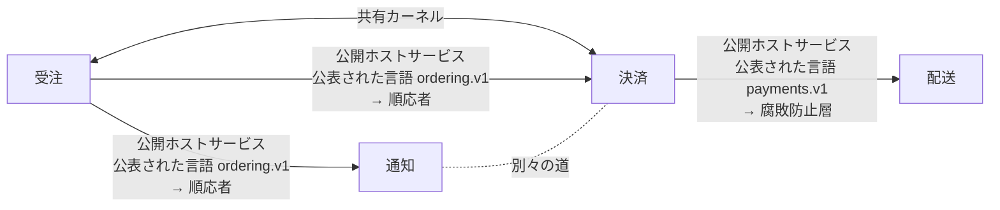

# コンテキストマップ：ネットショップ（webshop）v1

HTTP とイベントでやりとりする、小さな店の四つのサービス。どれも契約の文書を持つ

`ネットショップ.ctx` から書いた。`sakai check` の結果：コンテキスト 4、関係 5。成果物 9 件は、どれも一つのコンテキストに属する。境界を越える参照 7 件を確かめた（openapi 1、asyncapi 5、dandori 1）。

矢印は上流から下流へ向かい、上流の役割と、通る公表された言語と、下流の役割を書く。両向きの線は共有カーネルかパートナーシップ、点線は別々の道。

## コンテキスト

| コンテキスト | 別名 | 持ち主 | 成果物 | 説明 |
|---|---|---|---|---|
| [受注](#受注ordering) | `ordering` | 受注チーム | 3 | 客の注文を受け、注文が入ったことと取り消されたことを、ほかのサービスに知らせる |
| [決済](#決済payments) | `payments` | 決済チーム | 2 | 入った注文の代金を客のカードに課金し、課金がどうなったかを知らせる |
| [配送](#配送shipping) | `shipping` | 配送チーム | 2 | 課金が済んだ注文を出荷する |
| [通知](#通知notifications) | `notifications` | 顧客対応チーム | 2 | 注文がどうなったかを、客にメールで知らせる |

## 受注（ordering）

客の注文を受け、注文が入ったことと取り消されたことを、ほかのサービスに知らせる

- 持ち主：受注チーム
- 書いたファイル：`contexts/受注.ctx`

### 成果物

| ツール | ファイル | 持っているもの |
|---|---|---|
| `openapi` | `common/money.yaml` | 文書の一部 `Money` |
| `openapi` | `ordering/api/ordering.json` | OpenAPI 3.1.0「受注の API」、バージョン 1.0.0／操作 `createOrder`（POST /orders）、`getOrder`（GET /orders/{id}）／スキーマ `NewOrder`、`Line`、`Order`／列挙 `OrderStatus` |
| `asyncapi` | `ordering/events/ordering.yaml` | AsyncAPI 3.0.0「受注のイベント」、バージョン 1.0.0／チャネル `orderPlaced`（`shop.ordering.order.placed`）、`orderCancelled`（`shop.ordering.order.cancelled`）／送受信 `sendOrderPlaced`（send `orderPlaced`）、`sendOrderCancelled`（send `orderCancelled`） |

### 公表された言語

- `ordering.v1`：書いたもの OpenAPI `ordering/api/ordering.json`、AsyncAPI `ordering/events/ordering.yaml`。公開ホストサービス `createOrder`（HTTP の操作 POST /orders）。公開ホストサービス `getOrder`（HTTP の操作 GET /orders/{id}）。公開ホストサービス `orderPlaced`（チャネル shop.ordering.order.placed）。公開ホストサービス `orderCancelled`（チャネル shop.ordering.order.cancelled）

### 用語集

| 語 | 定義 | 指すもの | 越えていく先 |
|---|---|---|---|
| `注文` | 客が確定させた購入の申し込み。取り消されても消えない | `openapi "ordering/api/ordering.json" schema Order` | [通知](#通知notifications)、[決済](#決済payments) |
| `注文の受付` | 注文が入ったという知らせ | `asyncapi "ordering/events/ordering.yaml" channel orderPlaced` | [通知](#通知notifications)、[決済](#決済payments) |

### 関係

- [決済](#決済payments) と共有カーネル：`dir "common"`。越える参照：`payments/api/payments.yaml:50` ($ref) → `openapi "common/money.yaml" pointer /Money`
- 下流 [決済](#決済payments)：公開ホストサービス・公表された言語 `ordering.v1` → 順応者。越える参照：`payments/events/payments.yaml:8` (receive) → `asyncapi "ordering/events/ordering.yaml" channel orderPlaced`
- 下流 [通知](#通知notifications)：公開ホストサービス・公表された言語 `ordering.v1` → 順応者。越える参照：`notifications/events/notifications.yaml:8` (receive) → `asyncapi "ordering/events/ordering.yaml" channel orderPlaced`; `notifications/events/notifications.yaml:10` (receive) → `asyncapi "ordering/events/ordering.yaml" channel orderCancelled`; `notifications/notify.flow:4` (use openapi) → `openapi "ordering/api/ordering.json"`

## 決済（payments）

入った注文の代金を客のカードに課金し、課金がどうなったかを知らせる

- 持ち主：決済チーム
- 書いたファイル：`contexts/決済.ctx`

### 成果物

| ツール | ファイル | 持っているもの |
|---|---|---|
| `openapi` | `payments/api/payments.yaml` | OpenAPI 3.2.0「決済の API」、バージョン 1.0.0／操作 `createCharge`（POST /charges）、`getCharge`（GET /charges/{id}）／スキーマ `NewCharge`、`Charge`／列挙 `ChargeStatus` |
| `asyncapi` | `payments/events/payments.yaml` | AsyncAPI 3.1.0「決済のイベント」、バージョン 1.0.0／チャネル `orderPlaced`（`ordering/events/ordering.yaml` のもの）、`paymentSucceeded`（`shop.payments.payment.succeeded`）、`paymentFailed`（`shop.payments.payment.failed`）／送受信 `receiveOrderPlaced`（receive `orderPlaced`）、`sendPaymentSucceeded`（send `paymentSucceeded`）、`sendPaymentFailed`（send `paymentFailed`） |

### 公表された言語

- `payments.v1`：書いたもの OpenAPI `payments/api/payments.yaml`、AsyncAPI `payments/events/payments.yaml`。公開ホストサービス `createCharge`（HTTP の操作 POST /charges）。公開ホストサービス `getCharge`（HTTP の操作 GET /charges/{id}）。公開ホストサービス `paymentSucceeded`（チャネル shop.payments.payment.succeeded）。公開ホストサービス `paymentFailed`（チャネル shop.payments.payment.failed）

### 用語集

| 語 | 定義 | 指すもの | 越えていく先 |
|---|---|---|---|
| `課金` | 注文一つ分の代金を、客のカードから受け取ること | `openapi "payments/api/payments.yaml" schema Charge` | [配送](#配送shipping) |
| `課金の状態` | 課金がどこまで進んだか。カードの返事待ち、受け取った、通らなかった、返した | `openapi "payments/api/payments.yaml" schema ChargeStatus` | [配送](#配送shipping) |

### 関係

- [受注](#受注ordering) と共有カーネル：`dir "common"`。越える参照：`payments/api/payments.yaml:50` ($ref) → `openapi "common/money.yaml" pointer /Money`
- 上流 [受注](#受注ordering)：公開ホストサービス・公表された言語 `ordering.v1` → 順応者。越える参照：`payments/events/payments.yaml:8` (receive) → `asyncapi "ordering/events/ordering.yaml" channel orderPlaced`
- 下流 [配送](#配送shipping)：公開ホストサービス・公表された言語 `payments.v1` → 腐敗防止層。越える参照：`shipping/acl/payments.yaml:9` (receive) → `asyncapi "payments/events/payments.yaml" channel paymentSucceeded`; `shipping/acl/payments.yaml:11` (receive) → `asyncapi "payments/events/payments.yaml" channel paymentFailed`
- [通知](#通知notifications) と別々の道（越える参照が無いことを確かめた）

## 配送（shipping）

課金が済んだ注文を出荷する

- 持ち主：配送チーム
- 書いたファイル：`contexts/配送.ctx`

### 成果物

| ツール | ファイル | 持っているもの |
|---|---|---|
| `asyncapi` | `shipping/acl/payments.yaml` | AsyncAPI 3.0.0「配送が決済から受け取るもの」、バージョン 1.0.0／チャネル `paymentSucceeded`（`payments/events/payments.yaml` のもの）、`paymentFailed`（`payments/events/payments.yaml` のもの）／送受信 `receivePaymentSucceeded`（receive `paymentSucceeded`）、`receivePaymentFailed`（receive `paymentFailed`） |
| `openapi` | `shipping/api/shipping.yaml` | OpenAPI 3.0.3「配送の API」、バージョン 1.0.0／操作 `getShipment`（GET /shipments/{orderId}）／スキーマ `Shipment`／列挙 `ShipmentGate` |

### 公表された言語

- `shipping.v1`：書いたもの OpenAPI `shipping/api/shipping.yaml`。公開ホストサービス `getShipment`（HTTP の操作 GET /shipments/{orderId}）

### 用語集

| 語 | 定義 | 指すもの | 越えていく先 |
|---|---|---|---|
| `出荷の可否` | 注文を倉庫から出してよいか | `openapi "shipping/api/shipping.yaml" schema ShipmentGate` | — |

### 関係

- 上流 [決済](#決済payments)：公開ホストサービス・公表された言語 `payments.v1` → 腐敗防止層。越える参照：`shipping/acl/payments.yaml:9` (receive) → `asyncapi "payments/events/payments.yaml" channel paymentSucceeded`; `shipping/acl/payments.yaml:11` (receive) → `asyncapi "payments/events/payments.yaml" channel paymentFailed`

## 通知（notifications）

注文がどうなったかを、客にメールで知らせる

- 持ち主：顧客対応チーム
- 書いたファイル：`contexts/通知.ctx`

### 成果物

| ツール | ファイル | 持っているもの |
|---|---|---|
| `dandori` | `notifications/notify.flow` |  |
| `asyncapi` | `notifications/events/notifications.yaml` | AsyncAPI 3.0.0「通知が受注から受け取るもの」、バージョン 1.0.0／チャネル `orderPlaced`（`ordering/events/ordering.yaml` のもの）、`orderCancelled`（`ordering/events/ordering.yaml` のもの）／送受信 `receiveOrderPlaced`（receive `orderPlaced`）、`receiveOrderCancelled`（receive `orderCancelled`） |

### 用語集

| 語 | 定義 | 指すもの | 越えていく先 |
|---|---|---|---|
| `注文` |  | — | — |

### 関係

- 上流 [受注](#受注ordering)：公開ホストサービス・公表された言語 `ordering.v1` → 順応者。越える参照：`notifications/events/notifications.yaml:8` (receive) → `asyncapi "ordering/events/ordering.yaml" channel orderPlaced`; `notifications/events/notifications.yaml:10` (receive) → `asyncapi "ordering/events/ordering.yaml" channel orderCancelled`; `notifications/notify.flow:4` (use openapi) → `openapi "ordering/api/ordering.json"`
- [決済](#決済payments) と別々の道（越える参照が無いことを確かめた）

## 用語集の索引

| 語 | コンテキスト | 定義 | 境界を越えるとき |
|---|---|---|---|
| `出荷の可否` | [配送](#配送shipping) | 注文を倉庫から出してよいか | — |
| `注文` | [受注](#受注ordering) | 客が確定させた購入の申し込み。取り消されても消えない | [通知](#通知notifications)、[決済](#決済payments)。同じ名前の語が [通知](#通知notifications) にもある |
| `注文` | [通知](#通知notifications) |  | 同じ名前の語が [受注](#受注ordering) にもある |
| `注文の受付` | [受注](#受注ordering) | 注文が入ったという知らせ | [通知](#通知notifications)、[決済](#決済payments) |
| `課金` | [決済](#決済payments) | 注文一つ分の代金を、客のカードから受け取ること | [配送](#配送shipping) |
| `課金の状態` | [決済](#決済payments) | 課金がどこまで進んだか。カードの返事待ち、受け取った、通らなかった、返した | [配送](#配送shipping) |

## 対応

### 配送 ← 決済：ChargeStatus

`openapi "payments/api/payments.yaml" schema ChargeStatus` を `openapi "shipping/api/shipping.yaml" schema ShipmentGate` に読み替える。 層は `dir "shipping/acl"`。 対応は `contexts/配送.ctx` に書いたもの。下流の値は、対応の先の列挙にあることを確かめた。

| 上流の値 | 下流の値 |
|---|---|
| `pending` | `hold` |
| `succeeded` | `release` |
| `failed` | 拒否：課金に失敗した注文は出荷しない |
| `refunded` | 拒否：返金した注文は出荷しない |

## 確かめていないこと

- 腐敗防止層のコードが、書いた対応のとおりに読み替えているか。sakai が確かめるのは、対応が上流の列挙を網羅していることと、対応の先が下流の列挙にあることまで（規則が先のときは、規則の表を rulec が確かめる）。
- 契約に書いていない呼び出し：OpenAPI の文書の無い HTTP（URL を文字列で持つもの）、AsyncAPI の文書の無いメッセージのキュー、データベースの共有、リフレクションと動的な import。OpenAPI と AsyncAPI の文書に書いた HTTP の操作とチャネルは、ほかの成果物と同じく確かめる。
- コードが、OpenAPI と AsyncAPI の文書のとおりに HTTP を呼び、チャネルに送り、チャネルから受けているか。sakai が確かめるのは、文書どうしと、文書と地図が合っていることまで。
- 生成したコードの置き場所のコードが、本当にその公表された言語から生成したものか。
- 語の定義の文の中身。
- コードの import。これは sakai build が書く設定で、import-linter、dependency-cruiser、ArchUnit、go-arch-lint が CI で確かめる。

sakai 0.24.0 が `ネットショップ.ctx` から書いた。
