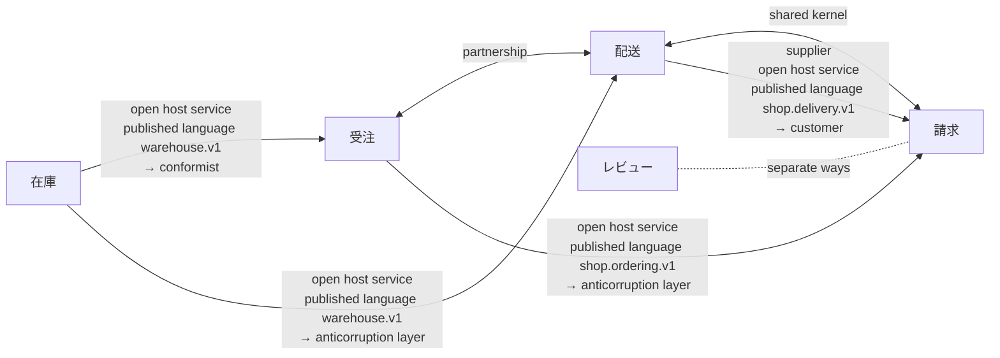

# Context map: 通販 (shop) v1

注文を受け、在庫を押さえ、届け、請求する小さな通販

Written from `通販.ctx`. `sakai check` says: 5 contexts, 7 relationships; 79 artifacts, each in one context; 9 crossings checked (proto 1, rulec 2, koyomi 1, dandori 5).

An arrow goes from the upstream to the downstream, with the upstream's roles, the published language the relationship goes through, and the downstream's role. A line with two heads is a shared kernel or a partnership; a dotted line is separate ways.

## Contexts

| Context | Alias | Owner | Artifacts | Description |
|---|---|---|---|---|
| [受注](#受注-ordering) | `ordering` | 受注チーム | 17 | 注文を受け付け、在庫を押さえ、配送に渡し、届くまでを見届ける |
| [在庫](#在庫-inventory) | `inventory` | 倉庫チーム | 17 | 倉庫の棚にある数を持ち、注文の一行ごとに押さえ、梱包の進みを答える |
| [配送](#配送-delivery) | `delivery` | 配送チーム | 19 | 出荷の日を決め、運び方を選び、荷物を届ける手配をする |
| [請求](#請求-billing) | `billing` | 経理チーム | 21 | 注文に請求するかを決め、手数料と送料を出し、支払の期日を決める |
| [レビュー](#レビュー-reviews) | `reviews` | 受注チーム | 5 | 買った人の感想を集めて見せる。請求とは何もやりとりしない |

## 受注 (ordering)

注文を受け付け、在庫を押さえ、配送に渡し、届くまでを見届ける

- Owner: 受注チーム
- Written in: `contexts/受注.ctx`

### Artifacts

| Tool | File | What it holds |
|---|---|---|
| `dandori` | `ordering/受注.flow` | implements `FulfillmentService`; child flows `delivery/配送の手配.flow` |
| `proto` | `proto/shop/ordering/v1/fulfillment.proto` | messages `FulfillRequest`, `FulfillmentOrder`, `Line`, `Gift`, `FulfillResponse`, `AnswerPackingRequest`, `AnswerPackingResponse`; services `FulfillmentService` |
| `proto` | `proto/shop/ordering/v1/order.proto` | messages `Order`, `GetOrderRequest`, `GetOrderResponse`; enums `OrderStatus`; services `OrderService` |
| `file` | 14 files (code) |  |

### Published language

- `shop.ordering.v1`: written in `proto/shop/ordering/v1/order.proto`, `proto/shop/ordering/v1/fulfillment.proto`; open host service `OrderService` (`GetOrder`); open host service `FulfillmentService` (`Fulfill`, `AnswerPacking`), implemented by `ordering/受注.flow`; generated code in `py/shop/ordering/v1`, `ts/shop/ordering/v1`, `java/src/main/java/shop/ordering/v1`, `go/shop/ordering/v1`

### Glossary

| Term | Definition | Means | Crosses into |
|---|---|---|---|
| `注文` | 客が確定させた購入の申し込み。取り消されても消えない | `proto "proto/shop/ordering/v1/order.proto" message Order` | — |
| `キャンセル` | 出荷の前に、客の申し出で注文を取り消すこと | `proto "proto/shop/ordering/v1/order.proto" enum OrderStatus value ORDER_STATUS_CANCELLED` | [請求](#請求-billing) (as `受注で取消`) |

### Relationships

- Upstream [在庫](#在庫-inventory): open host service, published language `warehouse.v1` → conformist. References that cross: `proto/shop/ordering/v1/fulfillment.proto:15` (proto import) → `proto "proto/warehouse/v1/stock.proto"`; `ordering/受注.flow:9` (use proto) → `proto "proto/warehouse/v1/stock.proto"`; `ordering/受注.flow:47` (connect) → `proto "proto/warehouse/v1/stock.proto" service StockService method Reserve`; `ordering/受注.flow:53` (connect) → `proto "proto/warehouse/v1/stock.proto" service StockService method Release`
- Partnership with [配送](#配送-delivery). References that cross: `ordering/受注.flow:6` (use rule … connect) → `rulec "delivery/rules/出荷の急ぎ.rule"`; `ordering/受注.flow:59` (flow) → `dandori "delivery/配送の手配.flow"`
- Downstream [請求](#請求-billing): open host service, published language `shop.ordering.v1` → anticorruption layer. References that cross: `billing/rules/請求の要否.rule:4` (import proto) → `proto "proto/shop/ordering/v1/order.proto" enum OrderStatus`

## 在庫 (inventory)

倉庫の棚にある数を持ち、注文の一行ごとに押さえ、梱包の進みを答える

- Owner: 倉庫チーム
- Also called: 在庫管理
- Written in: `contexts/在庫.ctx`

### Artifacts

| Tool | File | What it holds |
|---|---|---|
| `chobo` | `inventory/在庫の引当.book` | accounts `在庫`, `仕入先`, `客`; transfers `入荷`, `引当`, `返品` |
| `proto` | `proto/warehouse/v1/stock.proto` | messages `ReserveRequest`, `ReserveResponse`, `ReleaseRequest`, `ReleaseResponse`, `GetPackingRequest`, `GetPackingResponse`; enums `Stock`, `PackingStatus`; services `StockService`, `PackingService` |
| `file` | 15 files (code) |  |

### Published language

- `warehouse.v1`: written in `proto/warehouse/v1/stock.proto`; open host service `StockService` (`Reserve`, `Release`); open host service `PackingService` (`GetPacking`); generated code in `py/warehouse/v1`, `ts/warehouse/v1`, `java/src/main/java/warehouse/v1`, `go/warehouse/v1`

### Glossary

| Term | Definition | Means | Crosses into |
|---|---|---|---|
| `引当` | 注文の一行のために、棚の在庫を出荷か取消まで押さえておくこと | `proto "proto/warehouse/v1/stock.proto" message ReserveResponse` | [受注](#受注-ordering) |
| `在庫切れ` | 押さえようとした数が棚に無いこと | `proto "proto/warehouse/v1/stock.proto" enum Stock value STOCK_SHORT` | [受注](#受注-ordering) |
| `梱包の状態` | 注文の品を箱に詰め終えたか。詰める途中で欠品が分かることがある | `proto "proto/warehouse/v1/stock.proto" enum PackingStatus` | [受注](#受注-ordering) |

### Relationships

- Downstream [受注](#受注-ordering): open host service, published language `warehouse.v1` → conformist. References that cross: `proto/shop/ordering/v1/fulfillment.proto:15` (proto import) → `proto "proto/warehouse/v1/stock.proto"`; `ordering/受注.flow:9` (use proto) → `proto "proto/warehouse/v1/stock.proto"`; `ordering/受注.flow:47` (connect) → `proto "proto/warehouse/v1/stock.proto" service StockService method Reserve`; `ordering/受注.flow:53` (connect) → `proto "proto/warehouse/v1/stock.proto" service StockService method Release`
- Downstream [配送](#配送-delivery): open host service, published language `warehouse.v1` → anticorruption layer

## 配送 (delivery)

出荷の日を決め、運び方を選び、荷物を届ける手配をする

- Owner: 配送チーム
- Written in: `contexts/配送.ctx`

### Artifacts

| Tool | File | What it holds |
|---|---|---|
| `rulec` | `delivery/rules/出荷の急ぎ.rule` | inputs `会員`, `金額`; outputs `急ぎ`, `便` |
| `koyomi` | `delivery/出荷日.cal` | dates `出荷日`; calendar `東京の営業日`, its data 1955-01-01..2027-12-31 |
| `dandori` | `delivery/配送の手配.flow` |  |
| `proto` | `proto/shop/delivery/v1/shipment.proto` | messages `CreateShipmentRequest`, `Destination`, `Parcel`, `CreateShipmentResponse`; enums `Handling`; services `DeliveryService` |
| `file` | 15 files (code) |  |

### Published language

- `shop.delivery.v1`: written in `proto/shop/delivery/v1/shipment.proto`; open host service `DeliveryService` (`CreateShipment`); generated code in `py/shop/delivery/v1`, `ts/shop/delivery/v1`, `java/src/main/java/shop/delivery/v1`, `go/shop/delivery/v1`
- `rulec.urgency.v1`: written in `delivery/rules/出荷の急ぎ.rule`; open host service `UrgencyService`

### Glossary

| Term | Definition | Means | Crosses into |
|---|---|---|---|
| `出荷` | 荷物を倉庫から運送会社に渡すこと | `proto "proto/shop/delivery/v1/shipment.proto" message CreateShipmentRequest` | [請求](#請求-billing) |
| `割れ物` | 運ぶときに上に物を載せない荷物 | `proto "proto/shop/delivery/v1/shipment.proto" enum Handling value HANDLING_FRAGILE` | [請求](#請求-billing) |
| `急ぎ` | 翌日便で運ぶかどうか | `rulec "delivery/rules/出荷の急ぎ.rule" output 急ぎ` | [受注](#受注-ordering) |

### Relationships

- Partnership with [受注](#受注-ordering). References that cross: `ordering/受注.flow:6` (use rule … connect) → `rulec "delivery/rules/出荷の急ぎ.rule"`; `ordering/受注.flow:59` (flow) → `dandori "delivery/配送の手配.flow"`
- Upstream [在庫](#在庫-inventory): open host service, published language `warehouse.v1` → anticorruption layer
- Shared kernel with [請求](#請求-billing): `koyomi "calendars/東京の営業日.cal"`, `dir "py/calendars"`, `dir "ts/calendars"`, `dir "java/src/main/java/calendars"`, `dir "go/calendars"`. References that cross: `delivery/出荷日.cal:3` (use calendar) → `koyomi "calendars/東京の営業日.cal"`
- Downstream [請求](#請求-billing): supplier, open host service, published language `shop.delivery.v1` → customer. References that cross: `billing/rules/出荷の送料.rule:7` (shape) → `proto "proto/shop/delivery/v1/shipment.proto" message CreateShipmentRequest`

## 請求 (billing)

注文に請求するかを決め、手数料と送料を出し、支払の期日を決める

- Owner: 経理チーム
- Written in: `contexts/請求.ctx`

### Artifacts

| Tool | File | What it holds |
|---|---|---|
| `rulec` | `billing/rules/出荷の送料.rule` | inputs `あて先`, `割れ物あり`, `個数`, `申告額`, `時間帯`; outputs `送料` |
| `rulec` | `billing/rules/決済手数料.rule` | inputs `取引額`, `手数料率`, `少額`; outputs `手数料` |
| `rulec` | `billing/rules/請求の要否.rule` | inputs `状態`; outputs `扱い` |
| `koyomi` | `billing/支払条件.cal` | dates `締め日`, `支払日`; calendar `東京の営業日`, its data 1955-01-01..2027-12-31 |
| `koyomi` | `calendars/東京の営業日.cal` | calendar `東京の営業日`, its data 1955-01-01..2027-12-31 |
| `file` | 16 files (code) |  |

### Published language

- `rulec.payment_fee.v1`: written in `billing/rules/決済手数料.rule`; open host service `PaymentFeeService`

### Glossary

| Term | Definition | Means | Crosses into |
|---|---|---|---|
| `手数料` | 決済の一件ごとに、契約の率から決まる額 | `rulec "billing/rules/決済手数料.rule" output 手数料` | — |
| `キャンセル` | 請求を確定したあとに請求を取り消し、返金すること | — | — |

### Relationships

- Shared kernel with [配送](#配送-delivery): `koyomi "calendars/東京の営業日.cal"`, `dir "py/calendars"`, `dir "ts/calendars"`, `dir "java/src/main/java/calendars"`, `dir "go/calendars"`. References that cross: `delivery/出荷日.cal:3` (use calendar) → `koyomi "calendars/東京の営業日.cal"`
- Upstream [受注](#受注-ordering): open host service, published language `shop.ordering.v1` → anticorruption layer. References that cross: `billing/rules/請求の要否.rule:4` (import proto) → `proto "proto/shop/ordering/v1/order.proto" enum OrderStatus`
- Upstream [配送](#配送-delivery): supplier, open host service, published language `shop.delivery.v1` → customer. References that cross: `billing/rules/出荷の送料.rule:7` (shape) → `proto "proto/shop/delivery/v1/shipment.proto" message CreateShipmentRequest`
- Separate ways from [レビュー](#レビュー-reviews) (no reference crosses, as checked)

## レビュー (reviews)

買った人の感想を集めて見せる。請求とは何もやりとりしない

- Owner: 受注チーム
- Written in: `contexts/レビュー.ctx`

### Artifacts

| Tool | File | What it holds |
|---|---|---|
| `file` | 5 files (code) |  |

### Relationships

- Separate ways from [請求](#請求-billing) (no reference crosses, as checked)

## Glossary index

| Term | Context | Definition | Across a boundary |
|---|---|---|---|
| `キャンセル` | [受注](#受注-ordering) | 出荷の前に、客の申し出で注文を取り消すこと | [請求](#請求-billing) (as `受注で取消`); a term of the same name is in [請求](#請求-billing) |
| `キャンセル` | [請求](#請求-billing) | 請求を確定したあとに請求を取り消し、返金すること | a term of the same name is in [受注](#受注-ordering) |
| `出荷` | [配送](#配送-delivery) | 荷物を倉庫から運送会社に渡すこと | [請求](#請求-billing) |
| `割れ物` | [配送](#配送-delivery) | 運ぶときに上に物を載せない荷物 | [請求](#請求-billing) |
| `在庫切れ` | [在庫](#在庫-inventory) | 押さえようとした数が棚に無いこと | [受注](#受注-ordering) |
| `引当` | [在庫](#在庫-inventory) | 注文の一行のために、棚の在庫を出荷か取消まで押さえておくこと | [受注](#受注-ordering) |
| `急ぎ` | [配送](#配送-delivery) | 翌日便で運ぶかどうか | [受注](#受注-ordering) |
| `手数料` | [請求](#請求-billing) | 決済の一件ごとに、契約の率から決まる額 | — |
| `梱包の状態` | [在庫](#在庫-inventory) | 注文の品を箱に詰め終えたか。詰める途中で欠品が分かることがある | [受注](#受注-ordering) |
| `注文` | [受注](#受注-ordering) | 客が確定させた購入の申し込み。取り消されても消えない | — |

## Mappings

### 配送 ← 在庫: PackingStatus

Maps `proto "proto/warehouse/v1/stock.proto" enum PackingStatus` to `出荷の可否`. The layer is `dir "py/delivery/acl/inventory"`, `dir "ts/delivery/acl/inventory"`, `dir "java/src/main/java/delivery/acl/inventory"`, `dir "go/delivery/acl/inventory"`. The mapping is written in `contexts/配送.ctx`. Its target is only a name, so the downstream values are not checked.

| Upstream value | Downstream value |
|---|---|
| `PACKING_STATUS_WAITING` | `待つ` |
| `PACKING_STATUS_PACKED` | `出荷する` |
| `PACKING_STATUS_SHORT` | refused: 欠品のある箱は出荷しない。受注に戻す |

### 請求 ← 受注: OrderStatus

Maps `proto "proto/shop/ordering/v1/order.proto" enum OrderStatus` to `rulec "billing/rules/請求の要否.rule" enum 注文の状態`. The layer is `rulec "billing/rules/請求の要否.rule"`, `dir "py/billing/acl/ordering"`, `dir "ts/billing/acl/ordering"`, `dir "java/src/main/java/billing/acl/ordering"`, `dir "go/billing/acl/ordering"`. The mapping is read from the rule's `import proto` by rulec (rulec checks the rule's tables).

| Upstream value | Downstream value |
|---|---|
| `ORDER_STATUS_RECEIVED` | `受付` |
| `ORDER_STATUS_PAID` | `支払済` |
| `ORDER_STATUS_SHIPPED` | `出荷済` |
| `ORDER_STATUS_CANCELLED` | `受注で取消` |

## What is not checked

- Whether the code of an anticorruption layer maps as the mapping says. sakai checks that the mapping covers the upstream's enum and that what it maps to is in the downstream's enum (where a rule is the target, rulec checks the rule's tables).
- Calls seen only at run time: HTTP to a URL held in a string, message queues, a shared database, reflection and dynamic imports.
- Whether the code where generated code is kept was really generated from the published language.
- What a term's definition says.
- The imports of the code: the settings `sakai build` writes have import-linter, dependency-cruiser, ArchUnit and go-arch-lint check them in CI.

Written by sakai 0.23.0 from `通販.ctx`.
