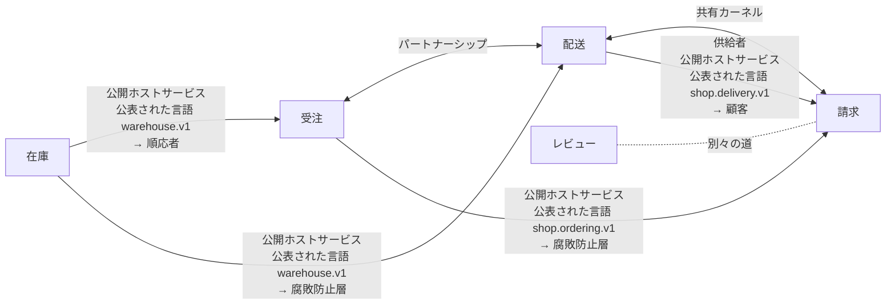

# コンテキストマップ：通販（shop）v1

注文を受け、在庫を押さえ、届け、請求する小さな通販

`通販.ctx` から書いた。`sakai check` の結果：コンテキスト 5、関係 7。成果物 79 件は、どれも一つのコンテキストに属する。境界を越える参照 9 件を確かめた（proto 1、rulec 2、koyomi 1、dandori 5）。

矢印は上流から下流へ向かい、上流の役割と、通る公表された言語と、下流の役割を書く。両向きの線は共有カーネルかパートナーシップ、点線は別々の道。

## コンテキスト

| コンテキスト | 別名 | 持ち主 | 成果物 | 説明 |
|---|---|---|---|---|
| [受注](#受注ordering) | `ordering` | 受注チーム | 17 | 注文を受け付け、在庫を押さえ、配送に渡し、届くまでを見届ける |
| [在庫](#在庫inventory) | `inventory` | 倉庫チーム | 17 | 倉庫の棚にある数を持ち、注文の一行ごとに押さえ、梱包の進みを答える |
| [配送](#配送delivery) | `delivery` | 配送チーム | 19 | 出荷の日を決め、運び方を選び、荷物を届ける手配をする |
| [請求](#請求billing) | `billing` | 経理チーム | 21 | 注文に請求するかを決め、手数料と送料を出し、支払の期日を決める |
| [レビュー](#レビューreviews) | `reviews` | 受注チーム | 5 | 買った人の感想を集めて見せる。請求とは何もやりとりしない |

## 受注（ordering）

注文を受け付け、在庫を押さえ、配送に渡し、届くまでを見届ける

- 持ち主：受注チーム
- 書いたファイル：`contexts/受注.ctx`

### 成果物

| ツール | ファイル | 持っているもの |
|---|---|---|
| `dandori` | `ordering/受注.flow` | 実装するサービス `FulfillmentService`／子のフロー `delivery/配送の手配.flow` |
| `proto` | `proto/shop/ordering/v1/fulfillment.proto` | メッセージ `FulfillRequest`、`FulfillmentOrder`、`Line`、`Gift`、`FulfillResponse`、`AnswerPackingRequest`、`AnswerPackingResponse`／サービス `FulfillmentService` |
| `proto` | `proto/shop/ordering/v1/order.proto` | メッセージ `Order`、`GetOrderRequest`、`GetOrderResponse`／列挙 `OrderStatus`／サービス `OrderService` |
| `file` | 14 個のファイル（コード） |  |

### 公表された言語

- `shop.ordering.v1`：書いたもの `proto/shop/ordering/v1/order.proto`、`proto/shop/ordering/v1/fulfillment.proto`。公開ホストサービス `OrderService`（`GetOrder`）。公開ホストサービス `FulfillmentService`（`Fulfill`、`AnswerPacking`）。`ordering/受注.flow` が実装する。生成したコード `py/shop/ordering/v1`、`ts/shop/ordering/v1`、`java/src/main/java/shop/ordering/v1`、`go/shop/ordering/v1`

### 用語集

| 語 | 定義 | 指すもの | 越えていく先 |
|---|---|---|---|
| `注文` | 客が確定させた購入の申し込み。取り消されても消えない | `proto "proto/shop/ordering/v1/order.proto" message Order` | — |
| `キャンセル` | 出荷の前に、客の申し出で注文を取り消すこと | `proto "proto/shop/ordering/v1/order.proto" enum OrderStatus value ORDER_STATUS_CANCELLED` | [請求](#請求billing)（`受注で取消` として） |

### 関係

- 上流 [在庫](#在庫inventory)：公開ホストサービス・公表された言語 `warehouse.v1` → 順応者。越える参照：`proto/shop/ordering/v1/fulfillment.proto:15` (proto import) → `proto "proto/warehouse/v1/stock.proto"`; `ordering/受注.flow:9` (use proto) → `proto "proto/warehouse/v1/stock.proto"`; `ordering/受注.flow:47` (connect) → `proto "proto/warehouse/v1/stock.proto" service StockService method Reserve`; `ordering/受注.flow:53` (connect) → `proto "proto/warehouse/v1/stock.proto" service StockService method Release`
- [配送](#配送delivery) とパートナーシップ。越える参照：`ordering/受注.flow:6` (use rule … connect) → `rulec "delivery/rules/出荷の急ぎ.rule"`; `ordering/受注.flow:59` (flow) → `dandori "delivery/配送の手配.flow"`
- 下流 [請求](#請求billing)：公開ホストサービス・公表された言語 `shop.ordering.v1` → 腐敗防止層。越える参照：`billing/rules/請求の要否.rule:4` (import proto) → `proto "proto/shop/ordering/v1/order.proto" enum OrderStatus`

## 在庫（inventory）

倉庫の棚にある数を持ち、注文の一行ごとに押さえ、梱包の進みを答える

- 持ち主：倉庫チーム
- ほかの呼び名：在庫管理
- 書いたファイル：`contexts/在庫.ctx`

### 成果物

| ツール | ファイル | 持っているもの |
|---|---|---|
| `chobo` | `inventory/在庫の引当.book` | 勘定 `在庫`、`仕入先`、`客`／振替 `入荷`、`引当`、`返品` |
| `proto` | `proto/warehouse/v1/stock.proto` | メッセージ `ReserveRequest`、`ReserveResponse`、`ReleaseRequest`、`ReleaseResponse`、`GetPackingRequest`、`GetPackingResponse`／列挙 `Stock`、`PackingStatus`／サービス `StockService`、`PackingService` |
| `file` | 15 個のファイル（コード） |  |

### 公表された言語

- `warehouse.v1`：書いたもの `proto/warehouse/v1/stock.proto`。公開ホストサービス `StockService`（`Reserve`、`Release`）。公開ホストサービス `PackingService`（`GetPacking`）。生成したコード `py/warehouse/v1`、`ts/warehouse/v1`、`java/src/main/java/warehouse/v1`、`go/warehouse/v1`

### 用語集

| 語 | 定義 | 指すもの | 越えていく先 |
|---|---|---|---|
| `引当` | 注文の一行のために、棚の在庫を出荷か取消まで押さえておくこと | `proto "proto/warehouse/v1/stock.proto" message ReserveResponse` | [受注](#受注ordering) |
| `在庫切れ` | 押さえようとした数が棚に無いこと | `proto "proto/warehouse/v1/stock.proto" enum Stock value STOCK_SHORT` | [受注](#受注ordering) |
| `梱包の状態` | 注文の品を箱に詰め終えたか。詰める途中で欠品が分かることがある | `proto "proto/warehouse/v1/stock.proto" enum PackingStatus` | [受注](#受注ordering) |

### 関係

- 下流 [受注](#受注ordering)：公開ホストサービス・公表された言語 `warehouse.v1` → 順応者。越える参照：`proto/shop/ordering/v1/fulfillment.proto:15` (proto import) → `proto "proto/warehouse/v1/stock.proto"`; `ordering/受注.flow:9` (use proto) → `proto "proto/warehouse/v1/stock.proto"`; `ordering/受注.flow:47` (connect) → `proto "proto/warehouse/v1/stock.proto" service StockService method Reserve`; `ordering/受注.flow:53` (connect) → `proto "proto/warehouse/v1/stock.proto" service StockService method Release`
- 下流 [配送](#配送delivery)：公開ホストサービス・公表された言語 `warehouse.v1` → 腐敗防止層

## 配送（delivery）

出荷の日を決め、運び方を選び、荷物を届ける手配をする

- 持ち主：配送チーム
- 書いたファイル：`contexts/配送.ctx`

### 成果物

| ツール | ファイル | 持っているもの |
|---|---|---|
| `rulec` | `delivery/rules/出荷の急ぎ.rule` | 入力 `会員`、`金額`／出力 `急ぎ`、`便` |
| `koyomi` | `delivery/出荷日.cal` | 日付 `出荷日`／カレンダー `東京の営業日` のデータ 1955-01-01..2027-12-31 |
| `dandori` | `delivery/配送の手配.flow` |  |
| `proto` | `proto/shop/delivery/v1/shipment.proto` | メッセージ `CreateShipmentRequest`、`Destination`、`Parcel`、`CreateShipmentResponse`／列挙 `Handling`／サービス `DeliveryService` |
| `file` | 15 個のファイル（コード） |  |

### 公表された言語

- `shop.delivery.v1`：書いたもの `proto/shop/delivery/v1/shipment.proto`。公開ホストサービス `DeliveryService`（`CreateShipment`）。生成したコード `py/shop/delivery/v1`、`ts/shop/delivery/v1`、`java/src/main/java/shop/delivery/v1`、`go/shop/delivery/v1`
- `rulec.urgency.v1`：書いたもの `delivery/rules/出荷の急ぎ.rule`。公開ホストサービス `UrgencyService`

### 用語集

| 語 | 定義 | 指すもの | 越えていく先 |
|---|---|---|---|
| `出荷` | 荷物を倉庫から運送会社に渡すこと | `proto "proto/shop/delivery/v1/shipment.proto" message CreateShipmentRequest` | [請求](#請求billing) |
| `割れ物` | 運ぶときに上に物を載せない荷物 | `proto "proto/shop/delivery/v1/shipment.proto" enum Handling value HANDLING_FRAGILE` | [請求](#請求billing) |
| `急ぎ` | 翌日便で運ぶかどうか | `rulec "delivery/rules/出荷の急ぎ.rule" output 急ぎ` | [受注](#受注ordering) |

### 関係

- [受注](#受注ordering) とパートナーシップ。越える参照：`ordering/受注.flow:6` (use rule … connect) → `rulec "delivery/rules/出荷の急ぎ.rule"`; `ordering/受注.flow:59` (flow) → `dandori "delivery/配送の手配.flow"`
- 上流 [在庫](#在庫inventory)：公開ホストサービス・公表された言語 `warehouse.v1` → 腐敗防止層
- [請求](#請求billing) と共有カーネル：`koyomi "calendars/東京の営業日.cal"`、`dir "py/calendars"`、`dir "ts/calendars"`、`dir "java/src/main/java/calendars"`、`dir "go/calendars"`。越える参照：`delivery/出荷日.cal:3` (use calendar) → `koyomi "calendars/東京の営業日.cal"`
- 下流 [請求](#請求billing)：供給者・公開ホストサービス・公表された言語 `shop.delivery.v1` → 顧客。越える参照：`billing/rules/出荷の送料.rule:7` (shape) → `proto "proto/shop/delivery/v1/shipment.proto" message CreateShipmentRequest`

## 請求（billing）

注文に請求するかを決め、手数料と送料を出し、支払の期日を決める

- 持ち主：経理チーム
- 書いたファイル：`contexts/請求.ctx`

### 成果物

| ツール | ファイル | 持っているもの |
|---|---|---|
| `rulec` | `billing/rules/出荷の送料.rule` | 入力 `あて先`、`割れ物あり`、`個数`、`申告額`、`時間帯`／出力 `送料` |
| `rulec` | `billing/rules/決済手数料.rule` | 入力 `取引額`、`手数料率`、`少額`／出力 `手数料` |
| `rulec` | `billing/rules/請求の要否.rule` | 入力 `状態`／出力 `扱い` |
| `koyomi` | `billing/支払条件.cal` | 日付 `締め日`、`支払日`／カレンダー `東京の営業日` のデータ 1955-01-01..2027-12-31 |
| `koyomi` | `calendars/東京の営業日.cal` | カレンダー `東京の営業日` のデータ 1955-01-01..2027-12-31 |
| `file` | 16 個のファイル（コード） |  |

### 公表された言語

- `rulec.payment_fee.v1`：書いたもの `billing/rules/決済手数料.rule`。公開ホストサービス `PaymentFeeService`

### 用語集

| 語 | 定義 | 指すもの | 越えていく先 |
|---|---|---|---|
| `手数料` | 決済の一件ごとに、契約の率から決まる額 | `rulec "billing/rules/決済手数料.rule" output 手数料` | — |
| `キャンセル` | 請求を確定したあとに請求を取り消し、返金すること | — | — |

### 関係

- [配送](#配送delivery) と共有カーネル：`koyomi "calendars/東京の営業日.cal"`、`dir "py/calendars"`、`dir "ts/calendars"`、`dir "java/src/main/java/calendars"`、`dir "go/calendars"`。越える参照：`delivery/出荷日.cal:3` (use calendar) → `koyomi "calendars/東京の営業日.cal"`
- 上流 [受注](#受注ordering)：公開ホストサービス・公表された言語 `shop.ordering.v1` → 腐敗防止層。越える参照：`billing/rules/請求の要否.rule:4` (import proto) → `proto "proto/shop/ordering/v1/order.proto" enum OrderStatus`
- 上流 [配送](#配送delivery)：供給者・公開ホストサービス・公表された言語 `shop.delivery.v1` → 顧客。越える参照：`billing/rules/出荷の送料.rule:7` (shape) → `proto "proto/shop/delivery/v1/shipment.proto" message CreateShipmentRequest`
- [レビュー](#レビューreviews) と別々の道（越える参照が無いことを確かめた）

## レビュー（reviews）

買った人の感想を集めて見せる。請求とは何もやりとりしない

- 持ち主：受注チーム
- 書いたファイル：`contexts/レビュー.ctx`

### 成果物

| ツール | ファイル | 持っているもの |
|---|---|---|
| `file` | 5 個のファイル（コード） |  |

### 関係

- [請求](#請求billing) と別々の道（越える参照が無いことを確かめた）

## 用語集の索引

| 語 | コンテキスト | 定義 | 境界を越えるとき |
|---|---|---|---|
| `キャンセル` | [受注](#受注ordering) | 出荷の前に、客の申し出で注文を取り消すこと | [請求](#請求billing)（`受注で取消` として）。同じ名前の語が [請求](#請求billing) にもある |
| `キャンセル` | [請求](#請求billing) | 請求を確定したあとに請求を取り消し、返金すること | 同じ名前の語が [受注](#受注ordering) にもある |
| `出荷` | [配送](#配送delivery) | 荷物を倉庫から運送会社に渡すこと | [請求](#請求billing) |
| `割れ物` | [配送](#配送delivery) | 運ぶときに上に物を載せない荷物 | [請求](#請求billing) |
| `在庫切れ` | [在庫](#在庫inventory) | 押さえようとした数が棚に無いこと | [受注](#受注ordering) |
| `引当` | [在庫](#在庫inventory) | 注文の一行のために、棚の在庫を出荷か取消まで押さえておくこと | [受注](#受注ordering) |
| `急ぎ` | [配送](#配送delivery) | 翌日便で運ぶかどうか | [受注](#受注ordering) |
| `手数料` | [請求](#請求billing) | 決済の一件ごとに、契約の率から決まる額 | — |
| `梱包の状態` | [在庫](#在庫inventory) | 注文の品を箱に詰め終えたか。詰める途中で欠品が分かることがある | [受注](#受注ordering) |
| `注文` | [受注](#受注ordering) | 客が確定させた購入の申し込み。取り消されても消えない | — |

## 対応

### 配送 ← 在庫：PackingStatus

`proto "proto/warehouse/v1/stock.proto" enum PackingStatus` を `出荷の可否` に読み替える。 層は `dir "py/delivery/acl/inventory"`、`dir "ts/delivery/acl/inventory"`、`dir "java/src/main/java/delivery/acl/inventory"`、`dir "go/delivery/acl/inventory"`。 対応は `contexts/配送.ctx` に書いたもの。対応の先は名前だけなので、下流の値は確かめていない。

| 上流の値 | 下流の値 |
|---|---|
| `PACKING_STATUS_WAITING` | `待つ` |
| `PACKING_STATUS_PACKED` | `出荷する` |
| `PACKING_STATUS_SHORT` | 拒否：欠品のある箱は出荷しない。受注に戻す |

### 請求 ← 受注：OrderStatus

`proto "proto/shop/ordering/v1/order.proto" enum OrderStatus` を `rulec "billing/rules/請求の要否.rule" enum 注文の状態` に読み替える。 層は `rulec "billing/rules/請求の要否.rule"`、`dir "py/billing/acl/ordering"`、`dir "ts/billing/acl/ordering"`、`dir "java/src/main/java/billing/acl/ordering"`、`dir "go/billing/acl/ordering"`。 対応は、規則の `import proto` から rulec が読んだもの（規則の表は rulec が確かめる）。

| 上流の値 | 下流の値 |
|---|---|
| `ORDER_STATUS_RECEIVED` | `受付` |
| `ORDER_STATUS_PAID` | `支払済` |
| `ORDER_STATUS_SHIPPED` | `出荷済` |
| `ORDER_STATUS_CANCELLED` | `受注で取消` |

## 確かめていないこと

- 腐敗防止層のコードが、書いた対応のとおりに読み替えているか。sakai が確かめるのは、対応が上流の列挙を網羅していることと、対応の先が下流の列挙にあることまで（規則が先のときは、規則の表を rulec が確かめる）。
- 契約に書いていない呼び出し：OpenAPI の文書の無い HTTP（URL を文字列で持つもの）、AsyncAPI の文書の無いメッセージのキュー、データベースの共有、リフレクションと動的な import。OpenAPI と AsyncAPI の文書に書いた HTTP の操作とチャネルは、ほかの成果物と同じく確かめる。
- コードが、OpenAPI と AsyncAPI の文書のとおりに HTTP を呼び、チャネルに送り、チャネルから受けているか。sakai が確かめるのは、文書どうしと、文書と地図が合っていることまで。
- 生成したコードの置き場所のコードが、本当にその公表された言語から生成したものか。
- 語の定義の文の中身。
- コードの import。これは sakai build が書く設定で、import-linter、dependency-cruiser、ArchUnit、go-arch-lint が CI で確かめる。

sakai 0.24.0 が `通販.ctx` から書いた。
