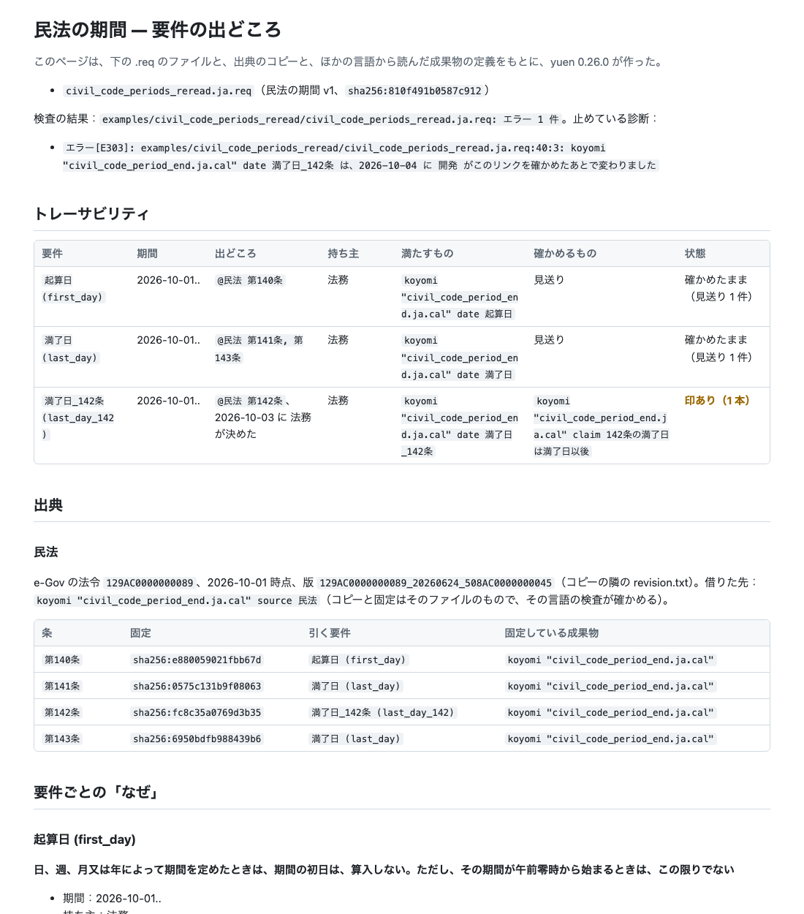
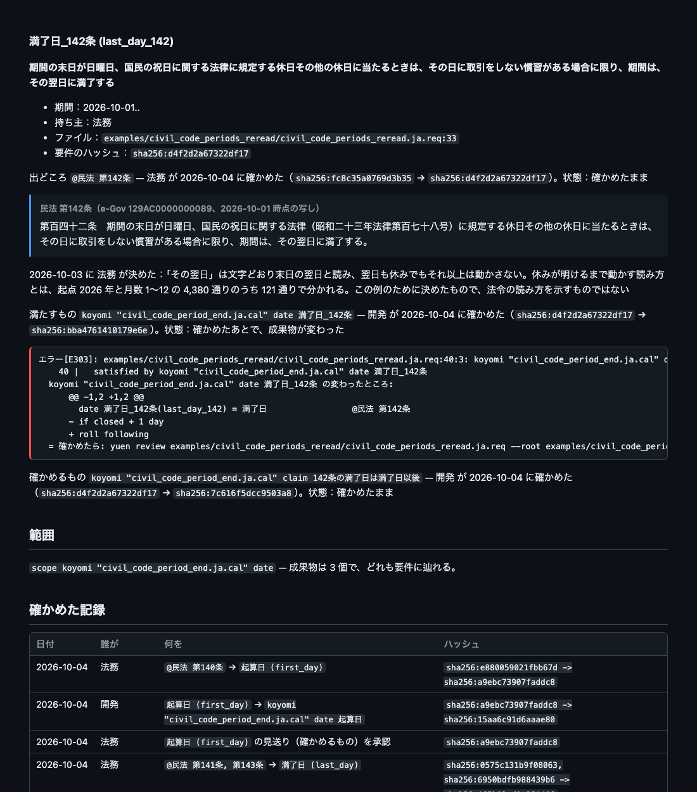

# yuen

**要件の出どころを書く。満たすものにつなぐ。どこかが変われば止める。**

yuen は、要件と、その出どころを書く小さな言語です。`.req` のファイルに、何が求められているか、それが法令のどの条か、誰のどの決定から来たか、持ち主は誰か、何が満たすのか（規則の表、カレンダーの日付、帳簿の勘定、コードのファイル）、何が確かめるのか（主張、規則そのものの検査）を書きます。そのつながりの一本ずつに、人が確かめたことを、両端のハッシュと一緒に記録します。条文が改正されたり、規則が書き換えられたり、コードの一行が変わったりすると、ハッシュが合わなくなり、検査はそのつながりで止まります。確かめたときとの差分を見せ、誰かが確かめ直すまで止まったままです。

yuen は [ritsu](https://github.com/i2y/ritsu) の七つの言語の一つです。ほかの言語が持つもの（rulec の規則の表、koyomi のカレンダーの日付と条件、chobo の帳簿の勘定と振替、geas の spec の主張、dandori のワークフローのタスク、sakai の地図の語、`.proto` のサービスとメッセージ）は、同じプロセスの中で、それぞれの言語に読んでもらいます。[OpenSpec](https://github.com/Fission-AI/OpenSpec) の仕様の要件は、出典として、要件ごとに読みます。

## 例：民法の期間

koyomi の例 `civil_code_period_end.ja.cal` は、民法 140〜143 条の期間の計算を、条文どおりに書いたカレンダーです。その日付と条件がどの条から来たか、142 条の「その翌日」を誰がどう読むと決めたかを書いたのが、例 `civil_code_periods` です。

```req
requirements 民法の期間 v1
description "koyomi の例「civil_code_period_end.ja.cal」の日付と条件が、民法のどの条から来たか、142 条の読み方を誰が決めたかを書いた例。例として書いたもので、法令の読み方を示すものではない"

role 法務 "条文の読み方を決める"
role 開発 "koyomi のファイルを書いて直す"

source 民法 = koyomi "civil_code_period_end.ja.cal" source 民法

scope koyomi "civil_code_period_end.ja.cal" date

requirement 満了日_142条(last_day_142)
  text "期間の末日が日曜日、国民の祝日に関する法律に規定する休日その他の休日に当たるときは、その日に取引をしない慣習がある場合に限り、期間は、その翌日に満了する"
  in force 2026-10-01..
  owner 法務
  from @民法 第142条
    reviewed 2026-10-04 by 法務 sha256:fc8c35a0769d3b35 -> sha256:d4f2d2a67322df17
  decided 2026-10-03 by 法務 "「その翌日」は文字どおり末日の翌日と読み、翌日も休みでもそれ以上は動かさない。休みが明けるまで動かす読み方とは、起点 2026 年と月数 1〜12 の 4,380 通りのうち 121 通りで分かれる。この例のために決めたもので、法令の読み方を示すものではない"
  satisfied by koyomi "civil_code_period_end.ja.cal" date 満了日_142条
    reviewed 2026-10-04 by 開発 sha256:d4f2d2a67322df17 -> sha256:bba4761410179e6e
  verified by koyomi "civil_code_period_end.ja.cal" claim 142条の満了日は満了日以後
    reviewed 2026-10-04 by 開発 sha256:d4f2d2a67322df17 -> sha256:7c616f5dcc9503a8
```

出典の民法は、カレンダーが保存して固定しているものを借りています（`source 民法 = koyomi … source 民法`）。同じ条を二か所で保存して固定すると、片方だけ取り直したときに食い違うからです。`reviewed` の行は人が書くのではなく、確かめた人の役割を渡して `yuen review` が書きます。行には、誰がいつ確かめたかと、そのときの両端のハッシュが入ります。

```console
$ ritsu yuen check examples/civil_code_periods/civil_code_periods.ja.req --root examples/civil_code_periods --lang ja
examples/civil_code_periods/civil_code_periods.ja.req: ok — 要件 3 件のリンク 7 本と見送り 2 件が、確かめたときのままです。どの要件にも、満たすものと確かめるもの（無ければ見送り）があり、範囲の date 3 個は、どれも要件に辿れます。
```

## 変わったら止まる

例 `civil_code_periods_reread` は、わざと止まる例です。`.req` と確かめた記録は上の例と同じバイト列で、カレンダーの一行だけを、決めたあとで別の読み方（休みが明けるまで動かす `roll following`）に書き換えてあります。検査はその日付へのつながりで止まり、確かめたときから何が変わったかを見せます。

```console
$ ritsu yuen check examples/civil_code_periods_reread/civil_code_periods_reread.ja.req --root examples/civil_code_periods_reread --lang ja
エラー[E303]: examples/civil_code_periods_reread/civil_code_periods_reread.ja.req:40:3: koyomi "civil_code_period_end.ja.cal" date 満了日_142条 は、2026-10-04 に 開発 がこのリンクを確かめたあとで変わりました
    40 |   satisfied by koyomi "civil_code_period_end.ja.cal" date 満了日_142条
  koyomi "civil_code_period_end.ja.cal" date 満了日_142条 の変わったところ:
      @@ -1,2 +1,2 @@
        date 満了日_142条(last_day_142) = 満了日                 @民法 第142条
      - if closed + 1 day
      + roll following
  = 確かめたら: yuen review examples/civil_code_periods_reread/civil_code_periods_reread.ja.req --root examples/civil_code_periods_reread --at examples/civil_code_periods_reread/civil_code_periods_reread.ja.req:40 --by <役割>
examples/civil_code_periods_reread/civil_code_periods_reread.ja.req: エラー 1 件
```

止まるのは、書き換えた日付へのつながり一本だけです。yuen が日付についてハッシュを取るのはファイル全体ではなく、その日付の定義の文なので、同じカレンダーのほかの日付と条件へのつながりは止まりません。逆に、条文そのものが改正されれば、要件のハッシュ（引いた条のハッシュを含む）が変わり、その要件から先のつながりが全部止まります。

人が差分を読み、カレンダーの書き換えが決めた読み方と合っていると確かめたら、その人の役割で `yuen review` を走らせて、記録を書き直します。合っていなければ、カレンダーを直すか、要件と決めたことを書き直します。

## OpenSpec の仕様から読む

OpenSpec は、システムが何をするかを Markdown の仕様に書く道具です。仕様には要件（`### Requirement:`）が並び、要件ごとに、それを具体的に示すシナリオが付きます。仕様を変えるときは、変更の提案をフォルダーに書き、`openspec archive` で仕様に当てます。

yuen は、この仕様を、法令を条ごとに読むのと同じく、要件ごとに出典として読みます。要件は、見出しから最後のシナリオまでのブロックのハッシュで固定します。このブロックは、変更がその要件を変えるときに OpenSpec の archive がまるごと置き換える範囲で、ほかの要件を変える変更では一字も変わりません。例 `openspec_greeter` の日本語の版は、geas の例 greeter の仕様を、日本語で書いた OpenSpec の仕様から読みます。

```req
source 挨拶 = openspec "ja/openspec/specs/greeting/spec.md"
  名前で挨拶する sha256:584f410eda34b49e

requirement 名前で挨拶する(greeting_by_name)
  text "挨拶は 200 と、Hello と頼まれた名前を返す。空の名前には 400 を返す"
  owner 窓口
  from @挨拶 名前で挨拶する
  verified by geas "greeter.ja.geas" claim 名前で挨拶する
  verified by geas "greeter.ja.geas" claim 空の名前は受け付けない
```

```console
$ ritsu yuen check examples/openspec_greeter/greeter.ja.req --root examples/openspec_greeter --lang ja
examples/openspec_greeter/greeter.ja.req: ok — 要件 3 件のリンク 10 本が、確かめたときのままです。どの要件にも、満たすものと確かめるもの（無ければ見送り）があります。
```

`ja/openspec/changes/trim-names/` には、名前の前後の空白を除き、ヘルスチェックを足す変更の提案があります。archive する前でも、`source outdated` が `openspec/changes/` の下の提案を読み（OpenSpec の仕様については通信しません）、固定している要件が提案でどう変わるか、それを誰が引いているか、確かめ直すリンクが何本になるかを言います。

```console
$ ritsu yuen source outdated examples/openspec_greeter/greeter.ja.req --root examples/openspec_greeter --lang ja
挨拶: まだ archive していない変更 trim-names が、名前で挨拶する を変えます（examples/openspec_greeter/ja/openspec/changes/trim-names/specs/greeting/spec.md:3）
  要件の変わるところ:
      @@ -1,4 +1,4 @@
        ### Requirement: 名前で挨拶する
      - サービスは `GET /greet?name=<名前>` に、ステータス 200 と、`message` が `Hello, <名前>` の JSON で答える（SHALL）。空の名前には、ステータス 400 で答える（SHALL）。
      + サービスは `GET /greet?name=<名前>` に、ステータス 200 と、`message` が、名前の前後の空白を除いた `Hello, <名前>` の JSON で答える（SHALL）。空白を除くと空になる名前には、ステータス 400 で答える（SHALL）。

        #### Scenario: 名前で挨拶する
      @@ -9,3 +9,7 @@
        #### Scenario: 空の名前は受け付けない
        - **WHEN** クライアントが `/greet?name=` を求める
      + - **THEN** ステータスは 400
      +
      + #### Scenario: 空白だけの名前は受け付けない
      + - **WHEN** クライアントが `/greet?name=%20%20` を求める
        - **THEN** ステータスは 400
  引いている要件: 名前で挨拶する（持ち主 窓口、examples/openspec_greeter/greeter.ja.req:12）
  確かめ直すもの: リンク 4 本
  読んでから、archive したあとで yuen source pin で固定すると、yuen check がこれらに印を付けます
挨拶: まだ archive していない変更 trim-names が、要件 ヘルスチェック を足します（examples/openspec_greeter/ja/openspec/changes/trim-names/specs/greeting/spec.md:21）。プロジェクトのどの要件もまだ読んでいません
```

提案のフォルダーを足すプルリクエストの差分には、`yuen affected` が同じことを答えます（[diffs/propose.ja.diff](examples/openspec_greeter/diffs/propose.ja.diff)）。

提案を archive すると、要件「名前で挨拶する」のブロックは提案が書いたものに置き換わり、検査はその固定で止まって、確かめたときのブロックとの差分を見せます。例 `openspec_greeter_archived` は、`openspec archive trim-names` のあとの同じプロジェクトで、`.req` と確かめた記録は上の例と同じバイト列です。

```console
$ ritsu yuen check examples/openspec_greeter_archived/greeter.ja.req --root examples/openspec_greeter_archived --lang ja
警告[W102]: examples/openspec_greeter_archived/greeter.ja.req:7:8: 仕様 examples/openspec_greeter_archived/ja/openspec/specs/greeting/spec.md の要件のうち 1 件を、プロジェクトのどの出典も固定していません: ヘルスチェック
     7 | source 挨拶 = openspec "ja/openspec/specs/greeting/spec.md"
  = 要件ごとに、固定の行と、それを引く要件を書いてください。読まないと決めた要件も、引く要件を書いて `not satisfied` と `not verified` に理由を書けば、外したことが承認とともに残ります。
エラー[E103]: examples/openspec_greeter_archived/greeter.ja.req:8:3: 挨拶 名前で挨拶する が固定と違います（固定は sha256:584f410eda34b49e、いまの要件は sha256:7b148317fa6902cd）
     8 |   名前で挨拶する sha256:584f410eda34b49e
  = 固定したあとで、仕様の要件が変わりました（変更の archive か、仕様の書き直し）。何が変わったかを読んでから、固定を書き換えてください（`yuen source pin`）。
  固定したときの要件からの差分（仕様は examples/openspec_greeter_archived/ja/openspec/specs/greeting/spec.md）:
      @@ -1,4 +1,4 @@
        ### Requirement: 名前で挨拶する
      - サービスは `GET /greet?name=<名前>` に、ステータス 200 と、`message` が `Hello, <名前>` の JSON で答える（SHALL）。空の名前には、ステータス 400 で答える（SHALL）。
      + サービスは `GET /greet?name=<名前>` に、ステータス 200 と、`message` が、名前の前後の空白を除いた `Hello, <名前>` の JSON で答える（SHALL）。空白を除くと空になる名前には、ステータス 400 で答える（SHALL）。

        #### Scenario: 名前で挨拶する
      @@ -9,3 +9,7 @@
        #### Scenario: 空の名前は受け付けない
        - **WHEN** クライアントが `/greet?name=` を求める
      + - **THEN** ステータスは 400
      +
      + #### Scenario: 空白だけの名前は受け付けない
      + - **WHEN** クライアントが `/greet?name=%20%20` を求める
        - **THEN** ステータスは 400
  = 直した行: 名前で挨拶する sha256:7b148317fa6902cd
警告[W402]: examples/openspec_greeter_archived/greeter.ja.req:15:3: 挨拶 名前で挨拶する のシナリオ 空白だけの名前は受け付けない と同じ名前の主張が、名前で挨拶する を確かめる主張の中にありません
    15 |   from @挨拶 名前で挨拶する
  = geas はシナリオを同じ名前の主張と突き合わせます（`geas scenarios`）。その名前の主張を、主張を読む人と一緒に書き、`verified by` でつないでください。別の名前の主張がそのシナリオを確かめているなら、どちらの名前を直すかを聞いてください。
examples/openspec_greeter_archived/greeter.ja.req: エラー 1 件、警告 2 件
```

`yuen source pin` で固定し直すと、仕様の要件から来るつながりと、要件「名前で挨拶する」から先の三本のつながりが、誰かが確かめ直すまで止まります。仕様のほかの二つの要件のつながりは止まりません。確かめ直したあとも W402 は残ります。提案がシナリオ「空白だけの名前は受け付けない」を足したのに、その名前の主張が、要件「名前で挨拶する」を確かめる主張の中にまだ無いからです。シナリオは、geas と同じく、同じ名前の主張と突き合わせます。主張のファイルの側からは `geas scenarios` が同じことを言い、書き足す主張の下書きを出します（[geas の README](../geas/README.ja.md)）。

## 確かめること、確かめないこと

yuen が確かめるのは、つながりとハッシュと期間です。名前がどれも何かを指していること、法令のコピーが固定と同じこと、確かめた記録が今のハッシュと合うこと、どの要件にも満たすものと確かめるもの（か、人が承認した見送りと、その理由）があること、宣言した範囲の成果物がどれも要件に辿れること、要件の版の期間が隙間も重なりもなく並ぶこと、要件が自分自身から読み出されていないこと。通信するのは `source fetch` と `source outdated` だけで、主張もテストも走らせません。

要件の意味は確かめません。要件の文が条文を正しく読めているか、規則が本当に要件を満たしているか、主張が要件を確かめるのに足りるかは、人が読んで決めることです。yuen がするのは、人が読んだものが、誰にも読み直されないまま変わることがないようにすることと、読むべきものを読む順に並べることです。

## ページ

`yuen doc` は、コードが実現すべきものを理解し、確かめる人（事業を回す人、経理や法務、運用する人、コードを見る開発者）が読むページを作ります。検査の結果、トレーサビリティの表、出典と、要件が引く条文（固定したコピーから引用）、要件ごとの「なぜ」（決めたこと、つながり、確かめた記録、印があればその差分）、範囲、日付の順の確かめた記録を載せます。Markdown か、外のファイルを何も読まない一枚の HTML で、明るい配色と暗い配色があります。

```console
$ ritsu yuen doc examples/civil_code_periods_reread/civil_code_periods_reread.ja.req --root examples/civil_code_periods_reread --format html --lang ja --out site
```





## エージェント向け

[skills/yuen](../../skills/yuen) は、yuen を使うためのエージェントのスキルです。`.req` を書く、`yuen check` を通す、印の差分を読む、人に何を聞くか。エージェントが自分の判断で `yuen review` を走らせることはしません。記録は、人が確かめたという印だからです。入れ方は [skills/README.md](skills/README.md) にあります。

## 入れ方

yuen は ritsu と一緒に入ります。

```console
$ cargo install --git https://github.com/i2y/ritsu --locked ritsu
```

`ritsu yuen <コマンド>` で呼びます。ritsu が置くリンクの名前 `yuen` でも呼べます。

## コマンド

```console
$ ritsu yuen check examples/civil_code_periods/civil_code_periods.ja.req
$ ritsu yuen review examples/civil_code_periods/civil_code_periods.ja.req --at examples/civil_code_periods/civil_code_periods.ja.req:40 --by 開発
$ ritsu yuen trace examples/civil_code_periods/civil_code_periods.ja.req --requirement 満了日_142条
$ ritsu yuen affected examples/greeter/greeter.ja.req --diff examples/greeter/changes/change.diff
$ ritsu yuen doc examples/stamp_tax/stamp_tax.ja.req --lang ja
$ ritsu yuen api examples/stamp_tax/stamp_tax.ja.req
$ ritsu yuen export reqif examples/stamp_tax/stamp_tax.ja.req
$ ritsu yuen source fetch examples/stamp_tax/stamp_tax.ja.req
$ ritsu yuen explain E303 --lang ja
```

どのコマンドにも `--lang ja|en` と `--root <dir>` を付けられます。フラグと終了コードは `ritsu yuen <コマンド> --help` で見られます。言語とコマンドの全部は [docs/reference.md](docs/reference.md)（英語）、診断のコードは 48 個（うち二つは退いたもの）で、[docs/codes.ja.md](docs/codes.ja.md) にあります。

## 例

例は、どれも一つのプロジェクトです。`check` には `.req` を一つずつ渡します。英語の例が先で、日本語の版があるものは `<名前>.ja.req` として横に置いてあります。

| 例 | 見せるもの |
|---|---|
| [osha](examples/osha) | 29 CFR 1910.157（eCFR）から読んだ要件。出典は yuen が保存して固定し、rulec の表が満たす（英語） |
| [greeter](examples/greeter) | 決めた要件を `server.py` が満たし、geas の主張が確かめる。変更への `affected`（英語と日本語） |
| [payment_terms](examples/payment_terms) | 例として決めた支払日と、koyomi のカレンダーが固定する祝日の表から借りた営業日（英語と日本語） |
| [refunds](examples/refunds) | 「返金は売上を超えない」を、chobo の帳簿の勘定一つと振替二つが満たす（英語と日本語） |
| [civil_code_periods](examples/civil_code_periods) | 民法 140〜143 条をカレンダーから借り、142 条の読み方を誰が決めたかを書く |
| [civil_code_periods_reread](examples/civil_code_periods_reread) | 同じものの、カレンダーを書き換えたあと。わざと止まる例（ほかに `openspec_greeter_archived`） |
| [stamp_tax](examples/stamp_tax) | 一つの要件を、期間の続く二つの版で書き、rulec の規則が満たす |
| [openspec_greeter](examples/openspec_greeter) | OpenSpec の仕様の要件を要件ごとに固定して読み、`server.py` が満たし、geas の主張が確かめる。まだ archive していない変更の提案への `source outdated` と `affected`（英語と日本語） |
| [openspec_greeter_archived](examples/openspec_greeter_archived) | 同じものの、提案を archive したあと。提案が変えた要件で止まる（英語と日本語） |

法令を引く例は、例として書いたもので、法令の読み方を示すものではありません。

## どう確かめているか

`cargo test -p yuen`（テストは 234 件）は、例とテストの材料のどれも、`ritsu yuen` と同じくすべての言語をつないで検査し、コマンドを走らせます。macOS（Apple silicon）で一度回すと、ビルドのあとは 44 秒で、飛ばしたテストはありませんでした。golden のファイルには、コマンドごとの英語と日本語の出力、`doc` の二つの形のページ、書き出しが入っています。外のツールは、ReqIF を検証する xmllint と ReqIF のスキーマ（`tools/reqif/fetch.sh`）、書き出しを読み戻す Python の `prov` と `reqif`、e-Gov と eCFR の代わりになる `curl` とテストの中のサーバー、geas が greeter のサーバーを走らせる Python、上の画像を描く Chrome です。ツールが無いテストは `SKIP: yuen: …` の一行を出して通ります。`YUEN_NET=1` で、本物の e-Gov と eCFR に問い合わせます。

このページと英語の README、`docs/`、スキルに載せた `.req` の行は、どれも `examples/` か `tests/` のファイルの行で、出力つきで載せたコマンドは、テストが実際に走らせて照らし合わせます（`tests/docs.rs`）。

## 次に読むもの

- [DESIGN.md](DESIGN.md)：決めたことと、その理由
- [docs/reference.md](docs/reference.md)：言語、コマンド、JSON の全部（英語）
- [README.md](README.md)：英語の README

## ライセンス

MIT OR Apache-2.0 のどちらかを選べます（[LICENSE-MIT](LICENSE-MIT)、[LICENSE-APACHE](LICENSE-APACHE)）。例とテストに入れた法令と祝日の表のコピーについては、[THIRD_PARTY_NOTICES.md](THIRD_PARTY_NOTICES.md) に書きました。
