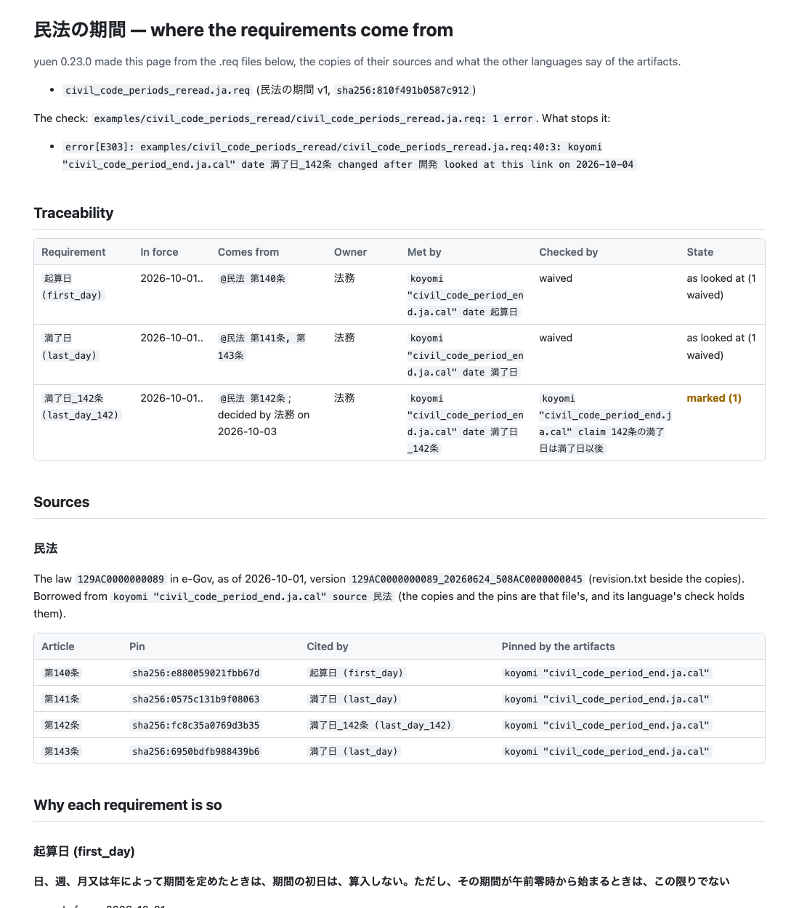
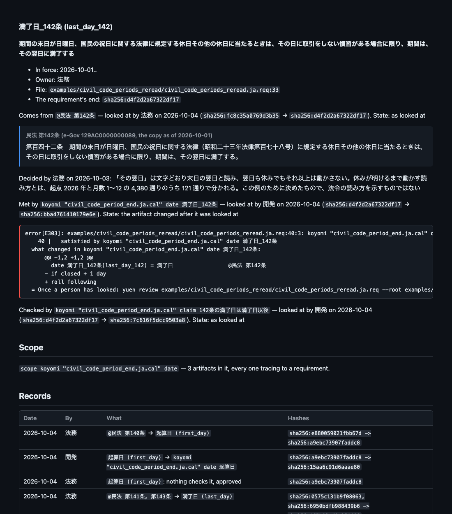

# yuen

**Write where each requirement comes from. Link what meets it. Stop when anything moves.**

yuen is a small language for requirements and where they come from. A `.req` file says what is
required, which article of a law or which decision it comes from, who owns it, what meets it (a
rule's table, a calendar's date, an account of a book, a file of code) and what checks it (a claim,
a rule's own check). Under each of those links, a person's look is recorded with the hashes of both
ends. When an article is amended, a rule is rewritten or a line of code moves, the hashes no longer
match and the check stops on that link, with the difference from what was looked at, until someone
looks again.

yuen is one of the seven languages of [ritsu](https://github.com/i2y/ritsu), and reads what the other languages
hold through them, in the same process: the tables of a rulec rule, the dates and claims of a
koyomi calendar, the accounts and transfers of a chobo book, the claims of a geas spec, the tasks of
a dandori workflow, the terms of a sakai map, and the services and messages of a `.proto`.

```req
requirements osha v1
description "Where the distances of rulec's rule osha_extinguisher.rule come from: 29 CFR 1910.157(d), read from the eCFR, copied and pinned here. Written as an example; it does not say how the regulation is to be read"

role safety "Decides how the regulation reads"
role development "Writes and fixes the rule"

source osha = law ecfr "29 CFR 1910" asof 2026-01-01
  "§1910.157" sha256:c2a9ce966c7e2269

scope rulec "osha_extinguisher.rule" table

requirement extinguisher_distance
  text "Portable fire extinguishers for Class A hazards are placed so that the travel distance to any extinguisher is 75 feet or less, and for Class B hazards 50 feet or less"
  in force 2026-01-01..
  owner safety
  from @osha "§1910.157"
    reviewed 2026-10-04 by safety sha256:c2a9ce966c7e2269 -> sha256:849dc53f1d112c23
  satisfied by rulec "osha_extinguisher.rule" table distance
    reviewed 2026-10-04 by development sha256:849dc53f1d112c23 -> sha256:5681500476af8a56
  verified by rulec "osha_extinguisher.rule"
    reviewed 2026-10-04 by development sha256:849dc53f1d112c23 -> sha256:a52e955b88af88d6
```

The section is copied from the eCFR beside the file and pinned by its hash; the rule pins the same
copy, and the check finds the two the same. The requirement is met by the rule's table `distance`
and checked by rulec's own check of the rule. The three `reviewed` lines were written by
`yuen review`, never by hand: each holds who looked, when, and the hashes of the two ends then.

```console
$ ritsu yuen check examples/osha/osha.req --root examples/osha
examples/osha/osha.req: ok — 1 requirement, whose 3 links are as they were looked at; every requirement is met and checked, or waived; the table in scope traces to a requirement
```

## When something moves

The example `civil_code_periods_reread` stops on purpose. A requirement says when a period of
months ends under article 142 of Japan's Civil Code, and records the decision of how "the following
day" is read; after the link to koyomi's date was looked at, one line of the calendar was rewritten
to read it another way. The `.req` and its records are those of the example that passes, and the
check stops on that one link, showing the line that changed (the example is in Japanese, since the
law is Japan's and only e-Gov serves it):

```console
$ ritsu yuen check examples/civil_code_periods_reread/civil_code_periods_reread.ja.req --root examples/civil_code_periods_reread
error[E303]: examples/civil_code_periods_reread/civil_code_periods_reread.ja.req:40:3: koyomi "civil_code_period_end.ja.cal" date 満了日_142条 changed after 開発 looked at this link on 2026-10-04
    40 |   satisfied by koyomi "civil_code_period_end.ja.cal" date 満了日_142条
  what changed in koyomi "civil_code_period_end.ja.cal" date 満了日_142条:
      @@ -1,2 +1,2 @@
        date 満了日_142条(last_day_142) = 満了日                 @民法 第142条
      - if closed + 1 day
      + roll following
  = Once a person has looked: yuen review examples/civil_code_periods_reread/civil_code_periods_reread.ja.req --root examples/civil_code_periods_reread --at examples/civil_code_periods_reread/civil_code_periods_reread.ja.req:40 --by <role>
examples/civil_code_periods_reread/civil_code_periods_reread.ja.req: 1 error
```

The end of a date is its definition, not the whole file, so the other dates and the claims of the
same calendar keep their links. Had the article itself been amended, the requirement's own hash
would change (it holds the hashes of what it comes from), and every link below it would stop too.

When code changes, `yuen affected` answers which requirements the diff touches and whom to ask,
following the code through geas's records of the lines each claim runs:

```console
$ ritsu yuen affected examples/greeter/greeter.req --root examples/greeter --diff examples/greeter/changes/change.diff --map examples/greeter/greeter.geas=examples/greeter/.geas/greeter.map.jsonl --map examples/greeter/greeter.geas=examples/greeter/changes/after.map.jsonl
diff: examples/greeter/changes/change.diff
the claims the change touches (geas "greeter.geas"; records: examples/greeter/.geas/greeter.map.jsonl (before), examples/greeter/changes/after.map.jsonl (after)):
  claim "rejects an empty name": examples/greeter/server.py 26 (after), 26 (before)
    checked by rejects_an_empty_name
files that requirements name, that the diff touches:
  file "server.py": met by greets_by_name, rejects_an_empty_name, totals_accumulate, unknown_paths_are_404
changes no requirement reaches: none
requirements touched:
  greets_by_name (examples/greeter/greeter.req:9): owner api; decided 2026-10-04 by api: "A greeting names whoever asked for it. Decided for this example"
  rejects_an_empty_name (examples/greeter/greeter.req:18): owner api; decided 2026-10-04 by api: "An empty name is a mistake of the client, not a greeting. Decided for this example"
  totals_accumulate (examples/greeter/greeter.req:27): owner api; decided 2026-10-04 by api: "The total is kept across requests until it is reset. Decided for this example"
  unknown_paths_are_404 (examples/greeter/greeter.req:36): owner api; decided 2026-10-04 by api: "The service answers only the paths it knows. Decided for this example"
4 requirements touched; ask api
```

## What it checks, and what it does not

yuen checks the links, the hashes and the periods: that every name resolves, that every copy of a
law matches its pin, that every record still matches the hashes now, that every requirement is met
and checked (or that a person approved leaving one side out, with the reason), that every artifact
of a declared scope traces to a requirement, that the versions of a requirement follow one another
with no gap and no overlap, and that no requirement is read from itself. It reads the network only
in `source fetch` and `source outdated`, and runs no claim and no test.

It does not check what a requirement means. Whether the sentence reads the article right, whether
the rule really meets it, whether the claim checks enough of it: those are for a person to read and
decide. What yuen does is make sure nothing a person read changes without that person, or another,
reading it again, and lay out what to read in the order to read it.

## The page

`yuen doc` writes the page of a project for whoever has to understand and check what the code is
meant to do: the people who run the business, accounting or legal, operations, the developers who
read the code. It holds the check, a traceability table, the sources with the articles each
requirement cites (quoted from the pinned copies), why each requirement is so (its decisions,
links, records, and the diff of any mark), the scope, and every record by date. It is Markdown, or
one HTML file with nothing loaded from elsewhere, light or dark.

```console
$ ritsu yuen doc examples/civil_code_periods_reread/civil_code_periods_reread.ja.req --root examples/civil_code_periods_reread --format html --out site
```





## For AI agents

[skills/yuen](skills/yuen) is an agent skill for using yuen: writing a `.req`, getting it past
`yuen check`, reading a mark's diff, and what to ask a person. An agent never runs `yuen review` on
its own judgment: a record says a person looked. See [skills/README.md](skills/README.md) to install
it.

## Install

yuen comes with ritsu:

```console
$ cargo install --git https://github.com/i2y/ritsu --locked ritsu
```

Run it as `ritsu yuen <command>`, or as `yuen`, the link ritsu installs. ritsu builds with a recent
stable Rust.

## Commands

```console
$ ritsu yuen check examples/payment_terms/payment_terms.req
$ ritsu yuen review examples/payment_terms/payment_terms.req --at examples/payment_terms/payment_terms.req:18 --by development
$ ritsu yuen trace examples/osha/osha.req --requirement extinguisher_distance
$ ritsu yuen affected examples/greeter/greeter.req --diff examples/greeter/changes/change.diff
$ ritsu yuen doc examples/refunds/refunds.req --format html --out site
$ ritsu yuen api examples/refunds/refunds.req
$ ritsu yuen export prov examples/osha/osha.req
$ ritsu yuen source outdated examples/osha/osha.req
$ ritsu yuen explain E303
```

Every command takes `--lang ja|en` and `--root <dir>`; `ritsu yuen <command> --help` gives each
one's flags and exit codes. The whole language and every command are in
[docs/reference.md](docs/reference.md), and the 44 diagnostic codes (two of them retired) in
[docs/codes.md](docs/codes.md) ([Japanese](docs/codes.ja.md)).

## Examples

Each example is a project of its own; give `check` one `.req` at a time. The English one comes
first, and a Japanese version, where there is one, sits beside it as `<name>.ja.req`.

| Example | What it shows |
|---|---|
| [osha](examples/osha) | a requirement read from 29 CFR 1910.157 (eCFR), copied and pinned by yuen, met by a rulec table |
| [greeter](examples/greeter) | decided requirements met by `server.py` and checked by geas's claims; `affected` on a change |
| [payment_terms](examples/payment_terms) | a payment day decided for the example, and business days borrowed from the holidays a koyomi calendar pins |
| [refunds](examples/refunds) | "a refund does not exceed the sale", met by an account and two transfers of a chobo book |
| [civil_code_periods](examples/civil_code_periods) | Japan's Civil Code, articles 140 to 143, borrowed from a koyomi calendar, and who decided how article 142 reads (Japanese) |
| [civil_code_periods_reread](examples/civil_code_periods_reread) | the same, after the calendar was rewritten: the one example that stops (Japanese) |
| [stamp_tax](examples/stamp_tax) | one requirement in two versions, in force one after the other, met by a rulec rule (Japanese) |

The examples that read a law are written as examples; they do not say how any law is to be read.

## How it is checked

`cargo test -p yuen` (225 tests) checks every example and test fixture with every language
joined, as `ritsu yuen` does, and runs every command on them. On macOS on Apple silicon, one run of
them together with ritsu's own tests took 57 seconds once built, and no test was skipped. The golden files hold the output of each
command in English and in Japanese, the pages of `doc` in both forms, and the exports. The outside
tools: xmllint and ReqIF's schemas (`tools/reqif/fetch.sh`) validate the ReqIF, Python's `prov`
and `reqif` read the exports back, `curl` and a server in the test stand in for e-Gov and the eCFR,
Python runs the greeter's server for geas, and Chrome draws the pictures above. A test whose tool
is missing prints a line `SKIP: yuen: …` and passes; `YUEN_NET=1` asks the real e-Gov and eCFR.

The pages are held to what yuen prints: every `.req` line on them is a line of a file under
`examples/` or `tests/`, and every command shown with its output is run and compared
(`tests/docs.rs`).

## Read next

- [DESIGN.md](DESIGN.md): every decision and its reason (in Japanese)
- [docs/reference.md](docs/reference.md): the whole language, the commands and their JSON
- [README.ja.md](README.ja.md): this page in Japanese

## License

MIT OR Apache-2.0, at your option ([LICENSE-MIT](LICENSE-MIT), [LICENSE-APACHE](LICENSE-APACHE)).
The copies of laws and of the table of holidays in the examples and tests are described in
[THIRD_PARTY_NOTICES.md](THIRD_PARTY_NOTICES.md).
